# Manual Técnico — Práctica 1: QuetzalDev S.A

**Universidad de San Carlos de Guatemala** · Facultad de Ingeniería\
**Curso:** Redes de Computadoras 1 — Segundo Semestre 2026\
**Estudiante:** Santiago Barrera\
**Carné:** 201905884\
**Plano asignado:** Plano 3 (carnés con terminación 4-5)\

---

## Índice

1. [Introducción y alcance](#1-introducción-y-alcance)
2. [Datos base del edificio](#2-datos-base-del-edificio)
3. [Distribución de hosts por departamento](#3-distribución-de-hosts-por-departamento)
4. [Inventario de equipos](#4-inventario-de-equipos)
5. [Ubicación y justificación del MDF](#5-ubicación-y-justificación-del-mdf)
6. [Topología física por departamento](#6-topología-física-por-departamento)
7. [Puntos de red y tipos de toma](#7-puntos-de-red-y-tipos-de-toma)
8. [Medios de transmisión por segmento](#8-medios-de-transmisión-por-segmento)
9. [Cableado troncal vs. cableado horizontal](#9-cableado-troncal-vs-cableado-horizontal)
10. [Distancias estimadas y cálculo de bobinas](#10-distancias-estimadas-y-cálculo-de-bobinas)
11. [Equipo activo: justificación y dimensionamiento](#11-equipo-activo-justificación-y-dimensionamiento)
12. [Estándares T568A/T568B: straight-through y crossover](#12-estándares-t568at568b)
13. [Disposición de pines documentada](#13-disposición-de-pines-documentada)
14. [Canalización: tipo, ruta y justificación](#14-canalización)
15. [Rack o gabinete del MDF](#15-rack-o-gabinete-del-mdf)
16. [Respaldo de energía (UPS)](#16-respaldo-de-energía-ups)
17. [Etiquetado de cables](#17-etiquetado-de-cables)
18. [Comparación con el estándar TIA/EIA-606](#18-comparación-con-el-estándar-tiaeia-606)
19. [Flujo de conexión end-to-end](#19-flujo-de-conexión-end-to-end)
20. [Presupuesto estimado](#20-presupuesto-estimado)
21. [Consideraciones de escalabilidad futura](#21-consideraciones-de-escalabilidad-futura)
22. [Compra directa vs. proveedor externo](#22-compra-directa-vs-proveedor-externo)
23. [Referencias](#23-referencias)

---

## 1. Introducción y alcance

QuetzalDev S.A., empresa de desarrollo de software, inauguró un edificio corporativo de un solo
nivel que concentrará a sus equipos de ingeniería, diseño y administración. Antes de adquirir e
instalar cualquier equipo de red, la empresa requiere una planificación formal de su infraestructura
física. El diseño de esa infraestructura, elaborado sobre el plano arquitectónico base asignado
(Plano 3).

El alcance del diseño se limita a la **Capa 1 del modelo OSI**. En concreto, el documento define y
justifica: la distribución de los 48 puntos de red entre los ocho departamentos y el tipo de toma en
cada uno; la ubicación del cuarto de telecomunicaciones (MDF); la topología física por área; el tipo
y categoría del medio de transmisión en cada segmento; la separación entre cableado troncal y
cableado horizontal; la estimación de distancias sobre el plano y el cálculo de bobinas; el
dimensionamiento del equipo activo y pasivo, del rack y del respaldo de energía; la aplicación de los
estándares T568A/T568B con la disposición de pines correspondiente; la canalización propuesta; el
esquema de etiquetado y su contraste con el estándar TIA/EIA-606; y el presupuesto estimado del
proyecto.

---

## 2. Datos base del edificio

### 2.1 Dimensiones y zonificación

**Dimensiones generales:** 28 m × 21 m en un solo nivel, para una superficie total de 588 m².
El plano base trae todas las cotas rotuladas, por lo que las distancias de este documento se
calculan directamente sobre esas medidas y no requieren deducir una escala gráfica.

El edificio se organiza en tres franjas horizontales de fondo constante:

| Zona | Franja | Dimensiones | Área |
| --- | --- | --- | ---: |
| Departamento de Recepción | Superior, extremo oeste | 8 m × 9 m | 72 m² |
| Departamento de Recursos Humanos | Superior | 6 m × 9 m | 54 m² |
| Departamento Legal | Superior | 6 m × 9 m | 54 m² |
| Sala de Capacitación | Superior, extremo este | 8 m × 9 m | 72 m² |
| Baño | Dentro de Sala de Capacitación, esquina sureste | 2 m × 2 m | 4 m² |
| Vestíbulo de Ingreso | Central, extremo oeste | 6 m × 7 m | 42 m² |
| Departamento de Diseño e Innovación | Central | 6 m × 7 m | 42 m² |
| Dirección General | Central | 6 m × 7 m | 42 m² |
| Departamento de Backend | Central | 6 m × 7 m | 42 m² |
| Data Center | Central, extremo este | 4 m × 7 m | 28 m² |
| Área Abierta / Zona de Circulación General | Inferior, todo el ancho | 28 m × 5 m | 140 m² |

**Verificación de cierre de cotas:** la franja superior suma 8 + 6 + 6 + 8 = 28 m; la franja central
suma 6 + 6 + 6 + 6 + 4 = 28 m; y los fondos suman 9 + 7 + 5 = 21 m. Las tres franjas cubren el
perímetro completo sin holguras ni traslapes, lo que confirma que no hay áreas técnicas ni ductos no
rotulados que deban considerarse en el diseño.

### 2.2 Sistema de referencia adoptado

Para poder ubicar el MDF, los puntos de red y las rutas de canalización de forma inequívoca, se
adopta un sistema de coordenadas en metros con **origen (0, 0) en la esquina suroeste** del edificio,
eje X positivo hacia el este (0 a 28 m) y eje Y positivo hacia el norte (0 a 21 m). Bajo esa
convención, cada zona ocupa el siguiente rectángulo:

| Zona | X (m) | Y (m) |
| --- | :---: | :---: |
| Área Abierta / Circulación | 0 – 28 | 0 – 5 |
| Vestíbulo de Ingreso | 0 – 6 | 5 – 12 |
| Diseño e Innovación | 6 – 12 | 5 – 12 |
| Dirección General | 12 – 18 | 5 – 12 |
| Backend | 18 – 24 | 5 – 12 |
| Data Center | 24 – 28 | 5 – 12 |
| Recepción | 0 – 8 | 12 – 21 |
| Recursos Humanos | 8 – 14 | 12 – 21 |
| Legal | 14 – 20 | 12 – 21 |
| Sala de Capacitación | 20 – 28 | 12 – 21 |
| Baño | 26 – 28 | 12 – 14 |

Todas las coordenadas citadas en las secciones 5, 7 y 10 se expresan bajo este sistema.

### 2.3 Circulación y accesos

La lectura del plano arroja tres hechos que condicionan directamente el trazado del cableado:

1. **El Área Abierta es la espina dorsal del edificio.** Recorre los 28 m de ancho en la franja
   inferior y recibe las puertas de los cinco ambientes de la franja central (Vestíbulo, Diseño e
   Innovación, Dirección General, Backend y Data Center). Es la única zona que toca a todos los
   ambientes de una franja completa, y por lo tanto la ruta natural de la canalización principal.
2. **La franja superior no colinda con el Área Abierta.** Los cuatro ambientes de arriba
   (Recepción, RRHH, Legal y Sala de Capacitación) están separados del corredor por la franja
   central. Sus puertas se abren sobre las paredes divisorias laterales, encadenando el paso
   Recepción → RRHH → Legal → Sala de Capacitación, con acceso desde el Vestíbulo. En
   consecuencia, el cableado hacia esos cuatro departamentos no puede derivarse directamente del
   troncal del corredor y exige una ruta propia, resuelta en la sección 14.
3. **El acceso al edificio se produce por el Vestíbulo**, en el extremo oeste de la franja central.
   Esto vuelve al extremo oeste la zona de mayor tránsito de personas y de visitantes, un factor de
   seguridad física a considerar al ubicar el cuarto de telecomunicaciones (sección 5).

### 2.4 Zonas sin puntos de red

De las once zonas rotuladas, **ocho reciben servicio de red** y coinciden con los ocho departamentos
del enunciado. Las tres restantes quedan fuera del alcance del cableado horizontal:

| Zona | Motivo |
| --- | --- |
| Vestíbulo de Ingreso | No tiene equipos asignados en el enunciado; es área de paso y espera. |
| Baño | Ambiente sanitario; no admite tomas de datos por normativa ni por uso. |
| Área Abierta / Circulación | No tiene equipos asignados; se usa como ruta de canalización, no como área de trabajo. |

> Esta delimitación se hace explícita porque afecta el conteo: los 48 puntos de red de la sección 3
> se reparten entre ocho zonas, no entre las once que muestra el plano.

---

## 3. Distribución de hosts por departamento

**Totales del enunciado (fijo):** 30 PCs de escritorio + 12 laptops = 42 equipos de usuario, más 6 servidores.

| Departamento | Equipos usuario (fijo) | PCs escritorio | Laptops | Servidores (fijo) | Puntos de red |
| --- | ---: | ---: | ---: | ---: | ---: |
| Recepción | 3 | 3 | 0 | 1 | 4 |
| Recursos Humanos | 8 | 7 | 1 | 0 | 8 |
| Legal | 4 | 3 | 1 | 0 | 4 |
| Sala de Capacitación | 10 | 6 | 4 | 0 | 10 |
| Diseño e Innovación | 7 | 4 | 3 | 1 | 8 |
| Dirección General | 4 | 1 | 3 | 0 | 4 |
| Backend | 6 | 6 | 0 | 1 | 7 |
| Data Center | 0 | 0 | 0 | 3 | 3 |
| **TOTAL** | **42** | **30** | **12** | **6** | **48** |

**Criterio de reparto.** El total de equipos por departamento lo fija el enunciado; lo que se
decide aquí es el tipo de equipo en cada puesto, y el criterio aplicado es la **movilidad real del
puesto de trabajo**. Reciben laptop los puestos que se desplazan como parte de su función: los
directivos de Dirección General (3 laptops, con una única PC fija para el puesto de asistencia),
los perfiles de UI/UX de Diseño e Innovación que presentan propuestas fuera de su escritorio
(3 laptops, frente a 4 workstations fijas para Data Analytics y el Laboratorio de QA), los
instructores y dinámicas grupales de la Sala de Capacitación (4 laptops que complementan 6
estaciones fijas de práctica), y un equipo móvil tanto en Recursos Humanos (jefatura que realiza
entrevistas y visitas) como en Legal (diligencias ante juzgados y notarías). Reciben PC de
escritorio los puestos estacionarios o de alta demanda de cómputo: el mostrador de Recepción, los
puestos administrativos de RRHH y Legal, y la totalidad de Backend, donde el desarrollo se realiza
sobre workstations fijas de alto rendimiento. Cabe subrayar que, aunque una laptop podría operar
por Wi-Fi, esta práctica diseña la Capa 1 cableada del edificio: **todo host —PC, laptop o
servidor— recibe su punto de red cableado**, por lo que el reparto no altera el total de 48 puntos.

---

## 4. Inventario de equipos

### 4.1 Equipo activo

Se estandariza en la línea **Cisco Business** por dos razones prácticas: un solo proveedor para todo el
equipo activo simplifica el soporte y la garantía, y la gama trae switches administrables con puertos
SFP, que es lo que hace viable la migración a fibra que se plantea en §21 sin cambiar de plataforma.

| Ítem | Modelo propuesto | Cantidad | Ubicación | Función |
| --- | --- | ---: | --- | --- |
| Switch principal | Cisco CBS350-24T-4G (24× GbE + 4× SFP) | 1 | Rack del MDF | Núcleo de la estrella extendida; concentra los 8 troncales y el enlace del proveedor |
| Switch de departamento | Cisco CBS250-16T-2G (16× GbE + 2× SFP) | 8 | 7 gabinetes de pared + 1 en el rack del MDF | Concentra el cableado horizontal de su departamento y lo agrega en un uplink |
| UPS del MDF | APC Smart-UPS 1000 VA / 700 W, rackeable 2U | 1 | Rack del MDF | Respalda el switch principal y el switch del Data Center |
| UPS de departamento | APC Back-UPS 600 VA / 330 W | 7 | Gabinete de pared de cada área | Respalda el switch del área y regula el voltaje (véase §16.3) |

### 4.2 Equipo pasivo

| Ítem | Modelo propuesto | Cantidad | Ubicación | Función |
| --- | --- | ---: | --- | --- |
| Patch panel modular 12p (1U) | Panduit Mini-Com, marco de 12 posiciones | 9 | 8 en gabinetes de área + 1 en el rack del MDF | Terminación del horizontal de cada área (48 puertos) y de los 8 troncales |
| Panel keystone 3p (1U) — toma `H1` | Panduit Mini-Com | 1 | Rack del MDF | Hace de toma del área de trabajo para los 3 servidores principales (§7.2) |
| ODF | **No aplica** | — | — | La fibra se evaluó y se descartó en §8.3; el ODF solo sería necesario con fibra |
| Gabinete de piso cerrado 18U | 600 × 800 mm, con puerta de vidrio y llave | 1 | MDF (Data Center) | Aloja el equipo del cuarto principal (cálculo de U en §15) |
| Gabinete de pared 6U | Cerrado, con llave | 7 | Recepción, RRHH, Legal, Capacitación, Diseño, Dirección, Backend | Aloja el switch, el patch panel y el organizador del área |
| Jack keystone Cat 6 | Panduit Mini-Com CJ688TG | 96 | 48 en tomas + 48 en patch panels | Termina los dos extremos de cada enlace horizontal |
| Jack keystone Cat 6A apantallado | Panduit Mini-Com, serie apantallada | 16 | 8 en el panel del MDF + 8 en los paneles de área | Termina los dos extremos de cada enlace troncal |
| Faceplates | 6 de 1 posición, 7 de 2, 8 de 4 | 21 | Áreas de trabajo | Sostienen los jacks de las 21 tomas de pared |
| Tapas ciegas | — | 7 | Faceplates de 4 posiciones con 3 puertos | Cierran la posición libre de cada toma triple (§7.3) |
| Patch cords Cat 6 (1–3 m) | Fabricados en planta, no ponchados en obra | 96 | 48 host↔toma + 48 panel↔switch | Cordones flexibles; el cable sólido nunca se conecta directo al equipo |
| Patch cords Cat 6A (1–2 m) | Fabricados en planta | 16 | 2 por enlace troncal | Unen panel y switch en ambos extremos del troncal |
| Organizador de cable 1U | — | 9 | 2 en el MDF + 1 por gabinete de área | Orden y respeto del radio mínimo de curvatura |
| Escalerilla metálica abierta 100 mm | Tramos de 3 m + soportería | 54 m | Bandeja principal, montante y ramal superior | Canalización de las rutas troncales (§14) |
| Canaleta PVC 60 × 40 mm con tapa | Tramos de 2 m | 190 m | Dentro de cada departamento y bajadas a tomas | Distribución interna del horizontal (§14) |
| Poste de servicio | Con salida de datos y fuerza | 1 | Diseño e Innovación, toma `E1` | Alimenta la toma de 4 puertos del clúster central, que no toca ninguna pared |

> **Sobre la cuenta de gabinetes.** Son **7** gabinetes de pared y no 8, porque el switch del Data
> Center vive dentro del rack del MDF (§5.5). Los patch panels sí son 9: los 8 de área —incluido el
> del Data Center— más el de los troncales.

### 4.3 Fichas de equipo

Tablero visual de todo lo que se instala. Sirve para reconocer el material en obra y para verificar en la
recepción de la compra que llegó lo que se especificó, que es donde suelen aparecer las sustituciones.

**Equipo activo y respaldo de energía**

| | | | |
| :---: | :---: | :---: | :---: |
| 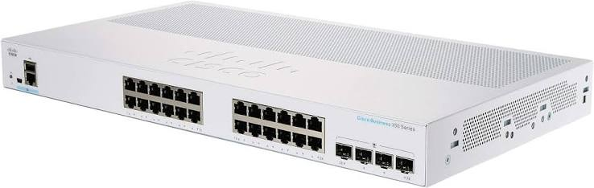 | 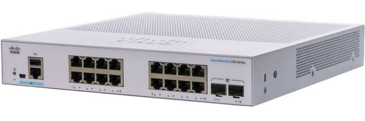 | 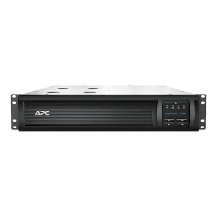 | 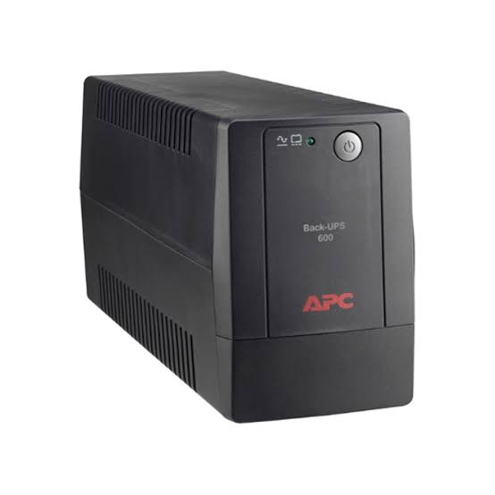 |
| **CBS350-24T-4G**<br>Switch principal · 1 | **CBS250-16T-2G**<br>Switch de área · 8 | **Smart-UPS 1000 VA**<br>Rackeable 2U · 1 | **Back-UPS 600 VA**<br>Compacto · 7 |

**Terminaciones y cordones**

| | | | |
| :---: | :---: | :---: | :---: |
| 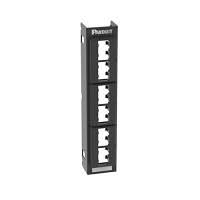 | 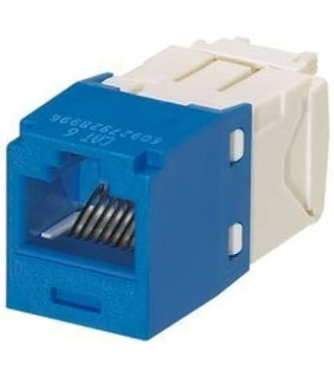 | 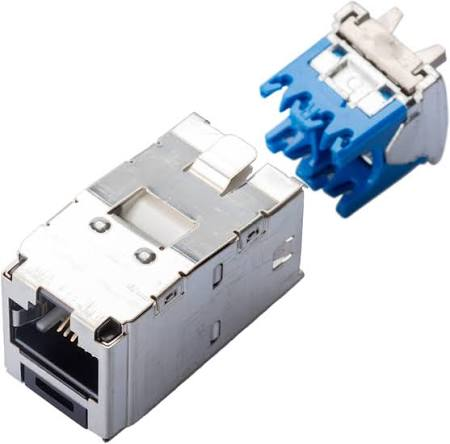 | 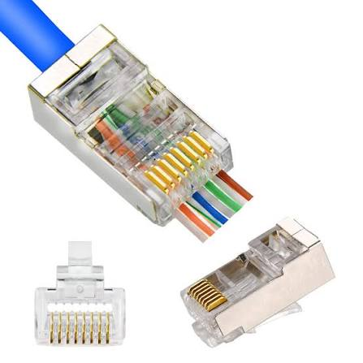 |
| **Patch panel 12p**<br>1U modular · 9 | **Jack Cat 6**<br>Horizontal · 96 | **Jack Cat 6A**<br>Apantallado · 16 | **Plug RJ45**<br>Contingencia · 50 |
| 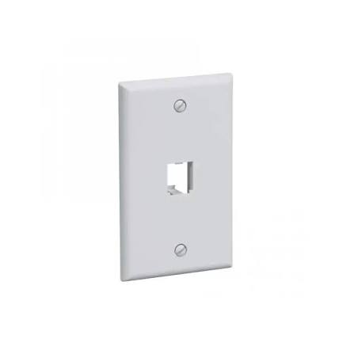 | 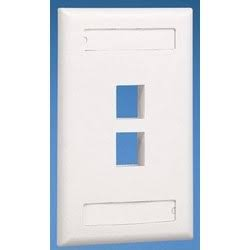 | 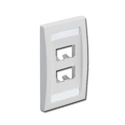 | 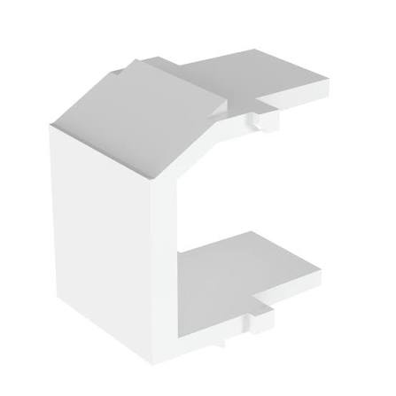 |
| **Faceplate 1p**<br>6 unidades | **Faceplate 2p**<br>7 unidades | **Faceplate 4p**<br>8 unidades | **Tapa ciega**<br>7 unidades |
| 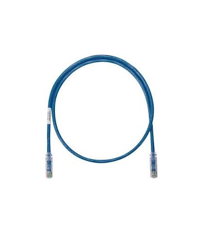 | 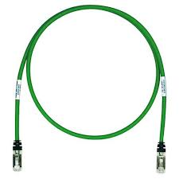 | 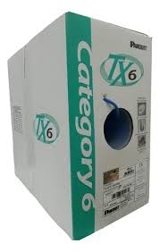 | 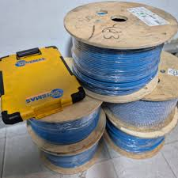 |
| **Patch cord Cat 6**<br>1–3 m · 96 | **Patch cord Cat 6A**<br>1–2 m · 16 | **Bobina Cat 6**<br>305 m · 2 | **Bobina Cat 6A**<br>305 m · 1 |

**Alojamiento, canalización e identificación**

| | | | |
| :---: | :---: | :---: | :---: |
| 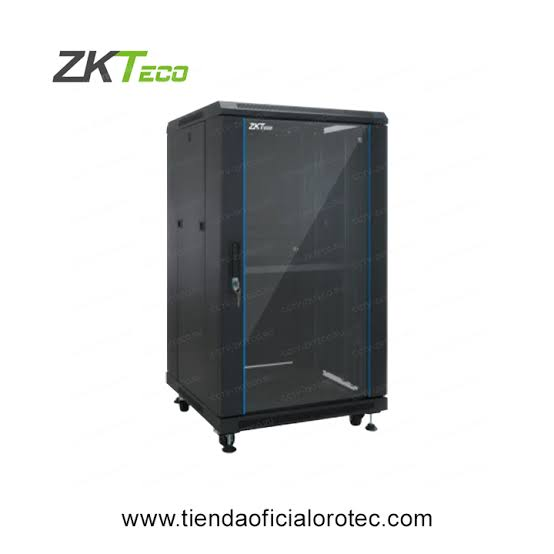 | 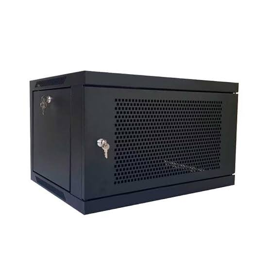 | 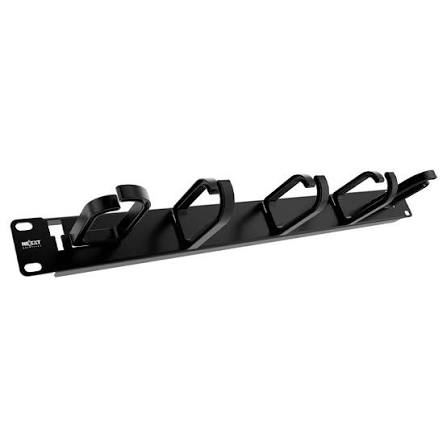 | 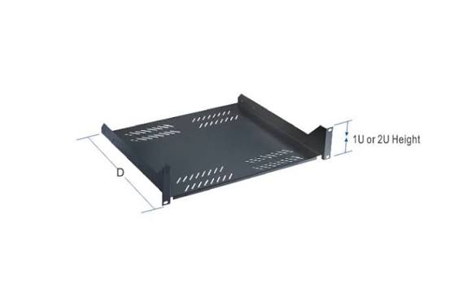 |
| **Gabinete 18U**<br>MDF · 1 | **Gabinete 6U**<br>De pared · 7 | **Organizador 1U**<br>9 unidades | **Bandeja 1U**<br>MDF · 1 |
| 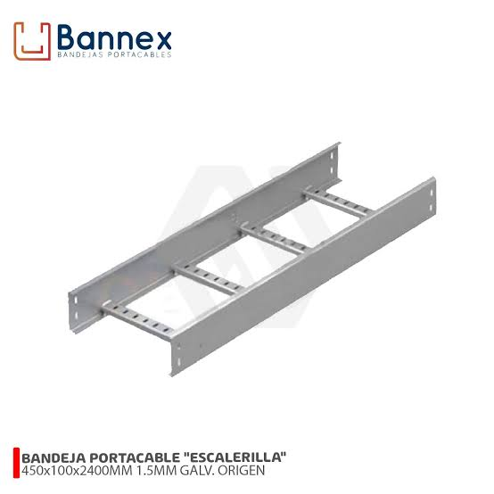 | 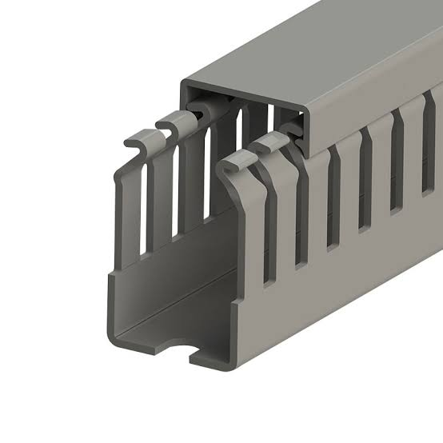 | 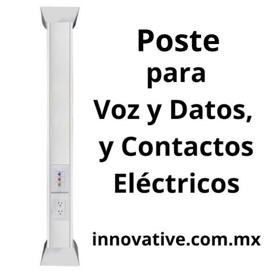 | 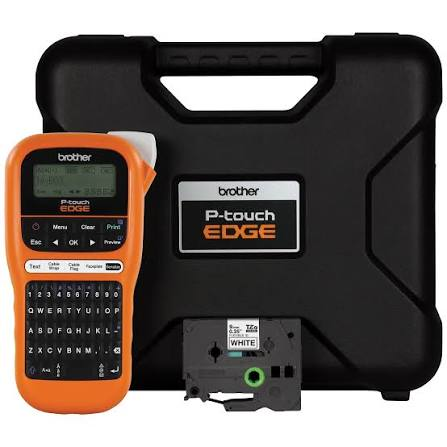 |
| **Escalerilla 100 mm**<br>54 m | **Canaleta 60×40**<br>190 m | **Poste de servicio**<br>Toma `E1` · 1 | **Rotuladora**<br>Etiquetado · 1 |

> Las imágenes provienen de los sitios de los fabricantes y se emplean con fines académicos de
> identificación del material especificado. Las fuentes se listan en §23.

---

## 5. Ubicación y justificación del MDF

**Ubicación seleccionada:** **Data Center** (X 24–28, Y 5–12), con el rack montado contra el muro
oeste del ambiente, junto a la puerta que comunica con el Área Abierta. Posición de referencia del
rack para todos los cálculos de este documento: **(24.5, 6.0)**.

**Cantidad de cuartos de telecomunicaciones:** uno solo. Al tratarse de un edificio de un único
nivel cuyo enlace más largo alcanza 29 m —menos de un tercio del límite normativo de 90 m—, no se
justifica ningún IDF (*Intermediate Distribution Frame*). La totalidad de los enlaces troncales
nace y muere en este MDF.

### 5.1 Alcance real del criterio de centralidad

El enunciado pide ubicar el centro de cableado en un punto que minimice la distancia hacia los
puntos de red. Conviene precisar el alcance de ese criterio en esta topología concreta.

El diseño es una **estrella extendida de dos niveles**: el switch principal alimenta a ocho
switches departamentales, y cada uno de ellos atiende exclusivamente a los hosts de su propia
área. En consecuencia, el cableado horizontal —los 48 enlaces entre cada switch de departamento y
sus hosts— **tiene la misma longitud independientemente de dónde se ubique el MDF**. La posición
del cuarto de telecomunicaciones afecta únicamente a los **ocho enlaces troncales**.

Esta observación no anula el criterio de centralidad, pero sí acota su peso: el ahorro que puede
producir una ubicación más céntrica se mide sobre ocho cables, no sobre cincuenta y seis. El
apartado 5.3 cuantifica ese ahorro y lo contrasta con los demás criterios normativos.

### 5.2 Justificación de la ubicación elegida

| Criterio (ANSI/TIA-569) | Cómo lo satisface el Data Center |
| --- | --- |
| Seguridad física | Es el único ambiente del edificio concebido como espacio técnico de acceso restringido. Se encuentra en el extremo opuesto al Vestíbulo de Ingreso, de modo que ningún visitante transita frente a él. |
| Condiciones ambientales | Al alojar tres servidores, el ambiente ya requiere climatización y control de humedad; el equipo activo de red se beneficia de esa misma infraestructura sin costo adicional. |
| Alimentación eléctrica | El ambiente ya exige circuito eléctrico dedicado, tierra física y respaldo, por ser el que concentra los servidores principales. |
| Concentración de espacios técnicos | Evita duplicar climatización, control de acceso y acometida eléctrica en dos cuartos distintos del edificio. |
| Proximidad a los servidores principales | El switch principal queda contiguo a los tres servidores del Data Center, que son el destino de mayor volumen de tráfico del edificio. El enlace troncal `MDF-DataCenter` se reduce a un patch cord dentro del propio rack. |
| Acceso a la canalización | La puerta del Data Center desemboca en el Área Abierta, sobre la cual corre la canalización principal, por lo que el MDF se conecta a la troncal sin obra intermedia. |
| Interferencia electromagnética | El ambiente no colinda con tableros eléctricos, motores ni cuartos de máquinas, y no existen tuberías de agua sobre él. |

Un beneficio adicional, propio de esta ubicación, es la **ruta del montante vertical**. El cableado
hacia la franja superior del edificio exige un montante que suba desde la canalización del Área
Abierta hasta el nivel de la franja superior. Ubicado el MDF en el Data Center, ese montante
asciende dentro del propio ambiente técnico (X ≈ 24.5) y penetra directamente en la Sala de
Capacitación, sin atravesar ninguna oficina ocupada.

### 5.3 Alternativa evaluada y descartada

Se evaluó la construcción de un cuarto de telecomunicaciones de 3 × 3 m recortado del Área Abierta
(X 13–16, Y 0–3), que es la posición geométricamente más céntrica disponible. La comparación de las
ocho rutas troncales, medidas en ángulo recto sobre la canalización, arroja lo siguiente:

| Enlace troncal | MDF en Data Center | MDF en cuarto central |
| --- | ---: | ---: |
| `MDF-Recepcion` | 29.0 m | 23.0 m |
| `MDF-RecursosHumanos` | 22.0 m | 16.0 m |
| `MDF-Legal` | 16.0 m | 11.0 m |
| `MDF-Capacitacion` | 10.0 m | 17.0 m |
| `MDF-Diseno` | 20.0 m | 11.0 m |
| `MDF-DireccionGeneral` | 14.0 m | 5.0 m |
| `MDF-Backend` | 8.0 m | 8.0 m |
| `MDF-DataCenter` | 2.0 m | 14.0 m |
| **Total de cable troncal** | **121.0 m** | **105.0 m** |
| **Distancia promedio** | 15.1 m | 13.1 m |

La ubicación céntrica ahorra **16 m de cable troncal en todo el edificio**, equivalentes al **5 %
de una bobina de 305 m**. A cambio, exige construir un ambiente nuevo con climatización, control de
acceso y circuito eléctrico dedicado propios —infraestructura que el Data Center ya posee—, obliga
a mantener dos espacios técnicos separados en lugar de uno, y su montante vertical debe atravesar
la Dirección General, con obra civil y registros dentro de una oficina ejecutiva.

Se descarta, por tanto, la alternativa céntrica: el beneficio medible es marginal y el costo, tanto
económico como operativo, es sustancialmente mayor.

Se descartó asimismo el **Vestíbulo de Ingreso** por incumplimiento directo del criterio de
seguridad física: es el punto de acceso al edificio y la zona de mayor tránsito de personal externo.

### 5.4 Verificación del límite de 90 m

La norma ANSI/TIA-568 establece un enlace permanente máximo de 90 m de cable sólido, más hasta 10 m
de patch cords, para un canal total de 100 m. Se verifica el caso más desfavorable de cada tipo de
cableado, incorporando los tramos verticales de subida y bajada y una holgura de servicio del 10 %:

| Caso más desfavorable | Ruta horizontal | Tramos verticales | Con holgura 10 % | ¿Cumple < 90 m? |
| --- | ---: | ---: | ---: | :---: |
| Troncal más largo: `MDF-Recepcion` | 29.0 m | 2.0 m | **34.1 m** | ✓ |
| Horizontal más largo: host extremo de Recepción | 12.5 m | 3.2 m | **17.3 m** | ✓ |

El enlace más largo del edificio utiliza el **38 % del límite normativo**, lo que deja un margen
superior a 55 m. Este resultado confirma dos cosas: que la ubicación del MDF puede decidirse por
criterios de seguridad y operación sin comprometer el desempeño, y que un segundo cuarto de
telecomunicaciones sería innecesario.

### 5.5 Ubicación de los gabinetes departamentales

Las distancias anteriores se calculan hasta el gabinete de pared de cada departamento, situado
junto a la puerta del ambiente para minimizar el recorrido hasta la canalización. Sus posiciones de
referencia son:

| Departamento | Posición del gabinete (X, Y) | Canalización de acometida |
| --- | :---: | --- |
| Diseño e Innovación | (7.0, 5.5) | Troncal principal del Área Abierta |
| Dirección General | (13.0, 5.5) | Troncal principal del Área Abierta |
| Backend | (19.0, 5.5) | Troncal principal del Área Abierta |
| Data Center | En el rack del MDF | Interna al rack |
| Recepción | (2.0, 12.5) | Ramal de la franja superior |
| Recursos Humanos | (9.0, 12.5) | Ramal de la franja superior |
| Legal | (15.0, 12.5) | Ramal de la franja superior |
| Sala de Capacitación | (21.0, 12.5) | Ramal de la franja superior |

El trazado completo de la canalización, incluido el montante vertical en X ≈ 24.5, se detalla en la
sección 14.

---

## 6. Topología física por departamento

**Topología global del edificio:** estrella extendida (árbol) de dos niveles — switch principal en el
MDF → 8 switches de departamento → hosts. El enunciado la impone al indicar un único switch principal
que distribuye hacia los switches de cada departamento.

### 6.1 Escala de criticidad adoptada

La criticidad de un segmento no se mide por su tamaño sino por el **impacto de su indisponibilidad
sobre la operación de la empresa**. Se adopta la siguiente escala, necesaria para que las ocho
justificaciones sean comparables entre sí:

| Nivel | Criterio | Departamentos |
| --- | --- | --- |
| **Crítica** | Su caída afecta la operación de todo el edificio | Data Center |
| **Alta** | Detiene la producción o la capacidad de decisión institucional | Backend, Dirección General |
| **Media-alta** | Alta demanda de datos y servidor propio de la unidad | Diseño e Innovación |
| **Media** | Degrada un servicio sin detener la operación | Recepción, Recursos Humanos, Legal |
| **Baja** | Uso intermitente y programado | Sala de Capacitación |

### 6.2 Topología seleccionada por departamento

| Departamento | Topología | Hosts | Criticidad | Factor dominante en la decisión |
| --- | --- | ---: | --- | --- |
| Recepción | Estrella | 4 | Media | Costo — la redundancia no se paga sola |
| Recursos Humanos | Estrella | 8 | Media | Escalabilidad del puesto administrativo |
| Legal | Estrella | 4 | Media | Aislamiento del tráfico confidencial |
| Sala de Capacitación | Estrella | 10 | Baja | Costo — es donde la malla sería más cara |
| Diseño e Innovación | Estrella | 8 | Media-alta | Ancho de banda dedicado por puesto |
| Dirección General | Estrella | 4 | Alta | Tolerancia a fallos pese a la baja densidad |
| Backend | Estrella | 7 | Alta | Aislamiento de fallos por enlace |
| Data Center | Estrella, integrada al rack del MDF | 3 | Crítica | Tolerancia a fallos y supresión del trayecto de cable |

Los ocho departamentos adoptan **topología en estrella**, resultado que no es una simplificación sino
una consecuencia de la arquitectura: al disponer cada área de un switch propio y de cableado
estructurado, cada host recibe un enlace dedicado hacia el concentrador, que es la definición misma de
la estrella. Lo que sí varía entre departamentos —y es lo que se justifica a continuación— es **cuál
de los tres factores domina la decisión en cada caso**.

**Recepción — 4 hosts, criticidad media.** Es, junto con Legal y Dirección, uno de los segmentos de
menor densidad; el switch de 16 puertos opera al 31 % de su capacidad. Su criticidad es media: aloja
el servidor de gestión de visitantes y constituye la cara visible de la empresa, de modo que una caída
degrada la atención al público sin detener la producción. El factor dominante es el **costo**: con
cuatro hosts, cualquier esquema redundante costaría más que el impacto de la falla que evitaría. Los
11 puertos libres absorben el crecimiento del área sin adquirir equipo activo.

**Recursos Humanos — 8 hosts, criticidad media.** Segunda mayor densidad de puestos administrativos
del edificio. Su criticidad es media: administra información sensible de personal, pero su operación
es de trámite y tolera interrupciones de horas sin efecto sobre el negocio. El factor dominante es la
**escalabilidad**: en estrella, incorporar un puesto consiste en tender un cable hasta el gabinete sin
interrumpir a los otros siete, mientras que en anillo obligaría a abrir el lazo y dejar sin servicio a
todo el departamento durante la intervención.

**Legal — 4 hosts, criticidad media.** Baja densidad y perfil ofimático. Su criticidad proviene de la
**confidencialidad**, no de la continuidad: lo determinante no es cuánto tarde en restablecerse el
servicio sino que su tráfico no sea accesible desde otros segmentos. La estrella es la única de las
topologías evaluadas que entrega tráfico exclusivamente al puerto de destino en lugar de difundirlo
por un medio compartido, y habilita además una segmentación lógica posterior por VLAN sin recablear
—capa 2, fuera del alcance de esta práctica, pero posibilitada por esta decisión física—.

**Sala de Capacitación — 10 hosts, criticidad baja.** Es el departamento de **mayor densidad** del
edificio y, a la vez, el de menor criticidad: su uso está ligado a sesiones programadas y su
indisponibilidad no detiene ninguna operación. El factor dominante es el **costo**, y es aquí donde la
ventaja de la estrella se cuantifica mejor: diez nodos en malla completa exigirían 45 enlaces frente a
los 10 de la estrella. Se acepta el menor margen de puertos libres del edificio —5— porque el aforo
del aula lo limita el espacio físico, no la red.

**Diseño e Innovación — 8 hosts, criticidad media-alta.** Alberga tres subáreas con perfiles de
tráfico distintos —Diseño UI/UX, Data Analytics y Laboratorio de QA— además de su propio servidor. Es
el segmento de mayor demanda de ancho de banda por puesto del edificio, por el manejo de activos
gráficos y conjuntos de datos. El factor dominante es el **ancho de banda dedicado**: en estrella cada
puesto dispone de la totalidad del enlace hasta el switch y ninguna subárea compite con otra por el
medio, situación opuesta a la del bus, donde el rendimiento de cada nodo se degrada conforme aumenta
la actividad de los demás.

**Dirección General — 4 hosts, criticidad alta.** Presenta la relación criticidad/densidad más
desfavorable del edificio: pocos hosts y alto impacto, ya que su indisponibilidad compromete la
capacidad de decisión y la comunicación externa de la empresa. Es el único departamento donde la
**tolerancia a fallos** pesaría más que el costo. Dentro de la estrella se mitiga con los 11 puertos
libres del switch, que permiten reubicar un puesto de forma inmediata ante la falla de un puerto, y
con la reserva del enlace de subida redundante documentada en §21.

**Backend — 7 hosts, criticidad alta.** Núcleo productivo de una empresa de desarrollo de software: su
indisponibilidad detiene compilaciones, despliegues y el trabajo del equipo completo. El factor
dominante es el **aislamiento de fallos por enlace**. En estrella, un cable dañado o un puerto en
falla afecta a un único desarrollador; en bus o en anillo, el mismo incidente dejaría sin servicio a
los siete. Para el segmento más productivo del edificio, ese aislamiento es el atributo decisivo.

**Data Center — 3 servidores, criticidad crítica.** Menor densidad del edificio y, simultáneamente,
mayor impacto por host: aloja los servidores principales, destino del tráfico de los ocho
departamentos. La estrella se implementa **dentro del propio rack del MDF**, decisión que aporta una
ventaja de tolerancia a fallos ausente en el resto: al no existir trayecto de cable por canalización,
desaparece toda una clase de fallos —daño mecánico, humedad, intervención accidental durante otras
obras— y el enlace troncal se reduce a un cordón de 2 m. Se evaluó dotarlo de un **segundo enlace de
subida redundante**, viable a costo casi nulo por compartir rack con el switch principal; se difiere
porque el enunciado establece un enlace troncal por departamento, y se documenta como mejora
prioritaria en §21.

### 6.3 Topologías evaluadas y descartadas

| Topología | Por qué se descartó |
| --- | --- |
| **Bus** | Todos los nodos comparten un único medio, de modo que el ancho de banda se reparte entre ellos y el rendimiento de cada puesto se degrada conforme aumenta la actividad de los demás —inaceptable en Diseño e Innovación y en Backend—. Un corte del medio deja fuera de servicio al segmento completo, y localizar la falla obliga a recorrer el bus entero. Es además incompatible con el equipo activo que el enunciado impone —un switch por departamento— y con el cableado estructurado en sí: se trata de una topología en desuso desde 10BASE-2 y 10BASE-5. |
| **Anillo** | Cada nodo se conecta a dos vecinos formando un lazo cerrado. La rotura de un solo enlace parte el anillo y, sin un segundo anillo que duplicaría el costo, interrumpe el segmento. El tráfico atraviesa nodos intermedios, sumando latencia proporcional al número de hosts, lo que resulta especialmente desfavorable en la Sala de Capacitación con sus 10 puestos. Incorporar un host obliga a abrir el anillo e interrumpir el servicio del área, contra la escalabilidad que exige el enunciado. Requiere además hardware específico —Token Ring, FDDI— hoy fuera del mercado. |
| **Malla completa** | Cada nodo se conecta directamente con todos los demás, de modo que el número de enlaces crece cuadráticamente según n(n−1)/2: 45 enlaces solo en la Sala de Capacitación y **1 128 enlaces** si se aplicara a los 48 puntos del edificio. Cada host requeriría n−1 interfaces de red. El costo de cable, canalización, terminación y certificación sería inviable, y la redundancia que aporta es innecesaria en hosts de usuario final, que no reencaminan tráfico. |
| **Malla parcial** | Descartada en el alcance de esta práctica, aunque no por deficiencia técnica: es la topología habitual entre nodos de backbone en edificios de mayor escala. Aquí no aplica porque el enunciado fija un único switch principal, lo que deja un solo nodo de agregación y ningún par de nodos entre los que tender enlaces alternativos. |

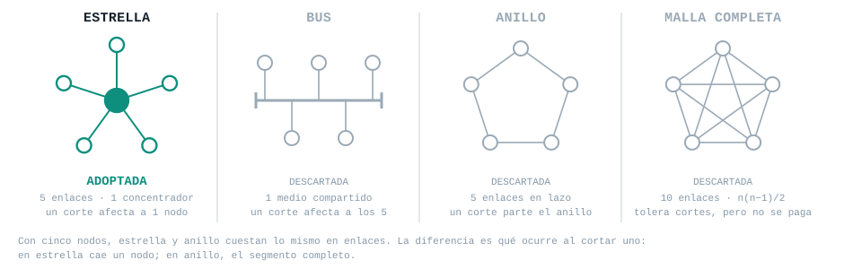

**Figura 1 — Las cuatro topologías con el mismo número de nodos.** Conviene notar que **estrella y
anillo cuestan lo mismo en número de enlaces**: con cinco nodos, cinco enlaces cada una. La razón para
descartar el anillo no es por tanto el costo, sino el comportamiento ante un corte —en estrella cae un
nodo; en anillo, el segmento completo—.

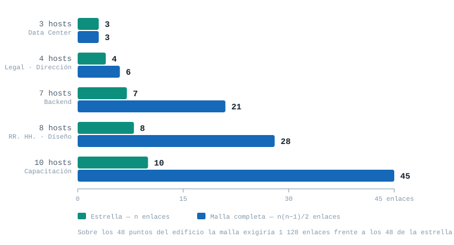

**Figura 2 — El costo de la malla, cuantificado.** Con tres hosts ambas topologías coinciden; a partir
de ahí la malla crece cuadráticamente. En la Sala de Capacitación son 45 enlaces contra 10, y sobre
los 48 puntos del edificio serían **1 128 contra 48**. El argumento de costo es aritmético, no de
apreciación.

### 6.4 Punto único de falla: reconocimiento explícito

Toda topología en estrella concentra el riesgo en su nodo central, y este diseño no es la excepción.
Conviene declararlo antes que omitirlo:

| Elemento | Alcance de su falla | Mitigación adoptada |
| --- | --- | --- |
| Switch de departamento | Deja sin servicio a los hosts de su área únicamente | Modelo único en los ocho departamentos: cualquier equipo sustituye a cualquier otro, y basta una unidad de repuesto en existencia para cubrir todo el edificio |
| Switch principal (MDF) | Interrumpe la comunicación **entre** departamentos y la salida al proveedor; el tráfico interno de cada área sigue conmutando localmente | Respaldo eléctrico mediante UPS (§16), ubicación en ambiente de acceso restringido y climatizado (§5), y reserva de puertos para un eventual equipo redundante (§21) |
| Enlace troncal | Aísla al departamento afectado del resto del edificio | Recorrido íntegro por canalización protegida (§14) y etiquetado que permite identificar el enlace sin trazar el cable (§17) |

La estandarización en un único modelo de switch de acceso, adoptada en §11.2 por razones de
cumplimiento normativo y de compra, produce aquí un beneficio adicional no previsto: **convierte una
sola unidad de repuesto en cobertura para los ocho departamentos**, que es la forma más económica de
tolerancia a fallos disponible en un diseño de este tamaño.

### 6.5 Representación gráfica: vista física y vista topológica

La topología descrita en este apartado se representa sobre el plano en **dos vistas complementarias**,
distinción habitual en documentación de infraestructura y que conviene explicitar para evitar que se
lean como versiones contradictorias del mismo dibujo:

| Vista | Cómo dibuja los enlaces | Para qué sirve |
| --- | --- | --- |
| **Física (de recorrido)** | En ángulos rectos, siguiendo la canalización real | Medir distancias, calcular metraje y bobinas (§10), replantear la obra |
| **Topológica (de adyacencia)** | En línea recta entre nodos | Comprender la estructura de la red: qué se conecta con qué y qué cae ante cada falla |

Un enlace que en la vista topológica aparece como una recta puede corresponder a un recorrido con
tres quiebres en la vista física; ambas describen el mismo cable. La vista topológica es la que hace
visible la **estrella extendida de dos niveles**: ocho estrellas departamentales cuyos centros son a
su vez los radios de una estrella mayor centrada en el MDF. En la vista física esa estructura queda
oculta, porque todos los enlaces se agrupan en las mismas bandejas.

El diagrama entregable incorpora la vista física —que es la que exige el enunciado al pedir la ruta de
canalización y el trazado diferenciado de troncal y horizontal— y añade la vista topológica como
lámina de apoyo.

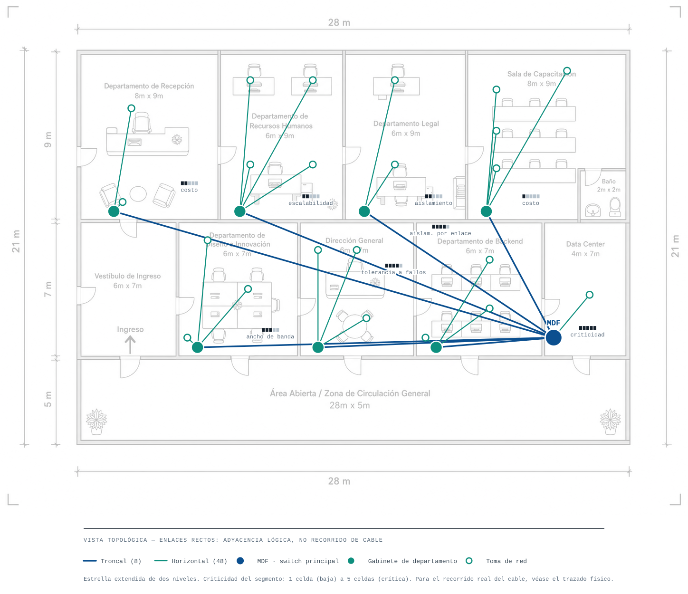

**Figura 3 — Vista topológica.** La misma red que traza la vista física de §7.5, pero con enlaces
rectos. La estructura que allí queda oculta —porque todos los cables se agrupan en las mismas
bandejas— aparece aquí de inmediato: **ocho estrellas departamentales cuyos centros son, a su vez,
los radios de una estrella mayor centrada en el MDF**. Bajo cada departamento se indica su criticidad
(de una celda, baja, a cinco, crítica) y el factor que domina su decisión de topología según §6.2.

---

## 7. Puntos de red y tipos de toma

**Total de puntos de red: 48** (42 equipos de usuario + 6 servidores), agrupados en **22 tomas**.

### 7.1 Criterio de dimensionamiento

El enunciado fija el criterio de forma explícita: la toma se define *"según la cantidad de
dispositivos que se conectarán en ese punto"*. Se adopta por tanto la siguiente regla, aplicada de
manera uniforme a los ocho departamentos:

> Una toma sirve a los dispositivos de un mismo puesto o mueble contiguo, y su número de puertos
> iguala la cantidad de dispositivos que atiende. Se instala una toma independiente cuando el
> dispositivo está físicamente separado del resto o requiere ubicación de acceso restringido, como
> es el caso de los servidores.

De esta regla se desprende la consecuencia central del apartado: **el diseño no incluye puertos de
reserva cableados**. Cada uno de los 48 puertos de toma atiende a un dispositivo real, de acuerdo con
la relación invariante de todo cableado estructurado —un puerto de toma equivale a un cable
horizontal y a un puerto de patch panel—. Provisionar puertos vacíos con cable tendido multiplicaría
el metraje, los jacks y las posiciones de panel sin dispositivo que los justifique, y desacoplaría el
conteo de terminaciones del total de 48 puntos de red que el enunciado toma como base para
dimensionar el patch panel del edificio (véase §11.3).

La reserva de crecimiento no desaparece: se traslada a tres capas que no consumen cable en la
instalación inicial y que se documentan en §21 —las posiciones libres de los marcos de patch panel
de 12 puertos, los puertos libres de cada switch, y los alojamientos ciegos de los faceplates de
cuatro posiciones—.

### 7.2 Distribución de tomas por departamento

| Departamento | Dispositivos | N.º de tomas | Composición por tipo | Puertos |
| --- | --- | ---: | --- | ---: |
| Recepción | 3 equipos + 1 servidor | 2 | 1 triple (mostrador) + 1 unitaria (servidor) | 4 |
| Recursos Humanos | 8 equipos | 4 | 4 dobles (cuatro escritorios de dos posiciones) | 8 |
| Legal | 4 equipos | 2 | 2 dobles (dos escritorios de dos posiciones) | 4 |
| Sala de Capacitación | 10 equipos | 4 | 3 triples (mesas de práctica) + 1 unitaria (instructor) | 10 |
| Diseño e Innovación | 7 equipos + 1 servidor | 3 | 1 cuádruple (clúster central) + 1 triple (QA y analítica) + 1 unitaria (servidor) | 8 |
| Dirección General | 4 equipos | 3 | 1 doble (mesa de reuniones) + 2 unitarias (dirección y asistencia) | 4 |
| Backend | 6 equipos + 1 servidor | 3 | 2 triples (dos filas de tres) + 1 unitaria (servidor) | 7 |
| Data Center | 3 servidores | 1 | 1 triple montada en rack | 3 |
| **TOTAL** | **48 dispositivos** | **22** | | **48** |

**Justificación por departamento.** En **Recepción** el mostrador en L concentra tres posiciones de
atención en un solo mueble, lo que hace de la toma triple la solución natural; el servidor de gestión
de visitantes recibe toma unitaria junto al gabinete, en ubicación de acceso restringido. En
**Recursos Humanos** y **Legal** el trabajo se organiza en escritorios de dos posiciones, de modo que
la toma doble corresponde exactamente al puesto físico. La **Sala de Capacitación** presenta tres
mesas largas de tres posiciones cada una —según el mobiliario del plano—, atendidas con una toma
triple por mesa, más una unitaria para el puesto del instructor. **Diseño e Innovación** alberga tres
subáreas con perfiles distintos: el clúster central de cuatro escritorios enfrentados se resuelve con
una toma de cuatro puertos alimentada por poste de servicio, los tres puestos de analítica y
laboratorio de QA comparten una toma triple, y el servidor de la unidad recibe unitaria. En
**Dirección General** los tres ambientes de uso son independientes entre sí —despacho, puesto de
asistencia y mesa de reuniones—, lo que impide agruparlos en una sola toma. **Backend** replica la
geometría del plano con una toma triple por cada fila de tres escritorios, más la unitaria del
servidor de compilación.

El caso del **Data Center** merece precisión: en un ambiente de rack no existe toma de pared, porque
los servidores se conectan mediante cordones de equipo directamente al panel del gabinete. La función
de toma del área de trabajo la cumple aquí un **panel keystone de tres puertos montado en el propio
rack**, que se contabiliza como una toma triple para efectos de inventario y etiquetado.

### 7.3 Resumen por tipo de toma

Este cuadro es el que alimenta el inventario de §4 y el presupuesto de §20.

| Tipo de toma | Cantidad | Puertos c/u | Puertos | Faceplate comercial | Tapas ciegas |
| --- | ---: | ---: | ---: | --- | ---: |
| Unitaria | 6 | 1 | 6 | 1 posición | 0 |
| Doble | 7 | 2 | 14 | 2 posiciones | 0 |
| Triple | 8 | 3 | 24 | 4 posiciones | 8 |
| Cuádruple | 1 | 4 | 4 | 4 posiciones | 0 |
| **TOTAL** | **22** | | **48** | | **8** |

Los faceplates se comercializan predominantemente en formatos de 1, 2, 4 y 6 posiciones. Las ocho
tomas triples se materializan por tanto sobre placas de cuatro posiciones con una tapa ciega, cuya
posición queda disponible para una ampliación futura —previa acometida de un nuevo cable horizontal—.

|  |  |
| :---: | :---: |
| Faceplate de 4 posiciones | Tapa ciega keystone |

**Figura 4 — Por qué no existe la toma triple.** El faceplate de la izquierda tiene cuatro
alojamientos; una toma triple ocupa tres con jacks y el cuarto se cierra con la tapa de la derecha. Esa
posición tapada no es un puerto de red: para habilitarla habría que tender un cable horizontal nuevo
hasta el patch panel, por lo que **no forma parte de los 48 puntos** ni del conteo de §11.3.

**Verificación del conteo:** (6 × 1) + (7 × 2) + (8 × 3) + (1 × 4) = 6 + 14 + 24 + 4 = **48
puertos**, coincidentes con los 48 dispositivos del §3 y con los 48 puertos poblados de patch panel
del §11.3.

### 7.4 Ubicación de las tomas sobre el plano

Las coordenadas siguen el sistema definido en §2.2. Cada toma constituye un único punto de acometida,
por lo que los cables que la alimentan comparten recorrido: los **48 enlaces horizontales se resuelven
sobre 22 rutas distintas**, dato que reduce la medición requerida en §10.

| Toma | Departamento | Posición (X, Y) | Tipo | Puertos | Sirve a |
| --- | --- | :---: | --- | ---: | --- |
| A1 | Recepción | (3.0, 18.0) | Triple | 3 | Mostrador de atención |
| A2 | Recepción | (2.5, 13.0) | Unitaria | 1 | Servidor de recepción |
| B1 | Recursos Humanos | (9.5, 19.5) | Doble | 2 | Escritorio norte-oeste |
| B2 | Recursos Humanos | (12.5, 19.5) | Doble | 2 | Escritorio norte-este |
| B3 | Recursos Humanos | (9.5, 15.0) | Doble | 2 | Escritorio sur-oeste |
| B4 | Recursos Humanos | (12.5, 15.0) | Doble | 2 | Escritorio sur-este |
| C1 | Legal | (16.5, 19.5) | Doble | 2 | Escritorio norte |
| C2 | Legal | (16.5, 15.0) | Doble | 2 | Escritorio sur |
| D1 | Sala de Capacitación | (21.5, 19.0) | Triple | 3 | Mesa de práctica 1 |
| D2 | Sala de Capacitación | (21.5, 16.8) | Triple | 3 | Mesa de práctica 2 |
| D3 | Sala de Capacitación | (21.5, 14.8) | Triple | 3 | Mesa de práctica 3 |
| D4 | Sala de Capacitación | (25.0, 20.0) | Unitaria | 1 | Puesto del instructor |
| E1 | Diseño e Innovación | (9.5, 8.5) | Cuádruple | 4 | Clúster central (poste de servicio) |
| E2 | Diseño e Innovación | (7.5, 11.0) | Triple | 3 | Analítica y laboratorio de QA |
| E3 | Diseño e Innovación | (6.5, 6.0) | Unitaria | 1 | Servidor de la unidad |
| F1 | Dirección General | (15.0, 10.5) | Unitaria | 1 | Despacho de dirección |
| F2 | Dirección General | (13.0, 10.5) | Unitaria | 1 | Puesto de asistencia |
| F3 | Dirección General | (15.5, 7.0) | Doble | 2 | Mesa de reuniones |
| G1 | Backend | (21.5, 10.0) | Triple | 3 | Fila de escritorios norte |
| G2 | Backend | (21.5, 7.5) | Triple | 3 | Fila de escritorios sur |
| G3 | Backend | (18.5, 6.0) | Unitaria | 1 | Servidor de compilación |
| H1 | Data Center | (24.5, 6.0) | Triple | 3 | Servidores principales (en rack) |

### 7.5 Representación sobre el plano

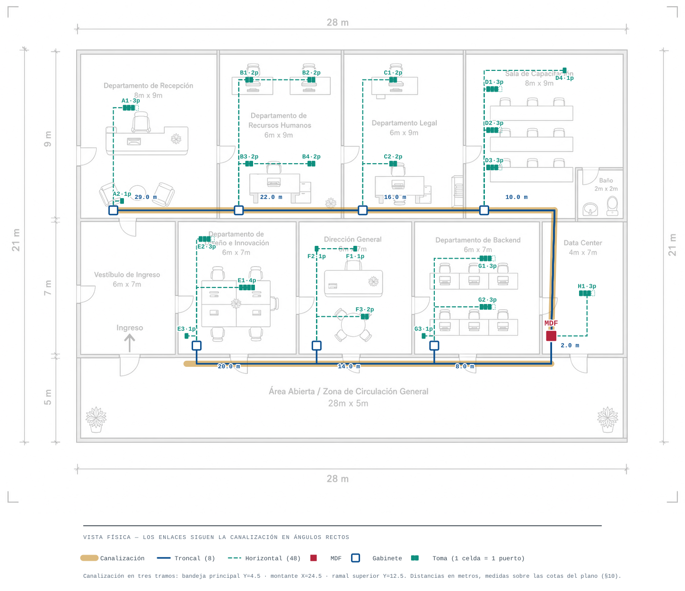

**Figura 5 — Vista física.** Canalización en sus tres tramos, MDF, los siete gabinetes
departamentales, los ocho enlaces troncales con su longitud, y las 22 tomas rotuladas con su número
de puertos. Los enlaces se trazan en ángulos rectos siguiendo la canalización real, que es la
geometría que sustenta el metraje de §10.

En el símbolo de toma, **cada celda representa un puerto cableado**; las ocho tomas triples muestran
una cuarta celda punteada, que es el alojamiento ciego del faceplate de cuatro posiciones descrito
en §7.3 y que no forma parte de los 48 puntos.

---

## 8. Medios de transmisión por segmento

### 8.1 Criterio de selección

El enunciado exige justificar el medio de cada segmento considerando **velocidad de uplink requerida,
distancia y costo/escalabilidad**. A esos tres ejes se antepone un principio que ordena la decisión:

> **La planta pasiva sobrevive a la activa.** La vida útil de un switch es de cinco a siete años; la
> de un cableado correctamente instalado y certificado, de quince a veinticinco. Sustituir equipo
> activo es una intervención de horas; recablear un edificio es una obra. En consecuencia, el medio
> físico se dimensiona para el horizonte largo y la electrónica se adquiere para la necesidad presente.

**Sobre el eje de la distancia conviene ser explícito:** en un edificio de 28 × 21 m **ninguna
distancia condiciona la elección**. El enlace horizontal más largo mide 14.7 m y el troncal más largo
31.0 m, frente a los 100 m de canal que admite cualquier categoría de cobre desde Cat 5e. Invocar la
distancia como argumento para elegir un medio superior sería incorrecto en este proyecto. Los
factores que sí deciden son el **ancho de banda agregado** y la **escalabilidad de la planta**.

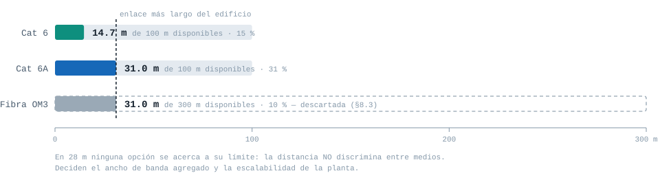

**Figura 6 — La distancia no discrimina.** Sobre una escala común, Cat 6 emplea el 15 % de su alcance,
Cat 6A el 31 % y la fibra multimodo apenas el 10 %. Las tres opciones sobran por márgenes amplios, de
modo que este eje no aporta ningún criterio de selección en un edificio de estas dimensiones.

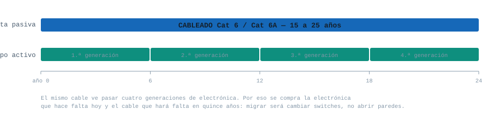

**Figura 7 — Por qué se sobredimensiona el cable.** En el horizonte de vida de un cableado
certificado, el equipo activo se renueva cuatro veces. Esa asimetría es la que justifica adquirir la
electrónica que resuelve la necesidad presente y una planta física capaz de sostener 10 Gbps: la
migración futura consistirá en sustituir switches, sin intervención de obra.

### 8.2 Medios seleccionados por segmento

| Segmento | Medio | Categoría / tipo | Distancia | Ancho de banda requerido | Justificación |
| --- | --- | --- | ---: | --- | --- |
| Horizontal: switch de depto → hosts (48 enlaces) | Cobre UTP | **Cat 6 U/UTP** 4 pares, 23 AWG, sólido | 1.0 – 14.7 m | 1 Gbps por puesto (1000BASE-T) | Cubre el requerimiento actual con margen y admite 10GBASE-T hasta ~55 m, muy por encima del enlace más largo del edificio. El sobrecosto frente a Cat 5e es marginal y esta última se encuentra en retirada comercial. |
| Troncal: MDF → Recepción | Cobre UTP apantallado | **Cat 6A U/FTP** | 31.0 m | 1 Gbps hoy · 10 Gbps de diseño | Agrega el tráfico de 4 puntos. Planta dimensionada a 10 Gbps. |
| Troncal: MDF → Recursos Humanos | Cobre UTP apantallado | **Cat 6A U/FTP** | 24.0 m | 1 Gbps hoy · 10 Gbps de diseño | Agrega 8 puntos administrativos. |
| Troncal: MDF → Diseño e Innovación | Cobre UTP apantallado | **Cat 6A U/FTP** | 22.0 m | 1 Gbps hoy · 10 Gbps de diseño | Agrega 8 puntos con manejo de activos gráficos y analítica; de los segmentos de mayor demanda. |
| Troncal: MDF → Legal | Cobre UTP apantallado | **Cat 6A U/FTP** | 18.0 m | 1 Gbps hoy · 10 Gbps de diseño | Agrega 4 puntos ofimáticos. |
| Troncal: MDF → Dirección General | Cobre UTP apantallado | **Cat 6A U/FTP** | 16.0 m | 1 Gbps hoy · 10 Gbps de diseño | Agrega 4 puntos; segmento de alta criticidad institucional. |
| Troncal: MDF → Sala de Capacitación | Cobre UTP apantallado | **Cat 6A U/FTP** | 12.0 m | 1 Gbps hoy · 10 Gbps de diseño | Agrega 10 puntos de uso simultáneo durante sesiones de formación. |
| Troncal: MDF → Backend | Cobre UTP apantallado | **Cat 6A U/FTP** | 10.0 m | 1 Gbps hoy · 10 Gbps de diseño | Agrega 7 puntos de desarrollo con compilación y despliegue continuos. |
| Troncal: MDF → Data Center | Cobre UTP apantallado | **Cat 6A U/FTP** (cordón) | 2.0 m | 10 Gbps | Enlace interno al rack. Une el switch principal con el switch de servidores, destino del mayor volumen de tráfico del edificio. |

**Uniformidad de la solución troncal.** Los ocho enlaces adoptan la misma categoría, aunque sus
longitudes varían entre 2 y 31 m. Diferenciar la categoría por departamento produciría un ahorro
despreciable —el troncal completo son 135 m— a cambio de multiplicar referencias de compra, repuestos
y herramienta de certificación. La uniformidad es aquí la decisión económicamente correcta.

**Sobre la electrónica.** Los switches que se instalan son de puertos gigabit, de modo que los
troncales operan inicialmente a 1 Gbps. La categoría del cable no se elige por lo que la red hace
hoy, sino para que la migración a 10 Gbps consista únicamente en sustituir switches, **sin abrir una
sola pared**. Esa es la aplicación concreta del principio enunciado en §8.1.

**Tabla de referencia de categorías.** Base normativa de la selección anterior:

| Categoría | Ancho de banda | Velocidad | Distancia máx. | Uso típico |
| --- | --- | --- | --- | --- |
| Cat 5e | 100 MHz | 1 Gbps | 100 m | Mínimo aceptable, en retirada |
| Cat 6 | 250 MHz | 1 Gbps (10 Gbps hasta ~55 m) | 100 m | Horizontal de oficina |
| Cat 6A | 500 MHz | 10 Gbps | 100 m | Troncales de cobre, backbone corto |
| Fibra MM OM3/OM4 | — | 10 Gbps | 300-550 m | Backbone de edificio/campus |
| Fibra SM OS2 | — | 10-100 Gbps | Kilómetros | Enlaces entre edificios |

**Regla ANSI/TIA-568 aplicada:** el enlace permanente horizontal no debe superar **90 m** de cable
sólido, más hasta 10 m de patch cords en ambos extremos = **100 m de canal máximo**.

### 8.3 Fibra óptica: alternativa evaluada y descartada

Se evaluó el empleo de fibra multimodo OM3/OM4 en los enlaces troncales. Se descarta, y conviene
precisar sobre qué argumentos, porque la razón habitual para elegir fibra **no aplica aquí**:

| Factor | Situación en este proyecto |
| --- | --- |
| Distancia | El troncal más largo mide 31 m. La fibra multimodo alcanza de 300 a 550 m y el cobre 100 m: ambos sobran holgadamente. **La distancia no aporta ningún argumento a favor de la fibra.** |
| Ancho de banda | Cat 6A entrega 10 Gbps, capacidad que excede la demanda proyectada de cualquier departamento del edificio. La ventaja de la fibra solo se materializaría por encima de 10 Gbps. |
| Inmunidad electromagnética | Sería un argumento válido si la canalización compartiera trayecto con acometidas de fuerza o maquinaria. No es el caso: el edificio es de oficinas y la ruta no colinda con tableros ni cuartos de máquinas. El apantallamiento del Cat 6A cubre el riesgo residual. |
| Costo y complejidad | Obliga a incorporar ODF, transceptores SFP+ en ambos extremos de los ocho enlaces, y una segunda disciplina de terminación —fusión o conectorización— con herramienta y personal distintos de los del cobre. |

La conclusión es que la fibra encarecería y complicaría la instalación sin resolver ninguna
limitación real del diseño. **Se documenta, en cambio, como ruta de migración** (§21): la canalización
propuesta queda dimensionada para alojar fibra en el futuro, de modo que un eventual salto a 40 o
100 Gbps en el backbone no exigiría rehacer la ruta, solo tender el nuevo medio sobre ella.

### 8.4 Consecuencia sobre el cómputo de bobinas

Al adoptarse **dos categorías distintas**, los subtotales de §10 corresponden a dos referencias
comerciales separadas y el cálculo de bobinas se resuelve por material:

| Material | Metros netos | Con holgura 10 % | Bobinas de 305 m | Capacidad | Margen |
| --- | ---: | ---: | ---: | ---: | ---: |
| Cat 6 U/UTP — cableado horizontal | 398.3 | 438.1 | **2** | 610 m | 171.9 m |
| Cat 6A U/FTP — cableado troncal | 135.0 | 148.5 | **1** | 305 m | 156.5 m |
| **TOTAL** | **533.3** | **586.6** | **3** | **915 m** | **328.4 m** |

Este resultado confirma la adquisición de **tres bobinas** ya anticipada en §10.5, pero por una razón
más sólida que la contingencia por desperdicio de corte: la separación de materiales la vuelve
obligatoria. Adicionalmente, los márgenes por material —171.9 m en Cat 6 y 156.5 m en Cat 6A— superan
con amplitud el remanente inservible al final de cada bobina, con lo que **el riesgo de quedarse sin
material durante la instalación queda eliminado**.

---

## 9. Cableado troncal vs. cableado horizontal

### 9.1 Qué es cada uno

El **cableado troncal** —o *backbone*— es el que amarra los armarios de telecomunicaciones entre sí.
En este edificio son los 8 cables que salen del switch principal del MDF y llegan al switch de cada
departamento. Cada uno carga el tráfico agregado de toda un área, así que si se corta uno, ese
departamento queda aislado del resto de la red aunque su switch siga funcionando por dentro.

El **cableado horizontal** es el que va del armario de un área hasta la toma de red de cada puesto.
Son 48 cables y cada uno lleva el tráfico de un solo host. Se le dice horizontal porque en un
edificio de varios niveles corre dentro de un mismo piso, mientras que el troncal es el que sube y
baja entre pisos por el montante. Acá, al ser un solo nivel, ambos corren en planta; pero la
distinción sigue valiendo, porque lo que los separa es **la función que cumplen, no la dirección en
que van**.

Hay una consecuencia práctica que conviene tener clara: el horizontal es cable sólido y forma un
*enlace permanente* que se poncha una vez y no se vuelve a tocar; el troncal, en cambio, es el punto
donde se concentra el riesgo, porque un solo cable representa a un departamento entero.

### 9.2 Comparación de los dos subsistemas

| Aspecto | Troncal (backbone) | Horizontal |
| --- | --- | --- |
| Recorrido | Switch principal del MDF ↔ switch de departamento | Switch de departamento ↔ toma del host |
| Cantidad en este diseño | 8 enlaces | 48 enlaces |
| Medio | Cat 6A U/FTP, 4 pares | Cat 6 U/UTP, 4 pares, 23 AWG sólido |
| Tráfico que transporta | Agregado de todo el departamento | De un solo host |
| Longitudes | 2.0 a 31.0 m | 1.0 a 14.7 m |
| Metraje total | 135.0 m | 398.3 m |
| Canalización | Escalerilla metálica en bandeja, montante y ramal | Canaleta PVC dentro del departamento |
| Terminación | Panel del MDF ↔ panel del área | Toma del puesto ↔ panel del área |
| Formato de etiqueta | `MDF-[Departamento]` | `[Departamento]-PR##` |
| Representación en el diagrama | Azul `#1668B8`, trazo de 2.2 px | Verde `#0E8F7E`, trazo de 1.5 px |

La diferencia de color y de grosor no es decorativa: es lo que permite contar los 8 troncales y los
48 horizontales por separado sobre el plano, que es la forma de verificar la topología sin seguir
cable por cable.

### 9.3 Los ocho enlaces troncales

| # | Etiqueta | Origen | Destino | Medio | Distancia |
| ---: | --- | --- | --- | --- | ---: |
| 1 | `MDF-Recepcion` | Switch principal (MDF) | Switch Recepción | Cat 6A U/FTP | 31.0 m |
| 2 | `MDF-RecursosHumanos` | Switch principal (MDF) | Switch RRHH | Cat 6A U/FTP | 24.0 m |
| 3 | `MDF-Diseno` | Switch principal (MDF) | Switch Diseño e Innovación | Cat 6A U/FTP | 22.0 m |
| 4 | `MDF-Legal` | Switch principal (MDF) | Switch Legal | Cat 6A U/FTP | 18.0 m |
| 5 | `MDF-DireccionGeneral` | Switch principal (MDF) | Switch Dirección General | Cat 6A U/FTP | 16.0 m |
| 6 | `MDF-Capacitacion` | Switch principal (MDF) | Switch Sala de Capacitación | Cat 6A U/FTP | 12.0 m |
| 7 | `MDF-Backend` | Switch principal (MDF) | Switch Backend | Cat 6A U/FTP | 10.0 m |
| 8 | `MDF-DataCenter` | Switch principal (MDF) | Switch Data Center | Cat 6A U/FTP (cordón) | 2.0 m |
| | | | | **Total** | **135.0 m** |

Las distancias incluyen los 2.0 m de tramos verticales de subida y bajada, tal como se calcula en
§10.3. El caso de `MDF-DataCenter` es distinto a los demás: ambos switches comparten el rack, así que
el "troncal" es en realidad un cordón de 2 m que no sale del gabinete.

### 9.4 Por qué el troncal existe

Vale la pena justificar por qué no se tiran los 48 cables directo al MDF, que es la alternativa
obvia. Si se hiciera, cada host necesitaría su propia corrida hasta el Data Center: las distancias
promedio pasarían de 8.3 m a más de 20 m, el metraje se iría de 533 m a cerca de 1 000 m, y toda la
canalización tendría que dimensionarse para 48 cables en el tramo final en lugar de 4. Además haría
falta un switch de 48 puertos en el MDF y desaparecería la posibilidad de intervenir un departamento
sin tocar el cuarto principal.

Los 8 troncales son, entonces, el mecanismo que convierte 48 corridas largas en 48 corridas cortas
más 8 largas. Esa es la razón de ser del cableado estructurado jerárquico.

---

## 10. Distancias estimadas y cálculo de bobinas

### 10.1 Método de estimación

1. Las distancias se miden **sobre las cotas del plano** (28 m × 21 m), aplicando el sistema de
   coordenadas de §2.2. Cada recorrido es la suma de diferencias entre las coordenadas del origen y
   del destino, ambas ya fijadas en §5.5 (gabinetes) y §7.4 (tomas).
2. La ruta se traza **por donde va la canalización**, en ángulos rectos — nunca en diagonal. Una
   medición diagonal representaría una longitud que la instalación real no puede materializar.
3. Se suman los **tramos verticales**, derivados de las alturas de montaje adoptadas: canalización a
   2.80 m, parte superior del gabinete de pared a 2.00 m y eje de la toma a 0.40 m del nivel de piso
   terminado. De ahí resultan **3.2 m por enlace horizontal** (0.8 m de subida al gabinete más 2.4 m
   de bajada a la toma) y **2.0 m por enlace troncal** (0.8 m en cada extremo, redondeado al alza).
4. Se aplica una **holgura de servicio (slack) del 10 %** sobre el total, destinada a curvas, radios
   mínimos, reservas de mantenimiento en el rack y el remanente que se deja en cada terminación.
5. Los enlaces internos al rack del MDF —el troncal `MDF-DataCenter` y los tres tendidos de la toma
   `H1`— se computan sin tramos verticales, por resolverse mediante cordones dentro del propio
   gabinete.

**Nota sobre la multiplicidad.** Conforme a §7, los 48 enlaces horizontales acometen a 22 tomas. Los
cables que alimentan una misma toma comparten íntegramente el recorrido, por lo que el cálculo se
organiza sobre las 22 rutas y cada una se multiplica por el número de puertos que sirve. La columna
*Cables* del cuadro siguiente hace explícita esa multiplicación.

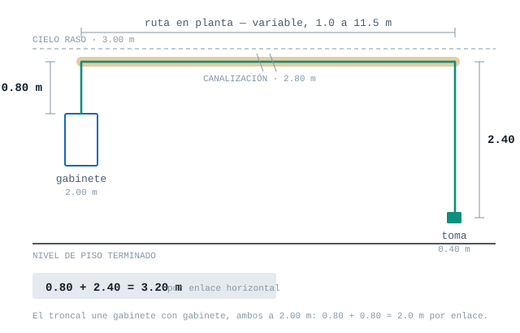

**Figura 8 — Origen de los 3.2 m verticales.** El cable no viaja en planta: asciende 0.80 m del
gabinete a la canalización y desciende 2.40 m hasta la toma. Sumados sobre los 45 enlaces horizontales
con acometida de pared, esos tramos representan 144 m —a los que se añaden 14 m de los troncales—, es
decir, cerca del **30 % de todo el cable del proyecto**. Omitirlos subestimaría la compra en más de
media bobina.

### 10.2 Cableado horizontal

| Toma | Etiquetas | Departamento | Cables | Ruta (m) | Vertical (m) | Por cable (m) | Total (m) |
| --- | --- | --- | ---: | ---: | ---: | ---: | ---: |
| A1 | `Recepcion-PR01…03` | Recepción | 3 | 6.5 | 3.2 | 9.7 | 29.1 |
| A2 | `Recepcion-PR04` | Recepción | 1 | 1.0 | 3.2 | 4.2 | 4.2 |
| B1 | `RecursosHumanos-PR01…02` | Recursos Humanos | 2 | 7.5 | 3.2 | 10.7 | 21.4 |
| B2 | `RecursosHumanos-PR03…04` | Recursos Humanos | 2 | 10.5 | 3.2 | 13.7 | 27.4 |
| B3 | `RecursosHumanos-PR05…06` | Recursos Humanos | 2 | 3.0 | 3.2 | 6.2 | 12.4 |
| B4 | `RecursosHumanos-PR07…08` | Recursos Humanos | 2 | 6.0 | 3.2 | 9.2 | 18.4 |
| C1 | `Legal-PR01…02` | Legal | 2 | 8.5 | 3.2 | 11.7 | 23.4 |
| C2 | `Legal-PR03…04` | Legal | 2 | 4.0 | 3.2 | 7.2 | 14.4 |
| D1 | `Capacitacion-PR01…03` | Sala de Capacitación | 3 | 7.0 | 3.2 | 10.2 | 30.6 |
| D2 | `Capacitacion-PR04…06` | Sala de Capacitación | 3 | 4.8 | 3.2 | 8.0 | 24.0 |
| D3 | `Capacitacion-PR07…09` | Sala de Capacitación | 3 | 2.8 | 3.2 | 6.0 | 18.0 |
| D4 | `Capacitacion-PR10` | Sala de Capacitación | 1 | 11.5 | 3.2 | 14.7 | 14.7 |
| E1 | `Diseno-PR01…04` | Diseño e Innovación | 4 | 5.5 | 3.2 | 8.7 | 34.8 |
| E2 | `Diseno-PR05…07` | Diseño e Innovación | 3 | 6.0 | 3.2 | 9.2 | 27.6 |
| E3 | `Diseno-PR08` | Diseño e Innovación | 1 | 1.0 | 3.2 | 4.2 | 4.2 |
| F1 | `DireccionGeneral-PR01` | Dirección General | 1 | 7.0 | 3.2 | 10.2 | 10.2 |
| F2 | `DireccionGeneral-PR02` | Dirección General | 1 | 5.0 | 3.2 | 8.2 | 8.2 |
| F3 | `DireccionGeneral-PR03…04` | Dirección General | 2 | 4.0 | 3.2 | 7.2 | 14.4 |
| G1 | `Backend-PR01…03` | Backend | 3 | 7.0 | 3.2 | 10.2 | 30.6 |
| G2 | `Backend-PR04…06` | Backend | 3 | 4.5 | 3.2 | 7.7 | 23.1 |
| G3 | `Backend-PR07` | Backend | 1 | 1.0 | 3.2 | 4.2 | 4.2 |
| H1 | `DataCenter-PR01…03` | Data Center | 3 | 1.0 | — | 1.0 | 3.0 |
| **TOTAL** | | | **48** | | | | **398.3** |

**Subtotal horizontal: 398.3 m** sobre 48 tendidos, con una longitud media de 8.3 m por enlace.

Agrupado por departamento, para efectos de logística de instalación:

| Departamento | Cables | Metros |
| --- | ---: | ---: |
| Recepción | 4 | 33.3 |
| Recursos Humanos | 8 | 79.6 |
| Legal | 4 | 37.8 |
| Sala de Capacitación | 10 | 87.3 |
| Diseño e Innovación | 8 | 66.6 |
| Dirección General | 4 | 32.8 |
| Backend | 7 | 57.9 |
| Data Center | 3 | 3.0 |
| **TOTAL** | **48** | **398.3** |

### 10.3 Cableado troncal

| Etiqueta | Ruta (m) | Vertical (m) | Subtotal (m) |
| --- | ---: | ---: | ---: |
| `MDF-Recepcion` | 29.0 | 2.0 | 31.0 |
| `MDF-RecursosHumanos` | 22.0 | 2.0 | 24.0 |
| `MDF-Diseno` | 20.0 | 2.0 | 22.0 |
| `MDF-Legal` | 16.0 | 2.0 | 18.0 |
| `MDF-DireccionGeneral` | 14.0 | 2.0 | 16.0 |
| `MDF-Capacitacion` | 10.0 | 2.0 | 12.0 |
| `MDF-Backend` | 8.0 | 2.0 | 10.0 |
| `MDF-DataCenter` | 2.0 | — | 2.0 |
| **Subtotal troncal** | **121.0** | | **135.0** |

### 10.4 Cálculo de bobinas

```
metros_totales = (subtotal_horizontal + subtotal_troncal) × (1 + slack)
               = ( 398.3 + 135.0 ) × (1 + 0.10)
               = 533.3 × 1.10
               = 586.6 m

bobinas = ⌈ metros_totales / 305 ⌉ = ⌈ 586.6 / 305 ⌉ = ⌈ 1.92 ⌉ = 2 bobinas
```

**Bobina estándar de UTP: 305 m (1000 ft).** El redondeo es siempre hacia arriba, porque una bobina
es una unidad de compra indivisible.

|  |  |
| :---: | :---: |
| Cat 6 U/UTP — 2 cajas (horizontal) | Cat 6A U/FTP — 1 caja (troncal) |

**Figura 9 — La unidad de compra.** El cable se vende en caja dispensadora de 305 m y **no se puede
partir la unidad**: de ahí que el redondeo sea siempre hacia arriba. Nótese también que son dos
referencias comerciales distintas, razón por la cual el cómputo se separa por material en §8.4 y las
tres cajas dejan de ser una recomendación para volverse una obligación de la solución adoptada.

### 10.5 Margen real y recomendación de adquisición

El cálculo estricto arroja **2 bobinas**, equivalentes a 610 m frente a los 586.6 m requeridos: un
excedente de **23.4 m, apenas el 3.8 %**. Ese margen resulta insuficiente en obra por una razón
específica del cableado estructurado: **ningún tendido admite empalme**. Cada enlace debe cortarse
continuo desde la bobina, de modo que cuando el remanente de una bobina es menor que el siguiente
tendido pendiente, ese remanente queda inutilizable. Con enlaces que alcanzan los 31 m en el troncal
de Recepción, el desperdicio esperable por fin de bobina es del orden de 10 a 15 m, lo que consume
íntegramente el excedente calculado. A ello se suman las reterminaciones por fallo de certificación,
habituales en cualquier instalación.

**Se recomienda por tanto adquirir 3 bobinas** (915 m). La tercera cubre el desperdicio de corte, las
reterminaciones y queda como existencia de mantenimiento para futuras adiciones y traslados. El
sobrecosto es marginal frente al riesgo de detener la instalación a la espera de material, y se
refleja como tal en el presupuesto de §20.

> **Resolución conforme a §8.** El cálculo anterior supone una única categoría de cable para todo el
> edificio, escenario que §8 descarta: el cableado horizontal se ejecuta en **Cat 6 U/UTP** y el
> troncal en **Cat 6A U/FTP**. Al tratarse de dos referencias comerciales distintas, el cómputo se
> separa por material —2 bobinas de Cat 6 para 438.1 m y 1 bobina de Cat 6A para 148.5 m—, de modo
> que **las tres bobinas dejan de ser una recomendación por contingencia y pasan a ser una
> obligación de la solución adoptada**. El desglose definitivo, con sus márgenes por material, se
> presenta en §8.4. El análisis de desperdicio de corte de este apartado conserva su validez como
> verificación: los márgenes resultantes (171.9 m y 156.5 m) lo absorben con amplitud.

---

## 11. Equipo activo: justificación y dimensionamiento

### 11.1 Función de cada elemento en el flujo de conexión

| Elemento | Función que cumple |
| --- | --- |
| Switch principal (MDF) | Núcleo de la estrella extendida. Concentra los ocho enlaces troncales y conmuta todo el tráfico entre departamentos; es además el punto donde se entrega el servicio del proveedor. Todo tráfico que cruce de un departamento a otro pasa obligatoriamente por él. |
| Switch de departamento | Punto de concentración del área. Termina el cableado horizontal de sus hosts y los agrega en un único enlace de subida (*uplink*) hacia el MDF, lo que evita tender un cable por host hasta el cuarto principal y reduce drásticamente el metraje y la ocupación de canalización. |
| Patch panel | Elemento **pasivo** de terminación. El cable horizontal es de conductor sólido y se fatiga al manipularse, de modo que nunca se conecta directamente al switch: se poncha de forma permanente en la parte posterior del panel y desde el frente se conecta al switch mediante un patch cord flexible. Cumple tres funciones —proteger la instalación permanente, permitir reconfigurar sin tocar la obra, y alojar el etiquetado de §17—. |
| ODF | **No aplica en este diseño.** El distribuidor de fibra sería necesario únicamente si algún segmento se resolviera en fibra óptica, alternativa evaluada y descartada en §8.3. |
| Rack / gabinete | Estructura normalizada que aloja y organiza el equipo, mide su capacidad en unidades de rack (1 U = 44.45 mm) y provee sujeción, orden y —en los gabinetes cerrados de departamento— control de acceso mediante llave. |
| UPS | Respaldo de energía del equipo activo. Sostiene la operación durante cortes breves y permite un apagado ordenado en los prolongados; regula además la calidad de la energía frente a picos y caídas de voltaje, que en la práctica es la causa más frecuente de daño al equipo. |
| Tomas de red | Interfaz del área de trabajo. Compuestas por el jack keystone —donde se poncha el cable horizontal— y el faceplate que lo sostiene, materializan el punto de conexión del usuario y son el extremo opuesto del enlace permanente que termina en el patch panel. |

|  |  |  |
| :---: | :---: | :---: |
| Patch panel modular 12p · 9 unidades | Organizador de cable 1U · 9 unidades | Bandeja fija 1U · 1 unidad |

**Figura 10 — Los tres elementos pasivos del gabinete.** El patch panel es modular: el marco trae 12
alojamientos y se pueblan con jacks según necesidad, que es la razón por la que §11.3 puede hablar de
"12p / 7 poblados" sin que eso sea un artificio de cálculo. El organizador guía los cordones respetando
el radio mínimo de curvatura, y la bandeja sostiene herramienta y documentación dentro del rack. Los
tres ocupan **1 U cada uno**, dato que alimenta directamente el cálculo de §15.1.

### 11.2 Dimensionamiento de switches de departamento

Regla aplicada: **puertos ≥ hosts del área + 1 uplink + reserva de crecimiento.**

| Departamento | Hosts | + Uplink | Mínimo | Switch elegido | Puertos libres |
| --- | ---: | ---: | ---: | --- | ---: |
| Recepción | 4 | 1 | 5 | 16p | 11 |
| Recursos Humanos | 8 | 1 | 9 | 16p | 7 |
| Legal | 4 | 1 | 5 | 16p | 11 |
| Sala de Capacitación | 10 | 1 | 11 | 16p | 5 |
| Diseño e Innovación | 8 | 1 | 9 | 16p | 7 |
| Dirección General | 4 | 1 | 5 | 16p | 11 |
| Backend | 7 | 1 | 8 | 16p | 8 |
| Data Center | 3 | 1 | 4 | 16p | 12 |

**Estandarización en un único modelo.** Los switches se comercializan en escalones de 8, 16, 24 y 48
puertos. Recursos Humanos, Capacitación, Diseño y Backend superan el escalón de 8 puertos al sumar el
uplink, por lo que requieren 16p necesariamente. Para los cuatro departamentos restantes —Recepción,
Legal, Dirección General y Data Center— un switch de 8 puertos bastaría para atender sus hosts; aun
así se adopta el modelo de 16 puertos en los ocho departamentos, por tres razones:

1. **Cumplimiento inequívoco de la regla del enunciado.** Con 16 puertos, la relación switch ≥ patch
   panel se satisface incluso comparando contra la capacidad del marco de 12 posiciones, no solo
   contra los puertos poblados. Elimina toda ambigüedad interpretativa (véase §11.3).
2. **Un solo modelo en planta.** Ocho equipos idénticos simplifican la compra, reducen el inventario
   de repuestos a una sola referencia y permiten que cualquier switch sustituya a cualquier otro ante
   una falla. Es la práctica habitual en el equipamiento de acceso de un sitio.
3. **Margen de crecimiento uniforme.** Los 72 puertos libres resultantes admiten prácticamente
   duplicar la población de hosts sin adquirir equipo activo adicional (véase §21).

El sobrecosto frente a la alternativa mixta se limita a cuatro equipos y queda reflejado en §20.

**Switch principal del MDF: 24 puertos.** Debe terminar los 8 enlaces troncales más el enlace hacia
el proveedor de servicio, con un mínimo de 9 puertos. Se selecciona el escalón de 24 puertos —y no el
de 16— porque el equipo de agregación concentra todo el tráfico entre departamentos y conviene
dotarlo de reserva para futuros segmentos, puntos de acceso inalámbrico o un segundo enlace de salida.


**Figura 11 — Switch principal: Cisco CBS350-24T-4G.** Los 24 puertos gigabit terminan los 8 troncales
y dejan 16 libres. A la derecha se distinguen los **4 puertos SFP**, que son los que hacen viable la
migración a fibra de §21.3 sin cambiar de equipo: bastaría poblar transceptores.


**Figura 12 — Switch de departamento: Cisco CBS250-16T-2G.** El mismo modelo en los ocho
departamentos. De sus 16 puertos, uno se destina al uplink hacia el MDF y el resto a los hosts del área.
Trae **2 puertos SFP**, de modo que el troncal también podría migrar a fibra desde el lado del
departamento. Que los ocho equipos sean idénticos es lo que convierte una sola unidad de repuesto en
cobertura para todo el edificio, según se argumenta en §6.4.

### 11.3 Dimensionamiento de patch panels y switches

**Regla del enunciado:** *el patch panel del edificio se dimensiona según la cantidad total de puntos
de red, y el switch seleccionado debe tener una cantidad de puertos igual o mayor a la del patch
panel **correspondiente**.*

**Interpretación aplicada.** La palabra *"correspondiente"* establece un emparejamiento
patch panel ↔ switch, no un panel monolítico único; y *"el patch panel del edificio"* se entiende
como la **capacidad de terminación total instalada en el edificio**. Bajo esa lectura, la capacidad
se distribuye: cada departamento aloja el patch panel de su cableado horizontal, y el MDF termina
únicamente los 8 enlaces troncales. La suma de puertos poblados en los departamentos da exactamente
48 — el total de puntos de red del edificio — con lo que el requisito queda cumplido de forma
literal y verificable, sin romper la separación troncal/horizontal que el mismo enunciado exige.

| Ubicación | Puntos a terminar | Patch panel (marco / poblado) | Switch | ¿Switch ≥ panel? |
| --- | ---: | --- | --- | :---: |
| Recepción | 4 | 12p / 4 | 16p | ✓ |
| Recursos Humanos | 8 | 12p / 8 | 16p | ✓ |
| Legal | 4 | 12p / 4 | 16p | ✓ |
| Sala de Capacitación | 10 | 12p / 10 | 16p | ✓ |
| Diseño e Innovación | 8 | 12p / 8 | 16p | ✓ |
| Dirección General | 4 | 12p / 4 | 16p | ✓ |
| Backend | 7 | 12p / 7 | 16p | ✓ |
| Data Center | 3 | 12p / 3 | 16p | ✓ |
| **Subtotal horizontal** | **48** | | | |
| MDF (8 troncales) | 8 | 12p / 8 | 24p | ✓ |

El uso de marcos de 12 puertos poblados parcialmente no es un artificio: los patch panels modulares
tipo keystone se comercializan así y se pueblan según necesidad. Las posiciones vacías quedan como
reserva documentada en §21 (escalabilidad futura).

**Verificación bajo ambas lecturas posibles.** La relación *switch ≥ patch panel* podría evaluarse
contra los puertos efectivamente terminados o contra la capacidad total del marco. El diseño la
satisface **bajo cualquiera de las dos interpretaciones**, lo que elimina el margen de discusión:

| Departamento | Puertos poblados | Capacidad del marco | Puertos del switch | ≥ poblados | ≥ marco |
| --- | ---: | ---: | ---: | :---: | :---: |
| Recepción | 4 | 12 | 16 | ✓ | ✓ |
| Recursos Humanos | 8 | 12 | 16 | ✓ | ✓ |
| Legal | 4 | 12 | 16 | ✓ | ✓ |
| Sala de Capacitación | 10 | 12 | 16 | ✓ | ✓ |
| Diseño e Innovación | 8 | 12 | 16 | ✓ | ✓ |
| Dirección General | 4 | 12 | 16 | ✓ | ✓ |
| Backend | 7 | 12 | 16 | ✓ | ✓ |
| Data Center | 3 | 12 | 16 | ✓ | ✓ |
| MDF (troncales) | 8 | 12 | 24 | ✓ | ✓ |

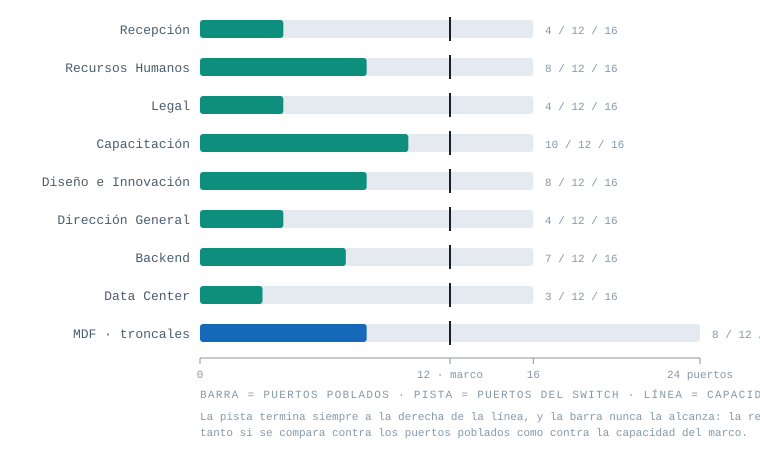

**Figura 13 — La regla verificada gráficamente.** La pista clara representa los puertos del switch, la
línea vertical la capacidad del marco de 12 posiciones y la barra llena los puertos poblados. La pista
termina siempre a la derecha de la línea y la barra nunca la alcanza, de modo que la relación se
satisface bajo las dos lecturas posibles en las nueve ubicaciones.

**Síntesis del criterio adoptado.** La capacidad de terminación del edificio se dimensiona según la
cantidad total de puntos de red y se distribuye entre las áreas: cada departamento aloja el patch panel
de su cableado horizontal, sumando 48 puertos poblados —igual al total de puntos de red del edificio—,
mientras que el patch panel del MDF termina los 8 enlaces troncales. Cada pareja panel/switch cumple la
relación de puertos exigida, y la verificación de la tabla anterior demuestra que lo hace bajo ambas
lecturas posibles del requisito.

---

## 12. Estándares T568A/T568B

### 12.1 Regla aplicada

- **Straight-through (directo):** mismo estándar en ambos extremos. Conecta dispositivos de **distinto
  tipo** (host ↔ switch, servidor ↔ switch). El cruce TX/RX lo resuelve el switch internamente.
- **Crossover (cruzado):** T568A en un extremo y T568B en el otro. Conecta dispositivos del **mismo
  tipo** (switch ↔ switch), porque ambos extremos transmiten por los mismos pines.

**Estándar seleccionado para todo el edificio: T568B.**

La elección se apoya en tres cosas. Primero, es el esquema predominante en instalaciones comerciales
de la región, así que cualquier técnico que llegue a dar mantenimiento se lo va a encontrar tal como
lo espera. Segundo, deriva del esquema AT&T 258A y es el que viene de fábrica en la mayoría de los
cordones y jacks que se distribuyen en el mercado local, lo que reduce el riesgo de mezclar estándares
por descuido. Y tercero —lo más importante desde el punto de vista eléctrico—: **entre A y B no hay
diferencia de desempeño**; los dos respetan el pareo de los cuatro pares trenzados. Lo que sí importa
es no mezclarlos dentro de una misma instalación, porque ahí sí se rompe el pareo y aparecen problemas
de crosstalk.

El cableado horizontal se poncha con el **mismo estándar en ambos extremos**: T568B en el jack de la
toma del área de trabajo y T568B en el jack del patch panel del departamento. Eso hace que el enlace
permanente quede pin a pin, es decir, straight-through.

### 12.2 Tabla de enlaces

El canal completo entre un host y su switch no es un solo cable, sino tres tramos. Conviene abrirlos
para que quede claro dónde aplica cada regla:

| # | Enlace | Cantidad | Extremo A | Extremo B | Tipo | Justificación técnica |
| ---: | --- | ---: | --- | --- | --- | --- |
| 1 | Host ↔ toma de red | 48 | Puerto NIC RJ45 del host (PC, laptop o servidor) | Jack de la toma | **Straight-through** | Son dispositivos de distinto tipo: el host transmite por los pines 1-2 y el switch, al otro lado del canal, recibe por esos mismos pines. El cruce lo resuelve el switch internamente, así que el cordón no debe cruzar nada. |
| 2 | Toma ↔ patch panel del área (enlace permanente) | 48 | Jack de la toma, ponchado T568B | Jack del patch panel, ponchado T568B | **Straight-through** | Mismo estándar en los dos extremos por exigencia del enunciado. Es cable sólido de 23 AWG y se poncha una sola vez; no es un cordón manipulable. |
| 3 | Patch panel del área ↔ switch del área | 48 | Puerto frontal del panel | Puerto del switch CBS250 | **Straight-through** | El panel es un elemento pasivo: no altera el orden de los pines, solo prolonga el enlace. El canal sigue siendo host ↔ switch. |
| 4 | Switch del área ↔ switch principal (troncal) | 8 | Puerto 16 del CBS250 (uplink) | Puerto del CBS350 en el MDF | **Crossover** | Son dispositivos del **mismo tipo**: ambos switches transmiten por los pines 1-2 y reciben por los 3-6. Sin cruzar, dos transmisores quedarían enfrentados y el enlace no levantaría. Se poncha T568A en el panel del MDF y T568B en el panel del área. |

**Cómo se materializa el crossover del troncal.** Como el troncal no va de switch a switch
directamente, sino pasando por un patch panel en cada punta, el cruce se hace en el **enlace
permanente**: se poncha un extremo en T568A y el otro en T568B. Con los cordones rectos de siempre en
ambas puntas, el canal resultante queda cruzado. Es la forma correcta de aplicar la regla clásica sin
tener que fabricar cordones especiales.

**Nota sobre Auto-MDIX.** En la vida real casi nadie ponchea crossover desde hace años. Todo switch
gigabit moderno —incluidos el CBS250 y el CBS350 de este diseño— trae **Auto-MDIX**, una función que
detecta si el par que tiene enfrente está cruzado o recto y ajusta internamente sus pines de
transmisión y recepción. Con Auto-MDIX activo, el enlace troncal levantaría igual estando cableado
straight-through, y de hecho 1000BASE-T lo exige por norma: usa los cuatro pares en modo bidireccional
y la negociación de MDI/MDI-X es obligatoria.

Aun así este diseño documenta y aplica la regla clásica, por dos motivos. Un enlace correctamente
cruzado funciona con o sin Auto-MDIX, mientras que uno recto depende de que la función esté habilitada.
Y en un troncal —el enlace más crítico del edificio— no conviene que la conectividad dependa de una
función de software que alguien puede desactivar en una configuración.

---

## 13. Disposición de pines documentada

### 13.1 Orden de colores de ambos estándares

Vista del conector RJ45 con los contactos hacia arriba y la pestaña hacia abajo; el pin 1 queda a la izquierda.

| Pin | T568A | T568B | Función (10/100BASE-T) |
| ---: | --- | --- | --- |
| 1 | Blanco/Verde | Blanco/Naranja | TX+ |
| 2 | Verde | Naranja | TX− |
| 3 | Blanco/Naranja | Blanco/Verde | RX+ |
| 4 | Azul | Azul | No usado |
| 5 | Blanco/Azul | Blanco/Azul | No usado |
| 6 | Naranja | Verde | RX− |
| 7 | Blanco/Café | Blanco/Café | No usado |
| 8 | Café | Café | No usado |

La única diferencia entre ambos: los pares **verde y naranja están intercambiados** (pines 1-2 ↔ 3-6).

|  |  |
| :---: | :---: |
| Jack Cat 6 — horizontal (96 unidades) | Jack Cat 6A apantallado — troncal (16 unidades) |

**Figura 14 — Donde se aplica el estándar.** El orden de colores de la tabla anterior no se elige al
ponchar a criterio propio: **viene rotulado en el cuerpo del jack**, con la secuencia de T568A por un
costado y la de T568B por el otro. Ponchar consiste en asentar cada par en la ranura que le corresponde
según el estándar elegido y cortar el excedente con la herramienta de impacto.

Nótese la diferencia física entre ambos jacks: el de Cat 6A lleva **carcasa metálica**, que es la que da
continuidad a la pantalla del cable. Esa continuidad es la que obliga a aterrizar el gabinete conforme a
§15.2 — una pantalla sin aterrizar se comporta como antena en lugar de como blindaje.

### 13.2 Cable straight-through — ejemplo real del diseño

**Enlace:** `Backend-PR07` (servidor de compilación de Backend)
**Extremos:** jack de la toma `G3`, en (18.5, 6.0) ↔ puerto 7 del patch panel de Backend
**Ambos extremos en T568B**, conforme a §12.1

| Pin | Extremo A — jack de la toma `G3` | Extremo B — patch panel Backend, puerto 7 | Par |
| ---: | --- | --- | :---: |
| 1 | Blanco/Naranja | Blanco/Naranja | 2 |
| 2 | Naranja | Naranja | 2 |
| 3 | Blanco/Verde | Blanco/Verde | 3 |
| 4 | Azul | Azul | 1 |
| 5 | Blanco/Azul | Blanco/Azul | 1 |
| 6 | Verde | Verde | 3 |
| 7 | Blanco/Café | Blanco/Café | 4 |
| 8 | Café | Café | 4 |

Cada pin va al mismo número en la otra punta: eso es lo que significa *straight-through*. Conviene
señalar además un detalle que suele pasar desapercibido: **el par 1 (azul) queda partido entre los
pines 4 y 5, en medio del par 3 (verde)**. No es un error del estándar sino una decisión deliberada,
tomada para mantener la compatibilidad con la telefonía analógica, que usaba justamente ese par central.

### 13.3 Cable crossover — ejemplo real del diseño

**Enlace:** `MDF-Backend` (troncal del switch principal al switch de Backend)
**Extremos:** patch panel del MDF, puerto 7 ↔ patch panel de Backend, posición de uplink
**T568A en el extremo del MDF y T568B en el extremo del área**

| Pin | Extremo A — panel del MDF (**T568A**) | Extremo B — panel de Backend (**T568B**) | ¿Cruza? |
| ---: | --- | --- | :---: |
| 1 | Blanco/Verde | Blanco/Naranja | Sí |
| 2 | Verde | Naranja | Sí |
| 3 | Blanco/Naranja | Blanco/Verde | Sí |
| 4 | Azul | Azul | No |
| 5 | Blanco/Azul | Blanco/Azul | No |
| 6 | Naranja | Verde | Sí |
| 7 | Blanco/Café | Blanco/Café | No |
| 8 | Café | Café | No |

El cruce afecta únicamente a los pares 2 y 3 —pines 1-2 y 3-6—, que son los que llevan transmisión y
recepción en 10/100BASE-T. Los pares 1 y 4 quedan iguales en ambos extremos.

Esto explica por qué un crossover hecho a mano sirve para 100 Mbps pero puede dar problemas en gigabit:
1000BASE-T usa **los cuatro pares** de forma bidireccional, así que un cruce parcial ya no describe
correctamente el enlace. Para gigabit el crossover formal cruza también los pares 1 y 4 (pines 4-5 con
7-8), y es otra razón de peso para que en la práctica todos confíen en Auto-MDIX.

### 13.4 Vista del conector

```
     Conector RJ45 macho, contactos hacia arriba y pestaña hacia abajo
     ┌─────────────────────────┐
     │  1  2  3  4  5  6  7  8 │   ← el pin 1 queda a la IZQUIERDA
     │  █  █  █  █  █  █  █  █ │
     └───────────┐   ┌─────────┘
                 └───┘   ← pestaña de retención (abajo, no se ve)

     T568B:  Bl/Na  Na  Bl/Ve  Az  Bl/Az  Ve  Bl/Ca  Ca
     T568A:  Bl/Ve  Ve  Bl/Na  Az  Bl/Az  Na  Bl/Ca  Ca
                                   └── solo cambian estos ──┘
```


**Figura 15 — El conector RJ45 real.** Se aprecian los **8 contactos dorados** —de ahí la designación
8P8C: ocho posiciones, ocho contactos— y la pestaña de retención plástica. Los contactos son las láminas
que perforan el aislamiento de cada conductor al engastar, razón por la cual **un conector no se
reutiliza**: una vez engastado, las láminas quedan deformadas.

Ojo con la orientación al ponchar: si se mira el conector con la pestaña arriba, el orden se invierte y
el pin 1 pasa a la derecha. Es el error más común al armar cables a mano y el tester lo reporta como
cableado invertido (*reversed pairs*).

> En este diseño los conectores macho son material de contingencia: los 112 cordones se adquieren
> **fabricados en planta** (§4.2), porque un cordón industrial viene certificado de origen y uno armado
> a mano es la causa más frecuente de fallo en la certificación del canal.

---

## 14. Canalización

**Tipo seleccionado para rutas principales: escalerilla metálica abierta de 100 mm**, suspendida del
cielo a 2.80 m del nivel de piso terminado.
**Tipo seleccionado para distribución interna y bajadas a tomas: canaleta de PVC de 60 × 40 mm con
tapa**, sobre pared.

### 14.1 Opciones evaluadas

| Tipo | Descripción | Ventajas | Desventajas | Decisión |
| --- | --- | --- | --- | --- |
| Escalerilla metálica abierta | Bandeja tipo escalera suspendida | Barata, ventilada, fácil de ampliar, permite inspección visual y soporta tramos largos | Acumula polvo, sin protección mecánica, estéticamente no va en área de oficina | **Adoptada** en rutas troncales |
| Escalerilla o ducto cerrado | Bandeja con tapa | Protección mecánica y contra polvo | Más cara, peor ventilación, agregar un cable obliga a destapar el tramo | Descartada: el volumen no lo amerita |
| Canaleta plástica | Canal de PVC sobre pared | Estética, barata, se instala sin obra | Capacidad limitada, expuesta a golpes a la altura del usuario | **Adoptada** en distribución interna |
| Tubería conduit | Tubo EMT o PVC | Máxima protección | Capacidad fija: llenarla obliga a tender otra tubería; no admite crecimiento | Descartada por rigidez |

|  |  |  |
| :---: | :---: | :---: |
| Escalerilla 100 mm — troncal (54 m) | Canaleta 60 × 40 — horizontal (190 m) | Poste de servicio — toma `E1` |

**Figura 16 — Las dos canalizaciones y la excepción.** La escalerilla de la izquierda explica por sí sola
las dos ventajas que se le atribuyen: al ser **abierta** se ve qué cables lleva dentro sin desmontar nada,
y agregar uno nuevo es apoyarlo encima en lugar de destaparlo todo. Su estructura de travesaños es la que
permite soportarla cada 1.5 m sobre el tramo de 22.5 m del ramal superior sin que pandee.

La canaleta del centro es lo contrario y por eso va dentro de las oficinas: **cerrada con tapa**, protege
del golpe al usuario que trabaja a un metro del cable y se instala sin romper pared.

El poste de la derecha resuelve el único punto del edificio que ninguna de las dos alcanza: la toma `E1`
alimenta el clúster de cuatro escritorios enfrentados en el centro de Diseño e Innovación, que no toca
ninguna pared. El poste baja del cielo con datos y fuerza hasta el mueble.

### 14.2 Ruta propuesta

El recorrido se resuelve en tres tramos que forman una **C acostada**, y sale de un hecho del plano
que ya se señaló en §2.3: el Área Abierta es lo único que toca a todos los ambientes de la franja
central, mientras que la franja superior no colinda con ningún corredor.

| Tramo | Recorrido | Longitud | Qué transporta |
| --- | --- | ---: | --- |
| **Bandeja principal** | Sobre el Área Abierta, en Y = 4.5, de X = 6.5 a X = 24.5 | 18.0 m | Los 3 troncales de la franja central: Diseño, Dirección y Backend |
| **Montante** | En X = 24.5, de Y = 4.5 a Y = 12.5, cruzando el Data Center hacia la Sala de Capacitación | 8.0 m | Los 4 troncales de la franja superior |
| **Ramal superior** | En Y = 12.5, de X = 24.5 a X = 2.0, sobre la pared divisoria de las franjas | 22.5 m | Los mismos 4 troncales, que se van desprendiendo en cada gabinete |
| | | **48.5 m** | Con soportería y desperdicio de corte: **54 m** (18 tramos de 3 m) |

De cada gabinete de área arranca la canaleta que reparte el horizontal dentro del departamento, baja
por la pared y remata en cada toma. Sumando las 22 rutas de §10.2 más las bajadas de 2.40 m, salen
unos 168 m netos que con holgura se compran como **190 m**.

La toma `E1` de Diseño e Innovación es la única excepción: alimenta el clúster de cuatro escritorios
enfrentados en el centro del ambiente, que no toca ninguna pared. Ahí no hay canaleta posible, así que
se resuelve con un **poste de servicio** que baja del cielo con datos y fuerza.

### 14.3 Justificación

**El volumen de cable es bajo y eso es el dato clave.** En el punto más cargado de la escalerilla
—el montante, justo al salir del MDF— corren únicamente **4 cables troncales**. Sobre una bandeja de
100 mm, eso es un llenado de menos del 5 %, muy por debajo del 40 % que recomienda ANSI/TIA-569 como
máximo. Sería tentador entonces bajar a canaleta también en el troncal y ahorrar; se decide no hacerlo
por tres razones concretas:

1. **Crecimiento.** §8.3 deja documentada la migración del backbone a fibra. Con escalerilla, tender
   esa fibra es apoyarla sobre la bandeja existente; con canaleta o conduit habría que abrir y
   posiblemente reemplazar la ruta completa. El sobrecosto de hoy compra la ampliación de mañana.
2. **Soporte mecánico en tramos largos.** El ramal superior mide 22.5 m de corrido. Una canaleta
   plástica a esa longitud pandea entre soportes y termina forzando el radio de curvatura del cable;
   la escalerilla metálica se soporta cada 1.5 m y mantiene el cable derecho sin tensión.
3. **Mantenimiento.** Al ser abierta, se ve qué hay dentro sin desmontar nada. En una instalación con
   solo 4 cables por tramo, poder identificar visualmente cuál es cuál vale más que la protección
   contra polvo que daría una tapa.

**Por qué canaleta dentro del departamento.** Ahí la lógica se invierte: los recorridos son cortos, van
a la vista dentro de oficinas ocupadas, y el usuario final está a un metro del cable. La canaleta con
tapa protege contra golpes, se ve prolija en un ambiente de trabajo y se instala sin romper pared.

**Radio de curvatura.** Para UTP de 4 pares el radio mínimo es de 4 veces el diámetro del cable en el
enlace permanente, unos 25 mm en Cat 6. Se respeta usando curvas y codos prefabricados en cada quiebre
—nunca doblando el cable contra el filo de la bandeja— y evitando amarres apretados: las cintas se
ajustan hasta que el mazo se sostenga, no hasta deformarlo. Un cable pinchado o sobre-doblado degrada
el NEXT y falla la certificación aunque haya continuidad en los ocho pines.

**Separación de la acometida eléctrica.** Donde la escalerilla corra en paralelo a un circuito de
fuerza se mantiene una separación mínima de 300 mm, y los cruces se hacen a 90°. El Cat 6A del troncal
es apantallado, lo que da margen adicional, pero la separación física sigue siendo la primera línea de
defensa contra interferencia.

---

## 15. Rack o gabinete del MDF

**Elección: gabinete de piso cerrado de 18 U**, de 600 mm de ancho por 800 mm de profundidad, con
puerta frontal de vidrio templado y cerradura.

### 15.1 Cálculo de unidades de rack

| Elemento | Cantidad | U c/u | U total |
| --- | ---: | ---: | ---: |
| Switch principal Cisco CBS350-24T-4G | 1 | 1 | 1 |
| Switch del Data Center Cisco CBS250-16T-2G | 1 | 1 | 1 |
| Patch panel de troncales (12p, 8 poblados) | 1 | 1 | 1 |
| Patch panel del Data Center (12p, 3 poblados) | 1 | 1 | 1 |
| Panel keystone de 3p — toma `H1` | 1 | 1 | 1 |
| Organizadores de cable horizontales | 2 | 1 | 2 |
| UPS APC Smart-UPS 1000 VA rackeable | 1 | 2 | 2 |
| Bandeja fija (herramienta, tester, documentación) | 1 | 1 | 1 |
| **Subtotal ocupado** | | | **10** |
| **Reserva de crecimiento (40 %)** | | | **4** |
| **Total requerido** | | | **14 U** |

> 1 U = 1.75 pulgadas (44.45 mm). Los escalones comerciales de gabinete de piso son 12, 15, 18, 22, 27
> y 42 U.

Con 14 U requeridas, el escalón de 12 U no alcanza y el de 15 U dejaría solo 1 U libre, que en la
práctica no es margen. Se adopta el de **18 U**, que queda ocupado al 56 % y deja **8 U disponibles**.

### 15.2 Justificación

|  |  |
| :---: | :---: |
| **Adoptado en el MDF** — gabinete de piso 18U | **Adoptado en las áreas** — gabinete de pared 6U |

**Figura 17 — La disyuntiva del enunciado, resuelta.** La comparación visual hace evidente el argumento
que se desarrolla abajo: el gabinete de piso descansa sobre el suelo y admite los 800 mm de profundidad
que hacen falta para trabajar por detrás, mientras que el de pared cuelga de un muro y ronda los 450 a
550 mm. Ambos son cerrados y con llave, y ambos llevan puerta transparente para leer los LED de estado
sin abrir. En este diseño **se usan los dos**: el de piso en el MDF y siete de pared en las áreas.

**Por qué de piso y no de pared.** El enunciado plantea la disyuntiva, y acá se resuelve por volumen y
por peso. Un gabinete de pared comercial llega hasta 12 U y está pensado para cargas de 40 a 60 kg. Este
MDF tiene que alojar 10 U de equipo, de las cuales 2 U son un UPS de baterías de plomo-ácido que pesa
por sí solo entre 15 y 20 kg, montado además en la parte baja. Colgar eso de un muro divisorio de
tabla-yeso es un riesgo estructural innecesario cuando el Data Center tiene el espacio de piso libre.

Hay dos argumentos adicionales. El primero es la **profundidad**: un gabinete de pared ronda los 450 a
550 mm, y aunque los switches de acceso caben, la gestión trasera del cable queda apretada; los 800 mm
del gabinete de piso permiten trabajar por detrás y respetar el radio de curvatura del Cat 6A, que es
más rígido que el UTP común por el apantallado. El segundo es el **crecimiento**: las 8 U libres son las
que hacen viables el switch redundante de §6.4 y el ODF de la migración a fibra de §8.3. En un gabinete
de pared de 12 U, con 10 ocupadas, esas mejoras se vuelven imposibles sin cambiar de gabinete.

**Por qué cerrado y con llave.** El Data Center es el único ambiente de acceso restringido del edificio
(§5.2), pero el gabinete agrega una segunda capa: quien entre al cuarto por mantenimiento de aire
acondicionado o de electricidad no queda con acceso físico al equipo de red. La puerta de vidrio permite
además leer los LED de estado sin abrir.

**Ventilación.** Al ser cerrado hay que resolver el flujo de aire. Se especifica con **rejillas
inferiores y kit de dos ventiladores en el techo**, con extracción hacia arriba. Los switches CBS250 y
CBS350 sin PoE disipan poco —del orden de 18 y 30 W— y el ambiente ya está climatizado por los
servidores (§5.2), así que la ventilación forzada del gabinete alcanza de sobra. Los equipos se montan
dejando 1 U libre entre el UPS y el resto, para que el calor de las baterías no suba directo al switch
principal.

**Puesta a tierra.** El gabinete se conecta a la barra de tierra del cuarto con conductor de cobre de
6 AWG. Esto no es opcional en este diseño: el troncal es Cat 6A **apantallado**, y una pantalla sin
aterrizar en al menos un extremo se comporta como antena en lugar de como blindaje, con lo que el
apantallamiento pasa de ayudar a estorbar.

---

## 16. Respaldo de energía (UPS)

**Alcance (fijo por el enunciado):** se respalda el equipo activo del edificio — switch central y
switches de departamento.

### 16.1 Estimación de consumo

| Equipo | Cantidad | W unitario | W total | Fuente del dato |
| --- | ---: | ---: | ---: | --- |
| Switch principal Cisco CBS350-24T-4G | 1 | 30 | 30 | Estimación de diseño sobre el rango de la clase (24p sin PoE: 20-40 W) |
| Switch de departamento Cisco CBS250-16T-2G | 8 | 18 | 144 | Estimación de diseño sobre el rango de la clase (16p sin PoE: 10-20 W) |
| **TOTAL** | **9** | | **174 W** | |

**Consumos de referencia:** switch 8-16 puertos sin PoE ≈ 10-20 W · switch 24 puertos ≈ 20-40 W ·
switch 48 puertos ≈ 40-70 W.

Se toma el extremo alto de cada rango de forma deliberada. Subestimar el consumo lleva a un UPS que se
satura en el momento en que más se necesita, y el sobrecosto de adoptar el valor conservador es mínimo.
En la etapa de compra los watts se confirman contra la hoja de datos vigente de cada modelo, dado que
las revisiones de fuente y de firmware modifican el dato.

### 16.2 Cálculo de capacidad agregada

Este es el cálculo que pide el enunciado: el respaldo del equipo activo del edificio tomado en conjunto.

```
1. Potencia_total  = 174 W
2. VA_requeridos   = 174 / 0.9        = 193.3 VA     (factor de potencia típico de fuente conmutada)
3. VA_con_margen   = 193.3 × 1.25     = 241.7 VA     (nunca cargar un UPS al 100 %)
4. UPS comercial   = 750 VA                          (escalón inmediato superior disponible)
```

**Resultado agregado: 750 VA** cubren con holgura los 174 W de los nueve switches del edificio.

### 16.3 Arquitectura de respaldo adoptada

Acá hay que hacer una precisión que el cálculo agregado esconde, y que es el punto interesante del
apartado: **esos 174 W no están en un solo lugar**. Están repartidos entre nueve equipos ubicados en
ocho ambientes distintos del edificio. Un UPS de 750 VA instalado en el MDF alimentaría el switch
principal y el del Data Center, pero no puede alimentar el switch de Recepción, que está a 29 m de
distancia. Para lograrlo habría que tender un circuito eléctrico regulado desde el MDF hasta cada
gabinete: ocho corridas de fuerza en paralelo a la canalización de datos, con el problema de
interferencia que eso implica y un costo de obra que supera varias veces el del propio respaldo.

Por eso el respaldo se distribuye igual que se distribuyó la conmutación:

| Ubicación | Carga a respaldar | W | UPS propuesto | Carga | Autonomía estimada |
| --- | --- | ---: | --- | ---: | --- |
| Rack del MDF | Switch principal + switch del Data Center | 48 | APC Smart-UPS 1000 VA / 700 W, 2 U | 7 % | > 90 min |
| Gabinete de cada área (× 7) | Switch del departamento | 18 | APC Back-UPS 600 VA / 330 W | 5 % | > 2 h |
| **TOTAL INSTALADO** | **9 switches** | **174** | **1 000 + 7 × 600 = 5 200 VA** | | |

**Por qué la capacidad instalada supera tanto lo calculado.** Los 5 200 VA instalados frente a los
241.7 VA que exige el cálculo se ven como un sobredimensionamiento enorme, y conviene explicarlo en
lugar de disimularlo: **la capacidad no la fija la carga, la fija el mínimo comercial**. No existen UPS
de 70 VA; el equipo más pequeño que se consigue con regulación de voltaje decente ronda los 500-600 VA.
Cuando la carga por punto es de 18 W, cualquier UPS del mercado queda holgado por definición.

Y eso trae un beneficio real: con cargas del 5 al 7 %, la autonomía se estira muchísimo. Un switch de
18 W en un UPS de 330 W aguanta horas, no minutos. En un edificio donde el corte típico dura unos
minutos, la red completa sobrevive sin que nadie note nada.

|  |  |
| :---: | :---: |
| **MDF** — Smart-UPS 1000 VA, rackeable 2U | **Áreas** — Back-UPS 600 VA, compacto |

**Figura 18 — Dos formatos para el mismo problema.** El de la izquierda es de **formato rack**: se
atornilla a los rieles del gabinete y ocupa 2 U de las 10 que computa §15.1. El de la derecha es de
**torre**, y va en el piso o en una repisa junto al gabinete de pared, precisamente para no colgar el peso
de las baterías del muro.

La diferencia de tamaño entre ambos refleja la diferencia de capacidad —1 000 VA contra 600 VA— pero no la
de carga: el grande respalda 48 W y cada pequeño 18 W. Ese contraste es el que explica el apartado
siguiente.

**Por qué el del MDF es rackeable y los de área no.** El del MDF ocupa 2 U dentro del gabinete (§15.1),
donde el espacio se administra por unidades y todo debe quedar fijo y aterrizado. Los de área son
gabinetes de pared de 6 U: ahí el UPS se coloca en el piso o en una repisa junto al gabinete, lo que
sale más barato y evita colgar el peso de las baterías del muro.

**Lo que este cálculo deja fuera.** El enunciado limita el alcance al equipo activo de red, así que los
**6 servidores no entran**. Es importante decirlo porque la diferencia de escala es grande: un servidor
de rack consume entre 300 y 500 W, de modo que los seis representan del orden de 2 400 W, casi catorce
veces el consumo de todos los switches juntos. En un proyecto real el Data Center llevaría su propio
UPS de 3 000 VA o más, dimensionado aparte y con by-pass de mantenimiento, y probablemente una planta
de emergencia detrás. Ese diseño queda fuera del alcance de esta práctica, pero el espacio y el
circuito eléctrico dedicado que §5.2 ya reconoce para el ambiente son justamente lo que lo haría
posible.

---

## 17. Etiquetado de cables

**Formato obligatorio del enunciado:**

- Cableado horizontal: `[Área/Departamento]-PR[##]` → ej. `Recepcion-PR01`, `Legal-PR03`
- Cableado troncal: `MDF-[Área/Departamento]` → ej. `MDF-Recepcion`, `MDF-Backend`

Cada cable se rotula en **ambos extremos**, con etiqueta autolaminada resistente a la abrasión, y el
mismo identificador se imprime en la posición correspondiente del patch panel y de la placa de la toma.
La regla es que se pueda identificar un cable sin necesidad de trazarlo.

### 17.1 Cableado troncal

| Etiqueta | Origen | Destino | Medio | Puerto en el MDF |
| --- | --- | --- | --- | :---: |
| `MDF-Recepcion` | Switch principal (CBS350) | Switch Recepción | Cat 6A U/FTP | 1 |
| `MDF-RecursosHumanos` | Switch principal | Switch RRHH | Cat 6A U/FTP | 2 |
| `MDF-Legal` | Switch principal | Switch Legal | Cat 6A U/FTP | 3 |
| `MDF-Capacitacion` | Switch principal | Switch Sala de Capacitación | Cat 6A U/FTP | 4 |
| `MDF-Diseno` | Switch principal | Switch Diseño e Innovación | Cat 6A U/FTP | 5 |
| `MDF-DireccionGeneral` | Switch principal | Switch Dirección General | Cat 6A U/FTP | 6 |
| `MDF-Backend` | Switch principal | Switch Backend | Cat 6A U/FTP | 7 |
| `MDF-DataCenter` | Switch principal | Switch Data Center | Cat 6A U/FTP (cordón) | 8 |

Los puertos 9 a 24 del switch principal quedan libres. El 24 se reserva para el enlace del proveedor de
servicio y el 23 para el equipo redundante que se plantea en §21.

### 17.2 Cableado horizontal

En todos los departamentos el uplink hacia el MDF ocupa el **puerto 16** del switch, que es el último
del equipo. Los hosts se numeran desde el puerto 1 en el mismo orden en que aparecen sus etiquetas.

| Etiqueta | Departamento | Puerto switch | Toma | Dispositivo |
| --- | --- | :---: | :---: | --- |
| `Recepcion-PR01` | Recepción | 1 | A1 | PC de atención 1 |
| `Recepcion-PR02` | Recepción | 2 | A1 | PC de atención 2 |
| `Recepcion-PR03` | Recepción | 3 | A1 | PC de atención 3 |
| `Recepcion-PR04` | Recepción | 4 | A2 | Servidor de gestión de visitantes |
| `RecursosHumanos-PR01` | Recursos Humanos | 1 | B1 | PC administrativa 1 |
| `RecursosHumanos-PR02` | Recursos Humanos | 2 | B1 | PC administrativa 2 |
| `RecursosHumanos-PR03` | Recursos Humanos | 3 | B2 | PC administrativa 3 |
| `RecursosHumanos-PR04` | Recursos Humanos | 4 | B2 | Laptop de jefatura de RRHH |
| `RecursosHumanos-PR05` | Recursos Humanos | 5 | B3 | PC administrativa 4 |
| `RecursosHumanos-PR06` | Recursos Humanos | 6 | B3 | PC administrativa 5 |
| `RecursosHumanos-PR07` | Recursos Humanos | 7 | B4 | PC administrativa 6 |
| `RecursosHumanos-PR08` | Recursos Humanos | 8 | B4 | PC administrativa 7 |
| `Legal-PR01` | Legal | 1 | C1 | PC de abogacía 1 |
| `Legal-PR02` | Legal | 2 | C1 | PC de abogacía 2 |
| `Legal-PR03` | Legal | 3 | C2 | PC de abogacía 3 |
| `Legal-PR04` | Legal | 4 | C2 | Laptop de diligencias externas |
| `Capacitacion-PR01` | Sala de Capacitación | 1 | D1 | PC de práctica 1 |
| `Capacitacion-PR02` | Sala de Capacitación | 2 | D1 | PC de práctica 2 |
| `Capacitacion-PR03` | Sala de Capacitación | 3 | D1 | PC de práctica 3 |
| `Capacitacion-PR04` | Sala de Capacitación | 4 | D2 | PC de práctica 4 |
| `Capacitacion-PR05` | Sala de Capacitación | 5 | D2 | PC de práctica 5 |
| `Capacitacion-PR06` | Sala de Capacitación | 6 | D2 | PC de práctica 6 |
| `Capacitacion-PR07` | Sala de Capacitación | 7 | D3 | Laptop de práctica 1 |
| `Capacitacion-PR08` | Sala de Capacitación | 8 | D3 | Laptop de práctica 2 |
| `Capacitacion-PR09` | Sala de Capacitación | 9 | D3 | Laptop de práctica 3 |
| `Capacitacion-PR10` | Sala de Capacitación | 10 | D4 | Laptop del instructor |
| `Diseno-PR01` | Diseño e Innovación | 1 | E1 | Laptop UI/UX 1 |
| `Diseno-PR02` | Diseño e Innovación | 2 | E1 | Laptop UI/UX 2 |
| `Diseno-PR03` | Diseño e Innovación | 3 | E1 | Laptop UI/UX 3 |
| `Diseno-PR04` | Diseño e Innovación | 4 | E1 | Workstation de diseño |
| `Diseno-PR05` | Diseño e Innovación | 5 | E2 | Workstation de Data Analytics 1 |
| `Diseno-PR06` | Diseño e Innovación | 6 | E2 | Workstation de Data Analytics 2 |
| `Diseno-PR07` | Diseño e Innovación | 7 | E2 | Workstation del Laboratorio de QA |
| `Diseno-PR08` | Diseño e Innovación | 8 | E3 | Servidor de la unidad |
| `DireccionGeneral-PR01` | Dirección General | 1 | F1 | Laptop de dirección general |
| `DireccionGeneral-PR02` | Dirección General | 2 | F2 | PC del puesto de asistencia |
| `DireccionGeneral-PR03` | Dirección General | 3 | F3 | Laptop de gerencia 1 |
| `DireccionGeneral-PR04` | Dirección General | 4 | F3 | Laptop de gerencia 2 |
| `Backend-PR01` | Backend | 1 | G1 | Workstation de desarrollo 1 |
| `Backend-PR02` | Backend | 2 | G1 | Workstation de desarrollo 2 |
| `Backend-PR03` | Backend | 3 | G1 | Workstation de desarrollo 3 |
| `Backend-PR04` | Backend | 4 | G2 | Workstation de desarrollo 4 |
| `Backend-PR05` | Backend | 5 | G2 | Workstation de desarrollo 5 |
| `Backend-PR06` | Backend | 6 | G2 | Workstation de desarrollo 6 |
| `Backend-PR07` | Backend | 7 | G3 | Servidor de compilación |
| `DataCenter-PR01` | Data Center | 1 | H1 | Servidor principal 1 |
| `DataCenter-PR02` | Data Center | 2 | H1 | Servidor principal 2 |
| `DataCenter-PR03` | Data Center | 3 | H1 | Servidor principal 3 |
| **48 enlaces** | | | **22 tomas** | |

### 17.3 Verificación de coherencia

| Comprobación | Resultado |
| --- | :---: |
| Etiquetas horizontales emitidas | 48 |
| Coincide con los puntos de red de §3 | ✓ |
| Coincide con los puertos de toma de §7.3 | ✓ |
| Coincide con los puertos poblados de patch panel de §11.3 | ✓ |
| Tomas referenciadas | 22, las mismas de §7.4 |
| Etiquetas troncales emitidas | 8, las mismas de §9.3 y §10.3 |
| Ninguna etiqueta repetida dentro del edificio | ✓ |

---

## 18. Comparación con el estándar TIA/EIA-606

El estándar **ANSI/TIA/EIA-606** (actualmente TIA-606-C) norma la **administración** de la
infraestructura de telecomunicaciones: cómo se identifica, etiqueta y documenta cada elemento.

| Aspecto | Esquema usado en esta práctica | Lo que exige TIA/EIA-606 |
| --- | --- | --- |
| Alcance de los identificadores | Solo cables: 48 horizontales y 8 troncales | Todo elemento de la infraestructura: cables, pares, terminaciones, patch panels, gabinetes, espacios de telecomunicaciones, rutas de canalización, tierras y aterrizajes |
| Estructura del identificador | Plano y descriptivo: `Departamento-PR##` | Jerárquico y posicional, del tipo `1A-B01:24` — piso, espacio, rack, panel, puerto—, de modo que el nombre indica dónde está el elemento |
| Codificación por colores | No define ninguna | Colores normalizados por función del cableado: naranja para demarcación de red, verde para interfaz de red, azul para horizontal, blanco para backbone entre edificios, gris para backbone dentro del edificio, café para backbone de campus |
| Registros y documentación | Tablas dentro de este manual, sin proceso de actualización | Exige registros formales, vinculados entre sí y actualizables ante cada movimiento, adición o cambio, con reportes y planos as-built que se mantienen vigentes |
| Unicidad del identificador | Única dentro del edificio | Única dentro de todo el conjunto administrado, incluido el campus |
| Clases de administración | No aplica | Define cuatro clases (1 a 4) según la complejidad del sitio: desde un solo espacio de telecomunicaciones hasta varios edificios en campus con enlaces externos |

### 18.1 Dos diferencias concretas

**Primera: el identificador de esta práctica no dice dónde está el cable.** La etiqueta `Legal-PR03`
informa el departamento y el número de punto, y nada más. Para saber en qué panel y en qué puerto
termina hay que ir a la tabla de §17.2. El 606 resuelve eso metiendo la ubicación **dentro** del propio
identificador: un rótulo como `1A-B02:07` se lee directo como piso 1, espacio A, panel B02, puerto 07.
La diferencia práctica es enorme: con el 606, un técnico que encuentra un cable suelto sabe de inmediato
adónde pertenece; con el esquema simplificado necesita el documento en la mano.

**Segunda: el 606 administra mucho más que cables.** Nuestro esquema etiqueta 56 cables y ahí termina.
El estándar exige identificar además cada patch panel, cada gabinete, cada espacio de
telecomunicaciones, cada tramo de canalización y el sistema de tierras, y mantener todo eso vinculado en
registros. En este diseño, por ejemplo, la escalerilla y el montante de §14 no llevan ningún
identificador: existen en el plano pero no en el sistema de administración. Bajo el 606 tendrían que
tenerlo, porque el día que haya que meter fibra por ahí, alguien necesita saber qué ruta es y qué lleva
dentro.

Una tercera diferencia que vale mencionar es la **unicidad**. `Legal-PR01` funciona porque hay un solo
edificio. Si QuetzalDev abre una segunda sede con su propio departamento Legal, esa etiqueta se duplica
y el conjunto de identificadores deja de ser válido. El 606 previene eso desde el diseño del esquema, no
después.

### 18.2 Por qué en un entorno real se usa el estándar completo

La razón se resume en el costo del tiempo de diagnóstico. En este edificio hay 56 cables y un solo
armario principal: si algo falla, se revisa el diagrama y en cinco minutos se ubica el enlace. En un
cuarto de telecomunicaciones o un data center real, con cientos o miles de cables terminados en decenas
de paneles, ese mismo problema cambia de naturaleza. Sin identificadores jerárquicos y sin registros
actualizados, encontrar un enlace deja de ser una consulta y se vuelve una búsqueda: hay que trazar
físicamente el cable o ir probando puertos con un tester.

Y el problema se agrava con el tiempo, no con el tamaño. Toda instalación acumula **movimientos,
adiciones y cambios** —los MAC, por *moves, adds and changes*—. Cada mudanza de puesto, cada equipo
nuevo, cada reparcheo va desactualizando la documentación. El 606 no es exigente por burocracia: exige
registros vinculados y un proceso de actualización precisamente porque sabe que la instalación va a
cambiar, y que una documentación desactualizada es peor que no tenerla, ya que lleva al técnico a
conclusiones equivocadas con confianza.

A eso se suma un punto contractual que suele pesar más que el técnico: las **garantías extendidas de
fabricante** —los 20 a 25 años que ofrecen Siemon o Panduit sobre instalaciones certificadas— exigen que
la administración cumpla el 606. Sin eso, no hay garantía que reclamar.

---

## 19. Flujo de conexión end-to-end

**Dispositivo elegido:** *Workstation de desarrollo 1* de Backend, cuyo punto de red es
`Backend-PR01`. Se traza su camino completo hasta un servidor del Data Center, que es el destino más
frecuente de su tráfico.

```
[ Workstation de desarrollo 1 — Backend ]           NIC RJ45 integrada
  │
  ↓ patch cord Cat 6 de 2 m, straight-through, T568B en ambas puntas
  │
[ TOMA G1 — triple, en (21.5, 10.0) ]               etiqueta: Backend-PR01
  │                                                  celda 1 de 3 del faceplate de 4 posiciones
  ↓ ENLACE PERMANENTE — cable horizontal Cat 6 U/UTP 23 AWG sólido
  ↓ ponchado T568B en los dos extremos
  ↓ recorrido: 7.0 m en planta + 3.2 m de tramos verticales = 10.2 m
  ↓ ruta: 2.40 m de bajada por canaleta PVC 60×40 → tramo en canaleta dentro de
  ↓        Backend → 0.80 m de subida al gabinete de pared
  │
[ PATCH PANEL DE BACKEND — puerto 7 de 12 ]         gabinete de pared 6U, en (19.0, 5.5)
  │                                                  posterior: ponchado permanente
  ↓ patch cord Cat 6 de 1 m, straight-through
  │
[ SWITCH BACKEND — Cisco CBS250-16T-2G, puerto 1 ]  7 hosts en los puertos 1 a 7
  │
  ↓ UPLINK — puerto 16
  ↓ patch cord Cat 6A de 1 m
  │
[ PATCH PANEL DE BACKEND — posición de uplink ]     ponchado T568B  ◄── el crossover
  │                                                                     empieza acá
  ↓ TRONCAL — cable Cat 6A U/FTP apantallado          etiqueta: MDF-Backend
  ↓ CROSSOVER: T568B en este extremo, T568A en el del MDF
  ↓ longitud: 8.0 m en planta + 2.0 m verticales = 10.0 m
  ↓ ruta: escalerilla metálica de la bandeja principal (Y = 4.5), de X = 19.0 a X = 24.5
  │
[ PATCH PANEL DE TRONCALES DEL MDF — puerto 7 de 12 ]  ponchado T568A  ◄── acá cierra
  │                                                                        el cruce
  ↓ patch cord Cat 6A de 1 m
  │
[ SWITCH PRINCIPAL — Cisco CBS350-24T-4G, puerto 7 ]   gabinete de piso 18U, Data Center
  │
  ↓ conmutación interna: el switch principal decide el puerto de salida
  ↓ patch cord Cat 6A de 1 m — puerto 8 (troncal MDF-DataCenter)
  │
[ SWITCH DATA CENTER — Cisco CBS250-16T-2G, puerto 1 ] mismo rack, cordón de 2 m
  │
  ↓ patch cord Cat 6 de 1 m
  │
[ PANEL KEYSTONE H1 — puerto 1 de 3 ]                  etiqueta: DataCenter-PR01
  │
  ↓ cordón de equipo de 1 m
  │
[ SERVIDOR PRINCIPAL 1 ]                               NIC RJ45
```

### 19.1 Lectura del recorrido

El tráfico atraviesa **cuatro terminaciones pasivas y tres switches** para llegar de un extremo a otro
del edificio. Vale la pena notar tres cosas de ese camino.

La primera es que **ningún cable sólido llega nunca a un equipo activo**. Entre el cable horizontal y el
switch siempre hay un patch panel y un cordón flexible en medio. Eso no es un capricho de diseño: el
conductor de 23 AWG sólido se fatiga y se fractura al manipularse, así que se poncha una vez en el panel
y no se vuelve a tocar. Todo el reparcheo posterior se hace con cordones.

La segunda es que **el crossover del troncal no está en un cordón, sino en el enlace permanente**. Se
poncha T568B del lado de Backend y T568A del lado del MDF; los cuatro cordones que intervienen son
rectos. Es la forma limpia de aplicar la regla de §12 sin fabricar cables especiales.

La tercera es la longitud total. Sumando enlaces permanentes y cordones, el canal completo desde la
workstation hasta el servidor mide alrededor de **27 m**. El límite normativo es de 100 m por canal, y
acá se están usando dos canales encadenados que individualmente ni se acercan: el horizontal de Backend
usa 10.2 m de los 90 m permitidos, y el troncal 10.0 m. La red está sobrada por márgenes muy amplios,
que es exactamente lo que §5.4 verificó para el caso más desfavorable del edificio.

### 19.2 Qué se cae en cada punto

Recorrer el flujo al revés sirve para ver el alcance de cada falla, que es el otro uso de este apartado:

| Si falla… | Deja sin servicio a | Se detecta por |
| --- | --- | --- |
| El patch cord del puesto | Un host | El LED del puerto del switch queda apagado |
| El enlace permanente `Backend-PR01` | Un host, de forma persistente | Certificación con tester; requiere reterminar o reparchear a otro puerto |
| El switch de Backend | Los 7 hosts de Backend | Todo el departamento pierde red a la vez |
| El troncal `MDF-Backend` | Backend queda aislado del resto del edificio, pero su tráfico interno sigue conmutando | Los 7 hosts se ven entre sí pero no alcanzan el Data Center |
| El switch principal | La comunicación **entre** departamentos y la salida al proveedor; el tráfico interno de cada área sobrevive | Ocho departamentos aislados simultáneamente |

Esta tabla es la que hace concreto el reconocimiento del punto único de falla de §6.4: el troncal aísla
un departamento, el switch principal aísla ocho.

---

## 20. Presupuesto estimado

> **Naturaleza de la estimación.** Los valores de la columna *Precio unitario* son **estimaciones de
> referencia** construidas sobre rangos habituales del mercado guatemalteco a la fecha de este
> documento, no cotizaciones formales. Su función es dimensionar el orden de magnitud del proyecto y
> permitir la comparación entre compra directa e integrador que se desarrolla en §22. La ejecución
> requiere sustituirlos por cotización en firme, dado que el equipo activo importado se mueve con el
> tipo de cambio y el cobre fluctúa con el mercado internacional.

### 20.1 Presupuesto detallado

| # | Ítem | Descripción / modelo | Cantidad | Precio unitario (Q) | Subtotal (Q) |
| ---: | --- | --- | ---: | ---: | ---: |
| 1 | Bobina Cat 6 U/UTP (305 m) | Panduit TX6, 23 AWG sólido — cableado horizontal | 2 | 1 450 | 2 900 |
| 2 | Bobina Cat 6A U/FTP (305 m) | Panduit TX6A apantallado — cableado troncal | 1 | 3 200 | 3 200 |
| 3 | Jack keystone Cat 6 | Panduit Mini-Com CJ688TG (96 + 4 de repuesto) | 100 | 45 | 4 500 |
| 4 | Jack keystone Cat 6A apantallado | Panduit Mini-Com serie apantallada (16 + 2 de repuesto) | 18 | 110 | 1 980 |
| 5 | Faceplates | 6 de 1 posición, 7 de 2, 8 de 4 | 21 | 30 | 630 |
| 6 | Tapas ciegas | Para la posición libre de las tomas triples | 7 | 8 | 56 |
| 7 | Patch panel modular 12p (1U) | 8 de área + 1 de troncales | 9 | 320 | 2 880 |
| 8 | Panel keystone 3p (1U) | Toma `H1` del Data Center | 1 | 180 | 180 |
| 9 | Patch cord Cat 6 (1–3 m) | 48 host↔toma + 48 panel↔switch | 96 | 45 | 4 320 |
| 10 | Patch cord Cat 6A (1–2 m) | 2 por enlace troncal | 16 | 120 | 1 920 |
| 11 | Conectores RJ45 Cat 6 | Bolsa de 50, para contingencias de obra | 1 | 350 | 350 |
| 12 | Switch principal | Cisco CBS350-24T-4G | 1 | 8 900 | 8 900 |
| 13 | Switch de departamento | Cisco CBS250-16T-2G | 8 | 3 400 | 27 200 |
| 14 | Gabinete de piso 18U | 600 × 800 mm, cerrado, con llave y kit de ventilación | 1 | 4 200 | 4 200 |
| 15 | Gabinete de pared 6U | Cerrado, con llave | 7 | 1 150 | 8 050 |
| 16 | Organizador de cable 1U | 2 en el MDF + 1 por gabinete de área | 9 | 180 | 1 620 |
| 17 | Escalerilla metálica 100 mm | Tramos de 3 m + soportería, curvas y uniones | 54 m | 86 | 4 644 |
| 18 | Canaleta PVC 60 × 40 mm | Con tapa, tramos de 2 m | 190 m | 32 | 6 080 |
| 19 | Poste de servicio | Toma `E1` del clúster central de Diseño | 1 | 950 | 950 |
| 20 | UPS del MDF | APC Smart-UPS 1000 VA / 700 W, rackeable 2U | 1 | 2 900 | 2 900 |
| 21 | UPS de departamento | APC Back-UPS 600 VA / 330 W | 7 | 520 | 3 640 |
| 22 | Identificación | Rotuladora industrial + cartuchos autolaminados | 1 | 1 200 | 1 200 |
| | | | | **Subtotal materiales** | **92 300** |
| 23 | Mano de obra de cableado | Tendido, ponchado y certificación por enlace | 56 | 350 | 19 600 |
| 24 | Instalación de canalización | Escalerilla y canaleta, incluye soportería | 244 m | 45 | 10 980 |
| | | | | **Subtotal mano de obra** | **30 580** |
| | | | | **Subtotal general** | **122 880** |
| 25 | Imprevistos (8 %) | Desperdicio de corte, reterminaciones, ajustes de obra | — | — | 9 830 |
| | | | | **TOTAL** | **Q 132 710** |

**ODF, fibra y transceptores SFP+: no se presupuestan.** La fibra se evaluó y se descartó en §8.3, así
que incluirla inflaría el presupuesto con equipo que el diseño no instala. Queda documentada en §21 como
ruta de migración, con su costo diferido al momento en que se ejecute.

### 20.2 Composición del gasto

| Rubro | Monto (Q) | % del total |
| --- | ---: | ---: |
| Equipo activo (9 switches) | 36 100 | 27.2 % |
| Mano de obra e instalación | 30 580 | 23.0 % |
| Cable, jacks, paneles y cordones | 22 916 | 17.3 % |
| Gabinetes y organización | 13 870 | 10.5 % |
| Canalización | 11 674 | 8.8 % |
| Imprevistos | 9 830 | 7.4 % |
| Respaldo de energía | 6 540 | 4.9 % |
| Identificación | 1 200 | 0.9 % |
| **TOTAL** | **132 710** | **100 %** |

**Costo por punto de red: Q 2 765** (132 710 ÷ 48 puntos). Es el indicador que conviene tener a mano,
porque permite estimar de inmediato cuánto costaría ampliar el edificio: cada puesto nuevo que se agregue
sobre la infraestructura ya instalada cuesta bastante menos que eso —básicamente cable, jack, faceplate,
cordones y mano de obra, del orden de Q 600— porque el switch, el panel, el gabinete y la canalización
ya están pagados.

Dos observaciones sobre la estructura del gasto. La primera es que **el equipo activo es el rubro más
caro y el que menos dura**: 27 % del presupuesto en equipos con vida útil de cinco a siete años, frente
al 17 % en cable que va a durar veinte. Es la asimetría que §8.1 usó para justificar sobredimensionar la
planta pasiva, ahora cuantificada. La segunda es que **la mano de obra pesa casi tanto como el equipo**,
lo que explica por qué la decisión de §22 —hacerlo por cuenta propia o contratar integrador— no es un
detalle administrativo sino casi una cuarta parte del proyecto.

### 20.3 Fuentes consultadas

| Rubro | Fuente de referencia |
| --- | --- |
| Cable, jacks, faceplates, patch panels y cordones | Panduit, *Infraestructura de redes — Catálogo 2025* (referencia del enunciado) y Siemon, *Catálogo de productos 2022* |
| Especificaciones de switches | Hojas de datos de la línea Cisco Business (CBS250 y CBS350) |
| Especificaciones de UPS | Hojas de datos de las series APC Smart-UPS y Back-UPS |
| Rangos de precio en quetzales | Estimación propia sobre rangos de distribuidores locales de material eléctrico y de cómputo; **pendiente de cotización formal** |
| Costo de mano de obra por enlace certificado | Estimación propia sobre valores de referencia del mercado local de instalación de cableado estructurado |

---

## 21. Consideraciones de escalabilidad futura

Varias decisiones de los apartados anteriores se tomaron pensando en el crecimiento y quedaron
remitidas acá. Este apartado las junta y cuantifica el margen real que tiene el diseño.

### 21.1 Reserva instalada, capa por capa

§7.1 estableció que el diseño **no incluye puertos de toma cableados sin dispositivo**: cada uno de los
48 puertos atiende a un equipo real. La reserva no desapareció, se trasladó a cuatro capas que no
consumen cable en la instalación inicial:

| Capa de reserva | Cantidad disponible | Qué habilita |
| --- | ---: | --- |
| Puertos libres en switches de acceso | 72 de 128 | Conectar un host nuevo sin comprar equipo activo |
| Posiciones libres en marcos de patch panel | 44 de 108 | Terminar un enlace nuevo sin comprar panel |
| Alojamientos ciegos en faceplates de 4 posiciones | 7 | Agregar un cuarto puerto a una toma triple sin cambiar la placa |
| Unidades libres en el gabinete del MDF | 8 de 18 | Alojar el switch redundante, un ODF o un segundo UPS |
| Puertos libres en el switch principal | 16 de 24 (2 ya reservados) | Sumar segmentos, puntos de acceso Wi-Fi o un segundo enlace de salida |
| Llenado de la canalización | Menos del 5 % en el tramo más cargado | Tender fibra o cables nuevos sobre la ruta existente |

**El diseño absorbe 44 puntos de red nuevos** sin adquirir un solo switch ni un solo patch panel. El
factor que limita no son los puertos de switch —hay 72 libres— sino las posiciones de panel, que son 44.
Pasar de 48 a 92 puntos significa **casi duplicar la población de hosts** con la infraestructura activa
ya instalada, y a un costo marginal del orden de Q 600 por punto según §20.2, contra los Q 2 765 que
costó cada punto de la instalación inicial.

### 21.2 Mejoras diferidas de tolerancia a fallos

Dos mejoras se identificaron durante el diseño y se dejaron fuera del alcance a propósito, no por
descuido:

**Segundo enlace de subida para el Data Center.** §6.2 lo detectó: el switch del Data Center comparte
rack con el switch principal, así que un segundo cordón entre ambos costaría prácticamente nada. Se
difiere porque el enunciado fija un enlace troncal por departamento. Es la mejora de mejor relación
costo-beneficio de todo el diseño: dos metros de cable y un puerto de cada lado protegen el segmento
más crítico del edificio. Al implementarla habría que habilitar agregación de enlaces —LACP— en los dos
switches, que ambos modelos soportan.

**Switch principal redundante.** §6.4 reconoce que el switch del MDF es el punto único de falla de mayor
alcance: su caída aísla los ocho departamentos entre sí. El diseño deja preparado el terreno con 8 U
libres en el gabinete, el puerto 23 reservado (§17.1) y capacidad de UPS sobrada (§16.3). Falta el
equipo y una topología de doble subida por departamento, lo que duplicaría el troncal de 8 a 16 cables.
La canalización lo admite sin obra.

### 21.3 Migración del backbone a fibra

§8.3 descartó la fibra porque en 31 m el cobre sobra, pero dejó la puerta abierta. La ruta de migración
ya está preparada en tres puntos: la escalerilla abierta de §14 permite apoyar la fibra sobre la bandeja
existente sin reobrar; el gabinete tiene las 8 U libres que necesitaría el ODF; y los switches elegidos
traen puertos SFP —cuatro en el CBS350 y dos en cada CBS250— de modo que no habría que reemplazar el
equipo activo, solo poblar transceptores.

Cuando la migración se justifique, la secuencia sería: instalar el ODF en el MDF, tender fibra multimodo
OM4 sobre la escalerilla, conectorizar, poblar transceptores SFP+ en los dos extremos de cada enlace y
pasar el cobre a respaldo. El Cat 6A instalado no se desperdicia: queda como camino alterno.

### 21.4 Proyección de arquitectura para el Data Center

Si el tráfico entre servidores creciera de forma sostenida —lo que en el jargón se llama tráfico
**este-oeste**, entre equipos del mismo centro de datos, en oposición al norte-sur entre usuario y
servidor—, la topología en estrella del Data Center dejaría de ser la adecuada y correspondería evaluar
una arquitectura **Spine & Leaf**.

La idea es que cada switch de acceso (*leaf*) se conecte a todos los de agregación (*spine*), sin
enlaces entre leaves ni entre spines. Eso da cuatro ventajas sobre la estrella jerárquica: cualquier
servidor alcanza a cualquier otro en exactamente **dos saltos**, con lo que la latencia se vuelve
predecible; el balanceo se hace con **ECMP** sobre todos los enlaces disponibles en lugar de bloquear
rutas con Spanning Tree; el *gateway* queda distribuido cerca de la carga; y con **VXLAN/EVPN** se supera
el techo de 4 094 VLANs del encapsulado 802.1Q tradicional.

Se deja constancia como **proyección de crecimiento, no como el diseño entregado**. Con tres servidores
en el Data Center, montar Spine & Leaf sería sobre-ingeniería pura: la complejidad operativa que agrega
no se paga con el beneficio que daría a esta escala.

---

## 22. Compra directa vs. proveedor externo

El presupuesto de §20 pone la decisión en números concretos: **Q 92 300 en materiales y Q 30 580 en mano
de obra**, es decir, la instalación representa el 23 % del proyecto. Esa cifra es la que está en juego.

### 22.1 Comparación de las dos vías

| Factor | Compra directa e instalación propia | Integrador certificado |
| --- | --- | --- |
| Costo de materiales | Menor: se compra al distribuidor sin margen de intermediario | Mayor: el integrador aplica su margen sobre el material |
| Costo de instalación | Aparente ahorro de Q 30 580, pero hay que pagar personal propio | Q 30 580 incluidos en el contrato |
| Herramienta | Hay que conseguir ponchadora de impacto, peladora, pelacables y **certificador de campo** | La aporta el integrador |
| Certificación de los 56 enlaces | Requiere un certificador de categoría —un Fluke DSX o equivalente— cuyo costo de compra supera el de toda la mano de obra; en alquiler ronda los Q 1 500 por día | Incluida, con reporte por enlace |
| Garantía del fabricante | **No aplica**: Panduit y Siemon condicionan sus garantías de 20 a 25 años a que la instalación la ejecute un instalador certificado por ellos | Aplica, con registro del proyecto ante el fabricante |
| Documentación as-built | Hay que elaborarla | Entregable del contrato |
| Riesgo de reterminación | Lo asume QuetzalDev por completo | Lo asume el integrador |
| Control sobre marcas y modelos | Total | Negociable, normalmente limitado al portafolio que el integrador maneja |
| Plazo | Depende de la disponibilidad del personal propio | Comprometido contractualmente |

### 22.2 Recomendación

**Se recomienda contratar un integrador certificado por el fabricante del sistema de cableado**, con el
material suministrado a través de él.

El argumento central no es el precio sino el **desfase de vidas útiles** que §8.1 estableció y que §20.2
cuantificó: la planta pasiva de este proyecto —cable, jacks, paneles, canalización— tiene que sostener de
quince a veinticinco años de operación, mientras que el equipo activo se renovará cuatro veces en ese
lapso. Un error de instalación en la planta pasiva no se corrige cambiando un switch: se corrige
abriendo pared. La certificación por enlace y la garantía extendida del fabricante son, en ese contexto,
el mecanismo que traslada ese riesgo al que sabe ejecutarlo.

Hay tres razones adicionales que apuntan en la misma dirección:

1. **La herramienta de certificación desbalancea la comparación.** Sin certificar, no hay forma de
   demostrar que un enlace cumple Cat 6; un tester de continuidad barato confirma que los ocho pines
   están conectados, pero no mide NEXT, *return loss* ni retardo diferencial, que es donde realmente
   falla un cable mal ponchado o sobre-doblado. Alquilar un certificador para 56 enlaces es viable, pero
   entonces hay que saber interpretar los reportes y reterminar lo que falle.
2. **Sin garantía, cualquier falla futura es costo propio.** En un proyecto de Q 132 710, renunciar a una
   garantía de veinte años para ahorrar una fracción del 23 % de mano de obra es una mala apuesta.
3. **QuetzalDev es una empresa de software, no de infraestructura.** No tiene personal de planta con esta
   especialidad, y formarlo para una instalación que se hace una sola vez no tiene sentido económico.

### 22.3 Cuándo tendría sentido la compra directa

Para no presentar la recomendación como absoluta: la vía propia sí se justificaría en tres escenarios.
Si se tratara de **ampliaciones posteriores** sobre la infraestructura ya certificada —agregar uno o dos
puntos aprovechando los 44 libres de §21.1—, contratar un integrador por tan poco resulta
desproporcionado. Si QuetzalDev **ya tuviera** personal de redes con la herramienta y la experiencia. O
si el proyecto fuera de una escala mucho menor, del orden de una decena de puntos, donde el costo fijo de
contratar pesa más que el riesgo que cubre.

Ninguno de los tres es el caso de esta instalación inicial.

---

## 23. Referencias

**Normas técnicas**

1. ANSI/TIA-568 — *Commercial Building Telecommunications Cabling Standard*. Serie de normas de cableado
   estructurado; se aplican en §8 (categorías y límite de 90 m del enlace permanente), §12 (T568A/T568B)
   y §13 (disposición de pines).
2. ANSI/TIA-569 — *Telecommunications Pathways and Spaces*. Base de §5 (criterios de ubicación del cuarto
   de telecomunicaciones) y §14 (canalización y llenado máximo del 40 %).
3. ANSI/TIA-606-C — *Administration Standard for Telecommunications Infrastructure*. Base de la
   comparación de §18.
4. IEEE 802.3ab — *1000BASE-T*. Referencia del uso de los cuatro pares y de la negociación MDI/MDI-X
   citada en §12.2 y §13.3.

**Bibliografía del curso**

5. Odom, Wendell. 2019. *CCNA 200-301 Official Cert Guide*, Vol. 1. Indianápolis: Cisco Press.
   ISBN-10 0138229635.
6. Cisco Networking Academy. 2024. *Cursos de redes y certificaciones*. <https://www.netacad.com/>
7. Notas de clase, Semanas 2 y 3 — UEDI, Redes de Computadoras 1.

**Catálogos de fabricante (dimensionamiento de equipo pasivo y precios de referencia)**

8. Siemon. *Catálogo de productos 2022*.
   <https://www.dartel-interactivo.cl/assets/catalogos_pdf/Catalogo-Siemon-2022.pdf>
9. Panduit. *Infraestructura de redes — Catálogo 2025*.
   <https://www.panduit.com/content/dam/panduit/es/website/support/documents/infraestructura-de-redes-corp-catalogo-cpcb295-sa-rolatam-01-2025.pdf>

**Hojas de datos del equipo activo y de respaldo**

10. Cisco Systems. *Cisco Business 250 Series Smart Switches — Data Sheet*. Modelo CBS250-16T-2G,
    empleado como switch de departamento en §4.1 y §11.2.
11. Cisco Systems. *Cisco Business 350 Series Managed Switches — Data Sheet*. Modelo CBS350-24T-4G,
    empleado como switch principal en §4.1 y §11.2.
12. Schneider Electric / APC. *Smart-UPS y Back-UPS — Especificaciones técnicas*. Modelos empleados en
    §16.3.
13. Brother. *Rotuladoras industriales P-touch — Especificaciones*. Equipo de identificación de §17 y §20.
