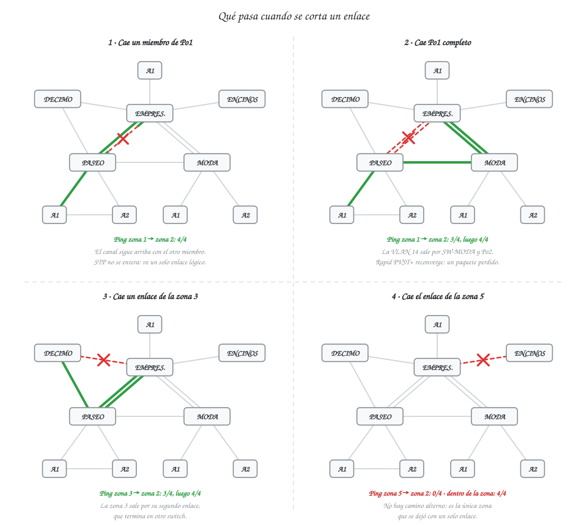
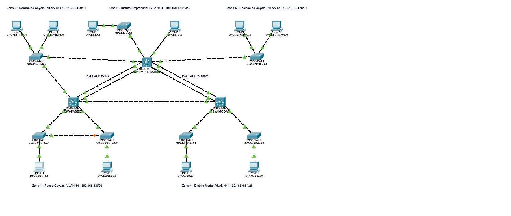
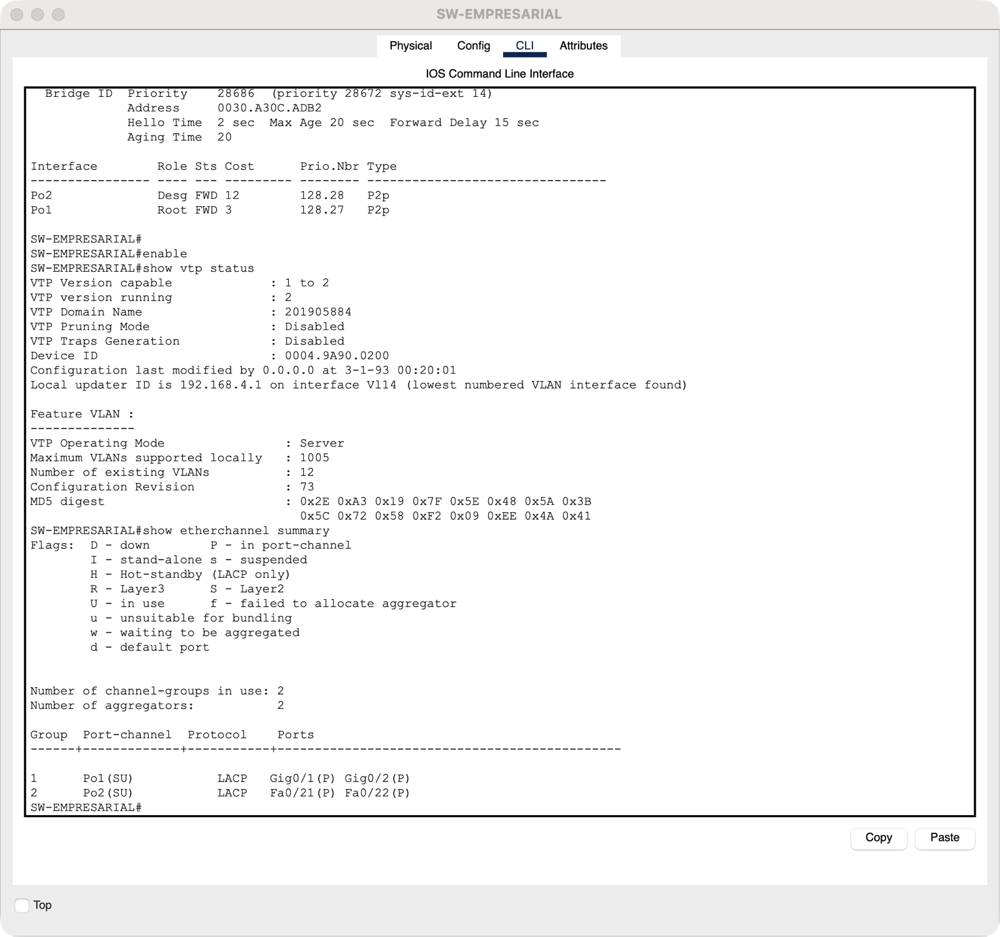
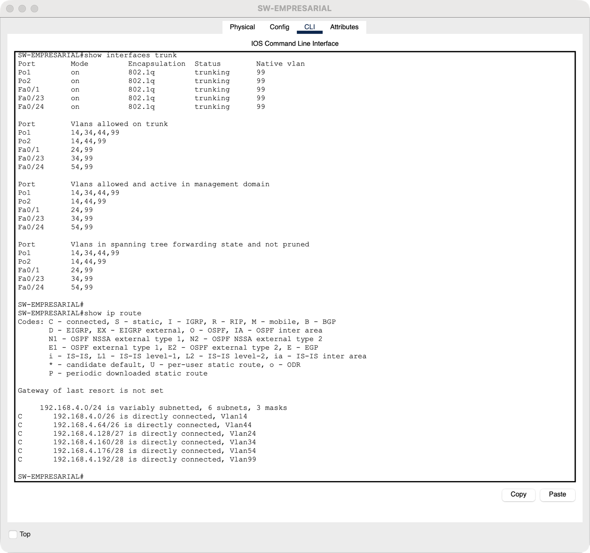
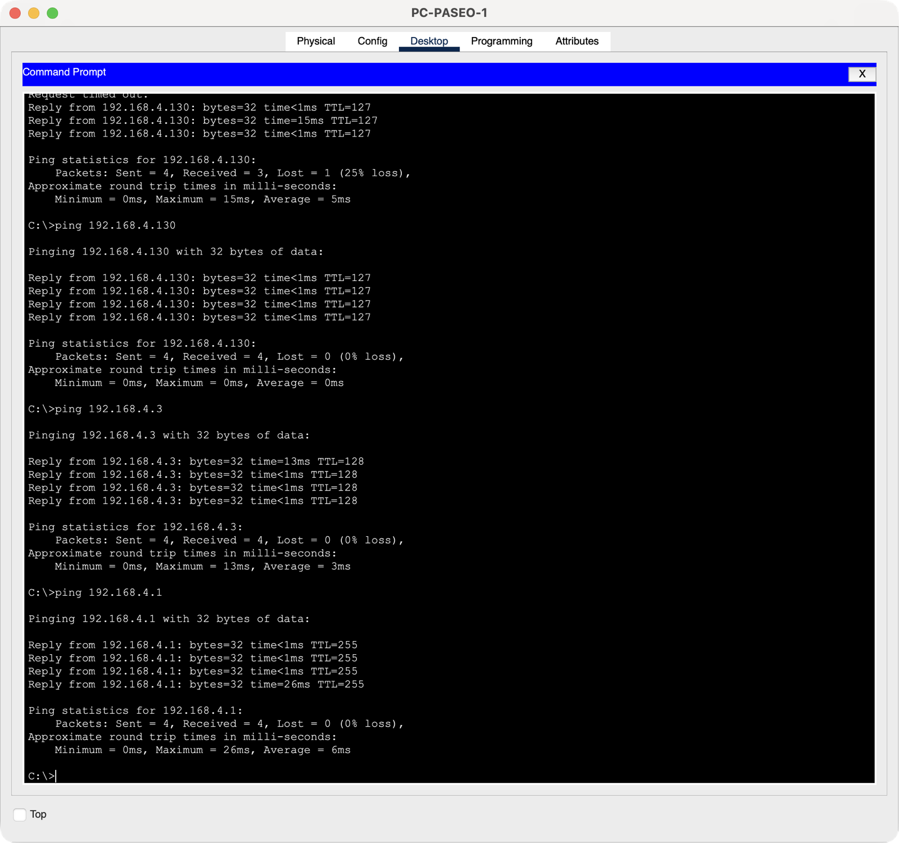
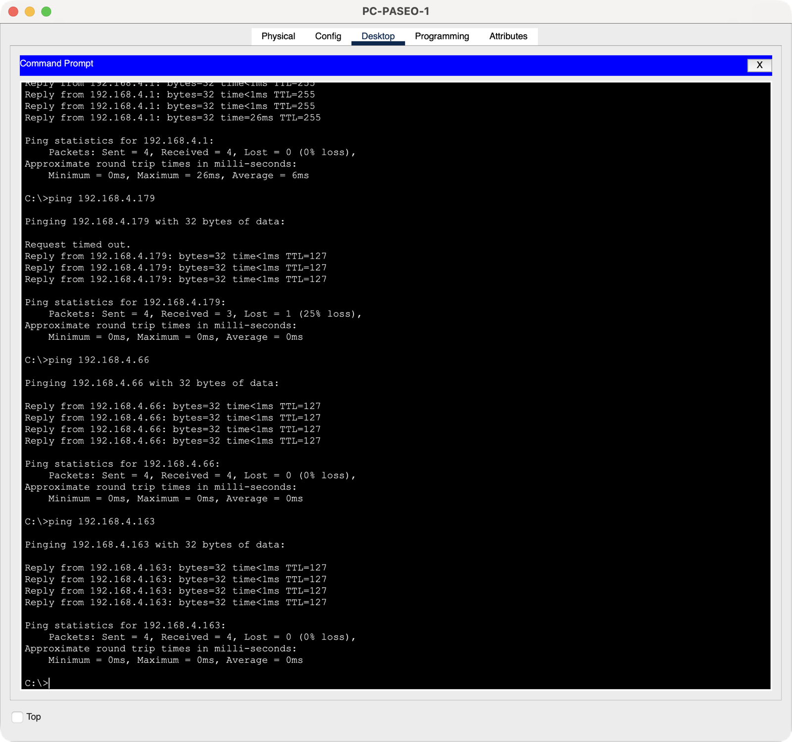
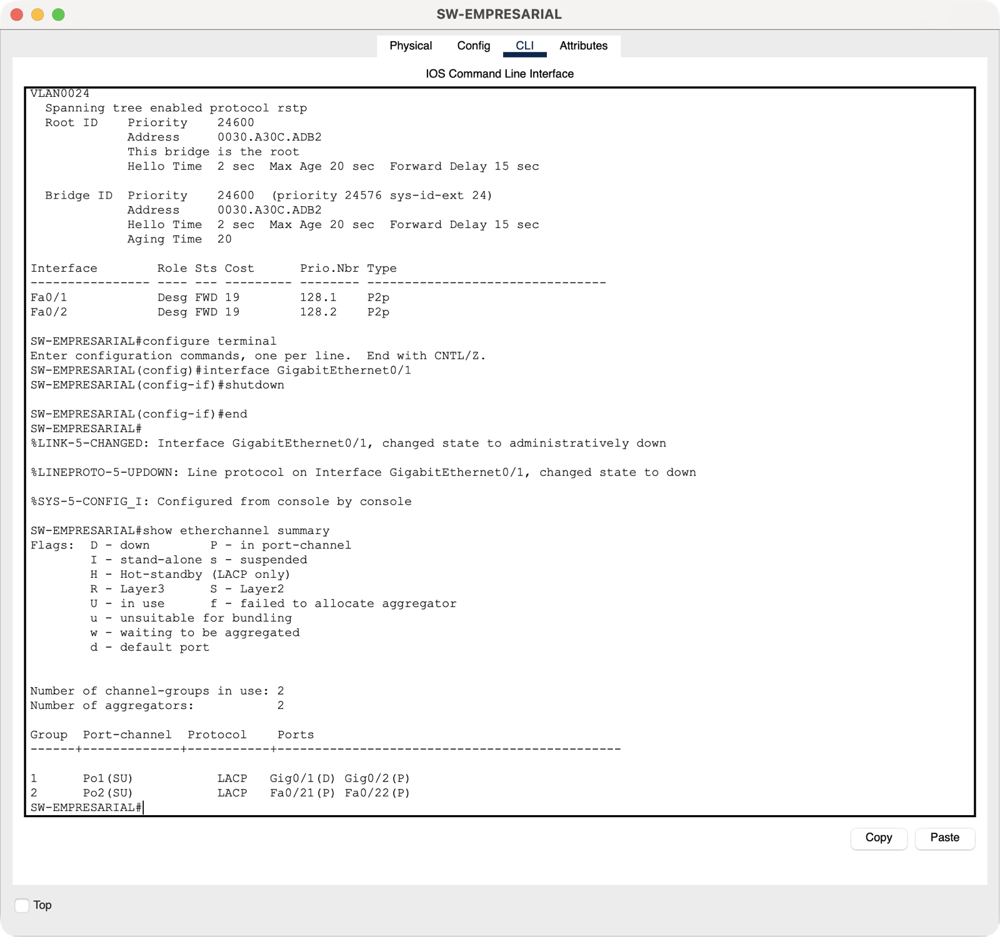

# Informe de Desarrollo — Práctica 2: Red de la Ciudad Comercial Cayalá

**Universidad de San Carlos de Guatemala** · Facultad de Ingeniería\
**Curso:** Redes de Computadoras 1 — Segundo Semestre 2026\
**Estudiante:** Santiago Barrera\
**Carné:** 201905884\
**Fecha:** 10 de octubre de 2026

---

## 1. Introducción

La práctica pide interconectar cinco zonas reales de Cayalá con una VLAN por zona, VTP, Rapid
PVST+ y EtherChannel, sobre una topología que no trate igual a todas las zonas. El Manual Técnico
dice **qué** quedó configurado; este informe cuenta **cómo** se llegó ahí: las decisiones, lo que
falló y lo que se midió.

---

## 2. Decisiones de diseño

**Las zonas.** Elegí cinco lugares con perfiles que no se parecieran entre sí, para que la
exigencia de «no aplicar un esquema uniforme» saliera del análisis y no de forzarla: un centro
comercial (Paseo Cayalá), oficinas (Distrito Empresarial), bancos y servicios (Décimo de Cayalá),
gastronomía y hotel (Distrito Moda) y un residencial (Encinos de Cayalá).

**Qué zona recibe cuántos hosts.** El enunciado fija las cantidades por número de zona, no por
nombre. Asigné los 60 y 50 hosts a las dos zonas comerciales, los 28 a la administración, los 12
a los bancos y los 7 al residencial, donde solo hay garitas y oficina del condominio.

**Criticidad y carga son cosas distintas.** Fue la idea que ordenó la topología:

- Las zonas 1 y 4 tienen mucha **carga** → EtherChannel, que suma capacidad.
- La zona 3 tiene poca carga pero alta **criticidad** → dos enlaces a switches distintos, que dan
  un camino alterno. Agregarlos en un canal no habría servido: los dos cables terminarían en el
  mismo switch.
- La zona 5 no tiene ni una ni otra → un enlace.

**Dónde va el gateway.** El alcance obligatorio pide default gateway en cada host, pings entre
zonas y `show ip route`, así que hace falta enrutamiento. Lo concentré en un solo 3560
(SW-EMPRESARIAL) con un SVI por VLAN: las seis redes quedan directamente conectadas y no hay que
configurar rutas. El costo es que ese switch es un punto único de falla para el tráfico entre
zonas, y por eso es el centro de la malla.

**«Aislamiento entre VLANs» y «conectividad entre zonas».** El objetivo de la práctica pide las
dos cosas. Las interpreté así: las VLANs aíslan en Capa 2 (un broadcast de una zona no llega a
otra, y los troncales no transportan VLANs ajenas), y la comunicación entre zonas existe solo a
través del gateway, en Capa 3.

**Hosts simulados.** Coloqué 10 PCs, dos por zona. Las cantidades reales se usan en el cálculo de
subredes, en los puertos de acceso configurados y en el conteo de dominios de colisión.

---

## 3. Implementación

1. **Equipos y cableado.** 10 switches, 10 PCs y 24 enlaces: cruzado entre switches, directo
   hacia las PCs.
2. **Base y troncales.** Hostname, Rapid PVST+ con sus prioridades, VTP y todos los troncales con
   nativa 99 y lista `allowed`. Los dos EtherChannel se configuraron en este paso y se rehicieron
   después (§4.4).
3. **VLANs.** Cada servidor VTP creó la VLAN de su zona, uno a la vez, y se comprobó la base de
   VLANs de los diez switches antes de seguir.
4. **Puertos de acceso, Blackhole y SVIs.** Con las VLANs ya propagadas.
5. **Direcciones IP** de las PCs.
6. **Verificación por consola** con los comandos `show`, corrección de los EtherChannel y
   pruebas de falla.

El orden importa: los troncales tienen que estar arriba antes de crear VLANs, o VTP no tiene por
dónde anunciarlas.

---

## 4. Problemas encontrados y soluciones

### 4.1 `interface range` cortaba la configuración de los 3560

**Síntoma.** Tras aplicar la configuración en bloque, los 2960 quedaron bien y los tres 3560
tenían hostname y Spanning Tree, pero **ninguna interfaz configurada**.

**Causa.** Packet Tracer rechazó `interface range` al recibir el bloque completo. El comando falla, el
switch sigue en modo de configuración global, y el `exit` que cerraba el bloque lo saca de
configuración: todo lo que venía después se descartó. Los 2960 no se vieron afectados porque sus
troncales no usaban rangos.

**Solución.** Aplicar cada interfaz por separado. Los scripts entregados conservan
`interface range` porque en la CLI interactiva sí es válido.

### 4.2 VLANs consecutivas: quedó una sola, con el nombre de la última

**Síntoma.** Después de crear las VLANs 24, 99 y 999, la base mostraba solo la **VLAN 24 llamada
BLACKHOLE**.

**Causa.** Al escribir `vlan 99` estando dentro de `config-vlan`, el cambio de VLAN no se tomó y
los `name` siguientes se aplicaron todos a la VLAN 24.

**Solución.** Un `exit` después de cada VLAN. Los scripts ya lo incluyen.

### 4.3 Dos servidores VTP modificando la base a la vez

**Síntoma.** SW-EMPRESARIAL creó sus tres VLANs y SW-PASEO la suya en el mismo momento. La VLAN 14
desapareció.

**Causa.** SW-PASEO hizo un cambio (revisión 1) y SW-EMPRESARIAL tres (revisión 3). El anuncio con
la revisión más alta sobrescribió la base de SW-PASEO, que no incluía la VLAN 14. Es el
comportamiento normal de VTP y el riesgo real de tener varios servidores en un dominio.

**Solución.** Crear las VLANs un servidor a la vez, dejando que cada cambio se propague antes del
siguiente. Así cada servidor parte de la base ya sincronizada y solo le suma su VLAN.

### 4.4 Los EtherChannel estaban suspendidos y los pings pasaban igual

**Síntoma.** Toda la conectividad funcionaba, pero al revisar `show etherchannel summary` los dos
canales estaban caídos: `Po1(SD)` y `Po2(SD)`, con los cuatro miembros en `(s)`, suspendidos. En
`show spanning-tree` los miembros aparecían como puertos sueltos, uno de ellos bloqueado.

**Causa.** Configuré primero los miembros como troncales y después les apliqué `channel-group`.
En ese momento se crea la interfaz `Port-channel` con valores por defecto, que no coinciden con
los del miembro, y el miembro queda suspendido. Configurar después el `Port-channel` como troncal
no lo recupera.

**Por qué no lo vi antes.** Los enlaces seguían transportando tráfico como enlaces individuales
y Spanning Tree bloqueaba uno de cada par, así que los pings salían bien. Las primeras pruebas de
falla también pasaron, pero por la razón equivocada: lo que respondía era STP, no el canal.

**Solución.** Crear y configurar el `Port-channel` **antes** de sumar los miembros. Probé las tres
variantes y solo esa forma el canal a la primera. Después guardé y recargué el archivo para partir
de un árbol STP limpio, y **repetí todas las pruebas de falla**: los resultados de §5 son los de
esa segunda corrida.

**Lección.** Un ping exitoso no demuestra que un EtherChannel esté formado. Hay que mirar
`(SU)` y `(P)` en la salida del comando.

### 4.5 ¿Hace falta la VLAN 1 en los troncales?

En el Proyecto 1 dejé la VLAN 1 en todas las listas `allowed` por precaución, suponiendo que VTP
la necesitaba. Aquí el enunciado pide permitir solo las VLANs necesarias, así que lo probé sin
ella: las VLANs se propagaron a los diez switches, incluidos los clientes a dos saltos. La VLAN 1
quedó fuera de todos los troncales.

### 4.6 Fibra entre edificios

Los enlaces entre zonas serían de fibra en un despliegue real. Los 2960-24TT y 3560-24PS del
simulador solo tienen puertos de cobre, así que todos los enlaces son UTP. Queda documentado como
limitación en el Manual, §20.

---

## 5. Resultados medidos

Pings ejecutados desde las PCs en Packet Tracer (4 paquetes cada uno), con los dos EtherChannel
formados.

### 5.1 Dentro de cada zona (intra-VLAN): 10 pings

| # | Origen | Destino | VLAN | Recibidos |
|---|---|---|---|---|
| 1 | PC-PASEO-1 | PC-PASEO-2 (192.168.4.3) | 14 | 4/4 |
| 2 | PC-PASEO-2 | PC-PASEO-1 (192.168.4.2) | 14 | 4/4 |
| 3 | PC-EMP-1 | PC-EMP-2 (192.168.4.131) | 24 | 4/4 |
| 4 | PC-EMP-2 | PC-EMP-1 (192.168.4.130) | 24 | 4/4 |
| 5 | PC-DECIMO-1 | PC-DECIMO-2 (192.168.4.163) | 34 | 4/4 |
| 6 | PC-DECIMO-2 | PC-DECIMO-1 (192.168.4.162) | 34 | 4/4 |
| 7 | PC-MODA-1 | PC-MODA-2 (192.168.4.67) | 44 | 4/4 |
| 8 | PC-MODA-2 | PC-MODA-1 (192.168.4.66) | 44 | 4/4 |
| 9 | PC-ENCINOS-1 | PC-ENCINOS-2 (192.168.4.179) | 54 | 4/4 |
| 10 | PC-ENCINOS-2 | PC-ENCINOS-1 (192.168.4.178) | 54 | 4/4 |

En las zonas 1, 2 y 4 las dos PCs están en switches distintos, así que el ping exitoso también
demuestra que la VLAN cruza los troncales.

### 5.2 Entre zonas y hacia el gateway

| # | Origen | Destino | Recorrido | Recibidos |
|---|---|---|---|---|
| 11 | PC-PASEO-1 | 192.168.4.1 (gateway) | VLAN 14 | 4/4 |
| 12 | PC-PASEO-1 | PC-EMP-1 | 14 → 24 | 3/4, luego 4/4 |
| 13 | PC-PASEO-1 | PC-ENCINOS-2 | 14 → 54 | 3/4 |
| 14 | PC-PASEO-1 | PC-MODA-1 | 14 → 44 | 4/4 |
| 15 | PC-PASEO-1 | PC-DECIMO-2 | 14 → 34 | 4/4 |
| 16 | PC-MODA-1 | PC-DECIMO-2 | 44 → 34 | 3/4 |
| 17 | PC-ENCINOS-1 | PC-DECIMO-1 | 54 → 34 | 4/4 |

Cuando se pierde un paquete es el primero: se descarta mientras se resuelve ARP hacia un destino
que todavía no está en la tabla. Al repetir el ping llegan los cuatro, como en el 12.

### 5.3 Pruebas de falla

| Falla inducida | Ping | Recibidos | Lectura |
|---|---|---|---|
| Un miembro de Po1 apagado | PC-PASEO-1 → PC-EMP-1 | **4/4** | `Po1(SU)` con `Gig0/1(D)` y `Gig0/2(P)`: el canal sigue arriba y STP no interviene |
| Po1 completo apagado | PC-PASEO-1 → PC-EMP-1 | **3/4**, luego 4/4 | La VLAN 14 sale por SW-MODA y Po2. Rapid PVST+ reconverge con un paquete perdido |
| Enlace SW-EMPRESARIAL ↔ SW-DECIMO apagado | PC-DECIMO-1 → PC-EMP-1 | **3/4**, luego 4/4 | La zona 3 sale por su segundo enlace, vía SW-PASEO |
| Enlace SW-EMPRESARIAL ↔ SW-ENCINOS apagado | PC-ENCINOS-1 → PC-EMP-1 | **0/4** | La zona 5 queda aislada: tiene un solo enlace. Dentro de la zona, 4/4 |
| Todo restaurado | PC-ENCINOS-1 → PC-DECIMO-1 | 4/4 | Servicio recuperado |

Las cuatro pruebas confirman el diseño: las zonas críticas mantuvieron el servicio y la única que
se aisló fue la que se dejó con un enlace a propósito. La caída de un canal completo costó un
solo paquete, contra los 30-50 s que medí con PVST+ en el Proyecto 1.

---

## 6. Capturas de funcionamiento

Las trece capturas de consola están en `capturas/evidencias/` y se muestran completas en el
Manual Técnico, §22. Aquí van las que resumen el funcionamiento.

**Figura 1 — Topología final en Packet Tracer, con todos los enlaces arriba.**

**Figura 2 — Los dos EtherChannel formados con LACP.**

**Figura 3 — `show ip route`: las seis subredes directamente conectadas.**

**Figura 4 — Pings dentro de la zona 1 y hacia su gateway.**

**Figura 5 — Pings desde la zona 1 hacia las zonas 5, 4 y 3.**

**Figura 6 — Con un miembro apagado, Po1 sigue en uso.**

| Evidencia | Archivo | Comando · equipo |
|---|---|---|
| E1 | `01-show-vlan-brief.png` | `show vlan brief` · SW-EMP-A1 |
| E2 | `02-show-vtp-status-servidor.png` | `show vtp status` · SW-EMPRESARIAL |
| E3 | `03-show-vtp-status-cliente.png` | `show vtp status` · SW-EMP-A1 |
| E4a | `04a-show-spanning-tree-vlan-14-root.png` | `show spanning-tree vlan 14` · SW-PASEO |
| E4b | `04b-show-spanning-tree-vlan-14-bloqueado.png` | `show spanning-tree vlan 14` · SW-PASEO-A2 |
| E5 | `05-show-spanning-tree-vlan-34-root.png` | `show spanning-tree vlan 34` · SW-DECIMO |
| E6 | `06-show-etherchannel-summary.png` | `show etherchannel summary` · SW-EMPRESARIAL |
| E7 | `07-show-interfaces-trunk.png` | `show interfaces trunk` · SW-EMPRESARIAL |
| E8 | `08-show-ip-route.png` | `show ip route` · SW-EMPRESARIAL |
| E9 | `09-ping-intra-vlan-paseo.png` | `ping` · PC-PASEO-1 |
| E10 | `10-ping-entre-zonas-paseo.png` | `ping` · PC-PASEO-1 |
| E11 | `11-falla-miembro-po1-etherchannel.png` | `show etherchannel summary` · SW-EMPRESARIAL |
| E12 | `12-falla-po1-completo-stp-vlan-14.png` | `show spanning-tree vlan 14` · SW-EMPRESARIAL |

---

## 7. Conclusiones

1. **Criticidad y carga piden soluciones distintas.** EtherChannel resuelve capacidad; un segundo
   enlace a otro switch resuelve disponibilidad. Las pruebas de falla lo mostraron: la zona 3
   sobrevivió con dos enlaces simples y la zona 5 no, con uno.
2. **Rapid PVST+ hace que la redundancia casi no se note.** Apagar un EtherChannel completo costó
   un solo paquete.
3. **Varios servidores VTP funcionan, con disciplina.** Cada zona pudo aportar su VLAN al dominio,
   pero dos cambios simultáneos se pisan: la revisión más alta gana sin avisar.
4. **Restringir los troncales no rompió nada.** VTP y la administración siguieron funcionando sin
   la VLAN 1, y cada troncal transporta solo lo que su zona necesita.
5. **Verificar el efecto, no el síntoma.** Los pings pasaban con los EtherChannel suspendidos.
   Sin revisar la salida de `show etherchannel summary` habría entregado una red que cumplía en
   apariencia y no en la configuración.
6. **Un switch por puerto y un enlace por dominio de colisión.** Sin hubs, las colisiones dejan de
   ser un factor; lo que queda por segmentar es el broadcast, y eso lo hacen las VLANs.
