# Manual Técnico — Práctica 2: Red de la Ciudad Comercial Cayalá

**Universidad de San Carlos de Guatemala** · Facultad de Ingeniería\
**Curso:** Redes de Computadoras 1 — Segundo Semestre 2026\
**Estudiante:** Santiago Barrera\
**Carné:** 201905884\
**Archivo de simulación:** `Practica2_201905884.pkt` (Cisco Packet Tracer)\
**Fecha:** 10 de octubre de 2026

---

## Índice

**Parte I — Marco Teórico**

1. [Dominios de colisión y de broadcast](#1-dominios-de-colisión-y-de-broadcast)
2. [VLANs y enlaces troncales 802.1Q](#2-vlans-y-enlaces-troncales-8021q)
3. [VLAN Trunking Protocol (VTP)](#3-vlan-trunking-protocol-vtp)
4. [Spanning Tree y Rapid PVST+](#4-spanning-tree-y-rapid-pvst)
5. [EtherChannel y LACP](#5-etherchannel-y-lacp)
6. [Topologías de interconexión](#6-topologías-de-interconexión)
7. [Enrutamiento entre VLANs con SVI](#7-enrutamiento-entre-vlans-con-svi)

**Parte II — Marco Práctico**

8. [Alcance y parámetros derivados del carné](#8-alcance-y-parámetros-derivados-del-carné)
9. [Zonas seleccionadas de Cayalá](#9-zonas-seleccionadas-de-cayalá)
10. [Topología](#10-topología)
11. [Justificación de cada enlace físico](#11-justificación-de-cada-enlace-físico)
12. [Tabla de VLANs y direccionamiento](#12-tabla-de-vlans-y-direccionamiento)
13. [Asignación de puertos por switch](#13-asignación-de-puertos-por-switch)
14. [Troncales implementados](#14-troncales-implementados)
15. [VTP implementado](#15-vtp-implementado)
16. [Root Bridge por VLAN](#16-root-bridge-por-vlan)
17. [EtherChannel implementados](#17-etherchannel-implementados)
18. [Enrutamiento entre zonas](#18-enrutamiento-entre-zonas)
19. [Dominios de colisión y de broadcast de la red](#19-dominios-de-colisión-y-de-broadcast-de-la-red)
20. [Cableado](#20-cableado)
21. [Scripts de configuración](#21-scripts-de-configuración)
22. [Evidencia de pruebas](#22-evidencia-de-pruebas)
23. [Referencias](#23-referencias)

### Índice de figuras y evidencias

Las **Figuras (F)** son diagramas propios en SVG (`diagrama/`) y la vista de la topología en
Packet Tracer. Las **Evidencias (E)** son capturas de la consola de cada equipo
(`capturas/evidencias/`).

| Fig. | § | Archivo | Qué muestra |
|---|---|---|---|
| F1 | 1 | `diagrama/01-dominios-colision.svg` | Hub (un dominio compartido) frente a switch (uno por puerto) |
| F2 | 1 | `diagrama/02-dominios-broadcast.svg` | Un dominio de broadcast sin VLANs; uno por VLAN con ellas |
| F3 | 2 | `diagrama/03-access-vs-trunk.svg` | Puerto de acceso y puerto troncal |
| F4 | 2 | `diagrama/04-trama-8021q.svg` | Trama Ethernet con el tag de 4 bytes |
| F5 | 4 | `diagrama/05-bucle-capa2.svg` | Tormenta de broadcast en un triángulo sin STP |
| F6 | 4 | `diagrama/06-eleccion-root-bridge.svg` | Elección de la raíz y puerto bloqueado |
| F7 | 5 | `diagrama/07-etherchannel-lacp.svg` | Enlaces físicos agrupados en un canal lógico |
| F8 | 15 | `diagrama/08-vtp-multiservidor.svg` | Un servidor VTP por zona |
| F9 | 10 | `diagrama/09-topologia-logica.svg` | Topología lógica: zonas, VLANs y enlaces |
| F10 | 10 | `diagrama/10-topologia-hibrida.svg` | Malla, anillo y estrella sobre la misma red |
| F11 | 12 | `diagrama/11-vlsm.svg` | Reparto de 192.168.4.0/24 |
| F12 | 16 | `diagrama/12-arbol-stp.svg` | Raíz y puertos alternos por VLAN |
| F13 | 22 | `diagrama/13-pruebas-de-falla.svg` | Cuatro fallas inducidas y su resultado |
| F14 | 18 | `diagrama/14-enrutamiento-svi.svg` | Camino de un paquete entre dos zonas |
| F15 | 10 | `capturas/00-topologia-completa.png` | Topología en Packet Tracer |

| Ev. | § | Archivo | Comando · equipo |
|---|---|---|---|
| E1 | 22 | `01-show-vlan-brief.png` | `show vlan brief` · SW-EMP-A1 |
| E2 | 22 | `02-show-vtp-status-servidor.png` | `show vtp status` · SW-EMPRESARIAL |
| E3 | 22 | `03-show-vtp-status-cliente.png` | `show vtp status` · SW-EMP-A1 |
| E4a | 22 | `04a-show-spanning-tree-vlan-14-root.png` | `show spanning-tree vlan 14` · SW-PASEO |
| E4b | 22 | `04b-show-spanning-tree-vlan-14-bloqueado.png` | `show spanning-tree vlan 14` · SW-PASEO-A2 |
| E5 | 22 | `05-show-spanning-tree-vlan-34-root.png` | `show spanning-tree vlan 34` · SW-DECIMO |
| E6 | 22 | `06-show-etherchannel-summary.png` | `show etherchannel summary` · SW-EMPRESARIAL |
| E7 | 22 | `07-show-interfaces-trunk.png` | `show interfaces trunk` · SW-EMPRESARIAL |
| E8 | 22 | `08-show-ip-route.png` | `show ip route` · SW-EMPRESARIAL |
| E9 | 22 | `09-ping-intra-vlan-paseo.png` | `ping` dentro de la VLAN 14 · PC-PASEO-1 |
| E10 | 22 | `10-ping-entre-zonas-paseo.png` | `ping` hacia otras zonas · PC-PASEO-1 |
| E11 | 22 | `11-falla-miembro-po1-etherchannel.png` | `show etherchannel summary` con un miembro caído |
| E12 | 22 | `12-falla-po1-completo-stp-vlan-14.png` | `show spanning-tree vlan 14` con Po1 caído |

---

# Parte I — Marco Teórico

## 1. Dominios de colisión y de broadcast

Un **dominio de colisión** es el conjunto de equipos cuyas tramas pueden chocar entre sí porque
comparten el medio. Un **dominio de broadcast** es el conjunto de equipos que reciben una trama
enviada a `FF:FF:FF:FF:FF:FF`.

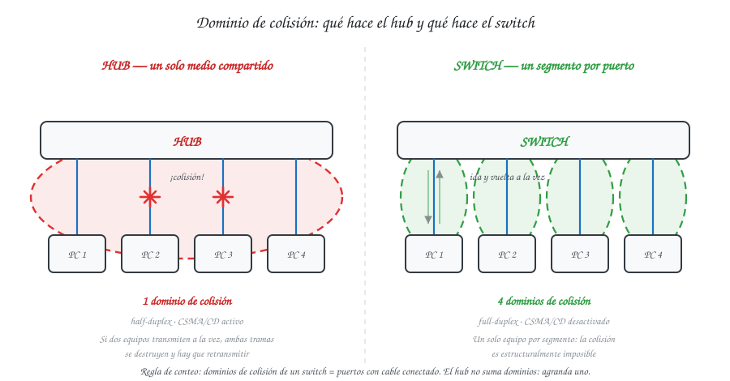

**Figura 1 — Un hub comparte el medio entre todos sus puertos; un switch lo separa.**

| Dispositivo | Dominios de colisión | Dominios de broadcast |
|---|---|---|
| Hub | Uno para todos sus puertos | No separa |
| Switch | **Uno por puerto** | No separa (salvo con VLANs) |
| Router o SVI | Uno por interfaz | **Uno por interfaz** |

En un enlace switch–equipo en **full-duplex** se transmite y recibe por pares distintos, así que
CSMA/CD no interviene y las colisiones desaparecen. Lo que un switch por sí solo no resuelve es el
broadcast: cada ARP o DHCP llega a todos los puertos.

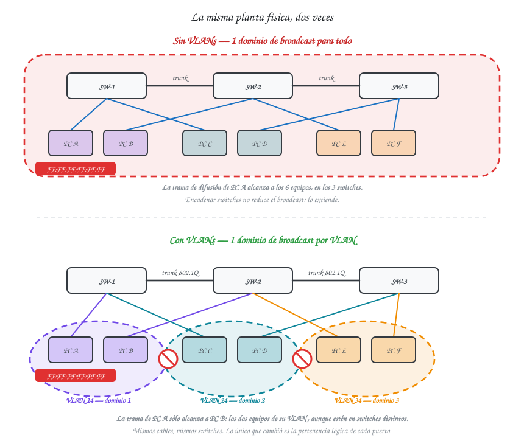

**Figura 2 — Sin VLANs hay un solo dominio de broadcast; con VLANs, uno por VLAN.**

## 2. VLANs y enlaces troncales 802.1Q

Una **VLAN** divide un switch en varias redes lógicas independientes. Los equipos de una VLAN
solo intercambian tramas con los de la misma VLAN, aunque estén en switches distintos, y cada VLAN
es un dominio de broadcast propio.

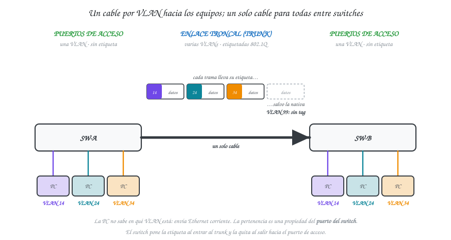

**Figura 3 — Un puerto de acceso pertenece a una VLAN; un troncal transporta varias.**

- **Puerto de acceso:** pertenece a una sola VLAN y entrega tramas sin etiqueta. Es el puerto de un
  equipo final.
- **Puerto troncal:** transporta varias VLANs entre switches. Para saber a cuál pertenece cada
  trama, le inserta una etiqueta **IEEE 802.1Q** de 4 bytes.

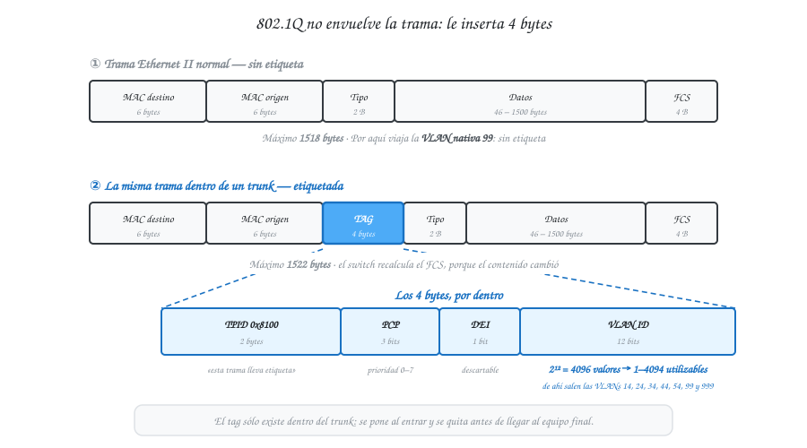

**Figura 4 — El tag 802.1Q va entre la MAC de origen y el EtherType; su campo VID tiene 12 bits.**

Tres decisiones de diseño sobre los troncales:

| Decisión | Qué es | Por qué importa |
|---|---|---|
| **VLAN nativa** | La única que viaja **sin** etiqueta por el troncal | Si se deja en la VLAN 1 con puertos de usuario en ella, permite *VLAN hopping* por doble etiquetado. Se mueve a una VLAN sin usuarios |
| **Lista `allowed`** | Qué VLANs puede transportar el troncal | Reduce broadcast innecesario y evita que una zona alcance VLANs que no le corresponden |
| **VLAN Blackhole** | VLAN sin salida para los puertos sin uso | Un equipo conectado a un puerto libre no llega a ninguna red, y además el puerto queda apagado |

## 3. VLAN Trunking Protocol (VTP)

VTP propaga la base de VLANs por los troncales de un mismo **dominio**, para no crear cada VLAN a
mano en cada switch.

| Modo | Crea o modifica VLANs | Adopta lo que recibe | Reenvía anuncios |
|---|---|---|---|
| **Server** | Sí | Sí | Sí |
| **Client** | No | Sí | Sí |
| **Transparent** | Solo localmente | No | Sí (versión 2) |

Cada anuncio lleva un **número de revisión de configuración** que aumenta con cada cambio. Un
switch adopta la base recibida si su revisión es mayor que la propia. De ahí salen dos riesgos:

- Un switch con una revisión alta heredada **sobrescribe la base de todo el dominio** al
  conectarse, aunque esté en modo cliente. Se evita pasándolo por modo transparente, que deja la
  revisión en 0.
- Con **varios servidores**, dos cambios simultáneos producen la misma revisión con contenidos
  distintos y uno se pierde.

El dominio y la contraseña deben coincidir en todos los switches, o los anuncios se descartan.

## 4. Spanning Tree y Rapid PVST+

Los enlaces redundantes entre switches forman bucles de Capa 2. Una trama Ethernet no tiene TTL:
un broadcast en un bucle circula sin fin y se multiplica hasta saturar la red.

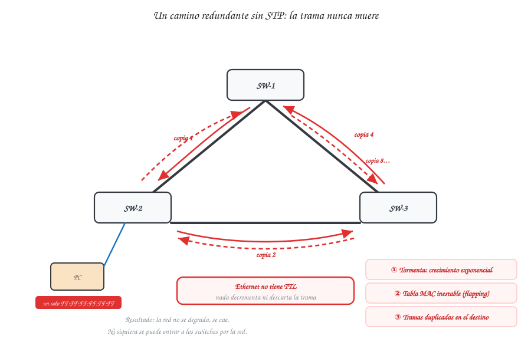

**Figura 5 — Sin Spanning Tree, un solo broadcast en un triángulo de switches no se detiene.**

**Spanning Tree** deja la redundancia cableada pero bloquea lógicamente los enlaces que sobran:

1. Se elige un **Root Bridge**: el switch con el *Bridge ID* más bajo (prioridad + MAC).
2. Cada switch que no es raíz elige su **Root Port**: el de menor costo acumulado hacia la raíz.
3. En cada segmento queda un **Designated Port**; el puerto restante pasa a **Alternate** y no
   reenvía datos.

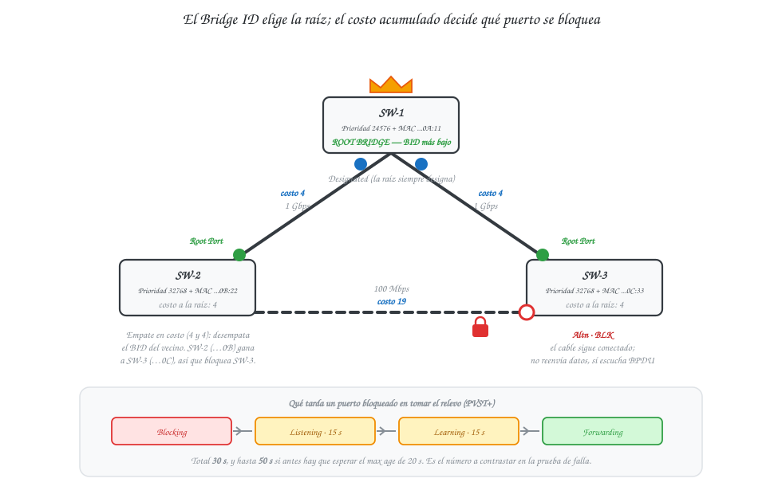

**Figura 6 — La prioridad elige la raíz y el costo decide qué puerto queda bloqueado.**

| Velocidad del enlace | Costo |
|---|---|
| 100 Mbps | 19 |
| 1 Gbps | 4 |
| EtherChannel 2×100 Mbps | 12 |
| EtherChannel 2×1 Gbps | 3 |

**Rapid PVST+** es la variante usada en esta práctica: combina Rapid Spanning Tree (IEEE 802.1w)
con una instancia independiente **por VLAN**.

| | PVST+ (802.1D) | Rapid PVST+ (802.1w) |
|---|---|---|
| Convergencia ante una falla | 30–50 s (Listening y Learning, 15 s cada uno) | Del orden de 1 s |
| Cómo converge | Temporizadores | Negociación directa entre vecinos (*proposal / agreement*) |
| Estados de puerto | Blocking, Listening, Learning, Forwarding | Discarding, Learning, Forwarding |
| Roles de respaldo | No | **Alternate** (respaldo del Root Port) y **Backup** |
| Árbol por VLAN | Sí | Sí |

Que haya un árbol por VLAN permite que **cada VLAN tenga su propia raíz**: un mismo enlace puede
reenviar para una VLAN y estar bloqueado para otra.

`spanning-tree portfast` lleva un puerto de equipo final directo a Forwarding, y
`bpduguard` lo apaga si recibe un BPDU, es decir, si alguien conecta un switch donde debía ir
una PC.

## 5. EtherChannel y LACP

**EtherChannel** agrupa varios enlaces físicos paralelos en un solo enlace lógico
(`Port-channel`). Spanning Tree ve **un enlace**, así que no bloquea ninguno de los miembros.

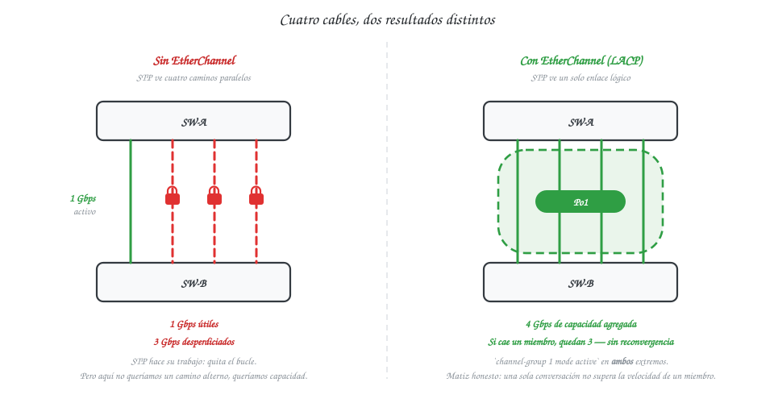

**Figura 7 — Sin EtherChannel, STP bloquea los enlaces paralelos; con él, todos transmiten.**

| | EtherChannel | Enlace redundante con STP |
|---|---|---|
| Para qué sirve | Sumar **capacidad** | Tener un **camino alterno** |
| Uso normal | Todos los miembros transmiten | El de respaldo no pasa tráfico |
| Si cae un cable | El canal sigue arriba con menos capacidad | STP reconverge |
| Protege contra la falla del switch vecino | No: todos los cables terminan en él | Sí, si el respaldo va a otro switch |

| Protocolo | Estándar | Modos | Se forma si |
|---|---|---|---|
| **LACP** | IEEE 802.3ad | `active` / `passive` | Al menos un extremo está en `active` |
| PAgP | Propietario de Cisco | `desirable` / `auto` | Al menos un extremo está en `desirable` |

Todos los miembros de un canal deben coincidir en velocidad, dúplex, modo troncal, VLAN nativa y
lista `allowed`. Un miembro que difiere de la interfaz `Port-channel` queda **suspendido**.

## 6. Topologías de interconexión

| Topología | Forma | Enlaces para *n* nodos | Tolerancia a fallas | Costo |
|---|---|---|---|---|
| **Estrella** | Todos conectados a un nodo central | n − 1 | Un enlace caído aísla a su nodo; si cae el centro, cae todo | Bajo |
| **Anillo** | Cada nodo con dos vecinos | n | Soporta la caída de un enlace cualquiera | Medio |
| **Malla completa** | Todos con todos | n(n − 1)/2 | Soporta varias fallas simultáneas | Alto |
| **Híbrida** | Combinación de las anteriores | — | La que cada parte necesite | El justo |

Una topología híbrida asigna el costo donde hay criticidad: malla o anillo para lo que no puede
caer, estrella para lo que tolera un corte.

## 7. Enrutamiento entre VLANs con SVI

Dos equipos en VLANs distintas no se alcanzan en Capa 2: hace falta un dispositivo de Capa 3. Un
**switch multicapa** resuelve esto con **SVIs** (*Switch Virtual Interface*): una interfaz
virtual por VLAN, con dirección IP, que actúa como default gateway de esa VLAN.

- `ip routing` activa el reenvío de Capa 3 en el switch.
- Cada `interface vlan N` con IP aparece en la tabla de rutas como red **directamente conectada**.
- El SVI solo sube si la VLAN existe y tiene al menos un puerto activo.

Frente a un router con subinterfaces (*router-on-a-stick*), el SVI enruta dentro del propio switch,
sin que todo el tráfico entre VLANs suba y baje por un único enlace troncal.

---

# Parte II — Marco Práctico

## 8. Alcance y parámetros derivados del carné

Red de Capa 2 que interconecta cinco zonas del complejo Cayalá con una VLAN por zona, VTP,
Rapid PVST+ y EtherChannel, más enrutamiento inter-VLAN en un switch multicapa para la
conectividad entre zonas.

| Parámetro | Regla del enunciado | Valor |
|---|---|---|
| Último dígito del carné (X) | — | **4** |
| VLAN de cada zona | `1X`, `2X`, `3X`, `4X`, `5X` | **14, 24, 34, 44, 54** |
| VLAN nativa / administración | ID 99 | **99** |
| VLAN Blackhole | ID 999 | **999** |
| Negociación de EtherChannel | par → LACP, impar → PAgP | **LACP** (`mode active`) |
| Dominio VTP | número de carné | **201905884** |
| Contraseña VTP | libre | `cayala2S2026` |
| Modo de Spanning Tree | Rapid PVST+ | `rapid-pvst` |

**Hosts simulados.** El archivo `.pkt` coloca **10 PCs, dos por zona**: es la muestra mínima que
permite probar conectividad dentro de cada VLAN y entre zonas. Las cantidades del enunciado
(60, 28, 12, 50 y 7) se usan completas donde importan: el cálculo de subredes (§12), la cantidad
de puertos de acceso configurados (§13) y el conteo de dominios de colisión (§19).

---

## 9. Zonas seleccionadas de Cayalá

Ciudad Cayalá está en la zona 16 de la Ciudad de Guatemala, sobre unos 441 000 m², con más de
260 comercios, 36 restaurantes, 7 bancos y 33 000 m² de oficinas. De ahí se tomaron cinco zonas
reales con perfiles operativos distintos.

| Zona | Lugar real | Rol operativo | Usuarios | Hosts | Tráfico | Criticidad |
|---|---|---|---|---|---|---|
| 1 | **Paseo Cayalá** | Centro comercial de uso mixto, inaugurado en 2011 | Locales, puntos de venta, cines | 60 | **Alto**: transaccional y continuo en horario comercial | **Alta** |
| 2 | **Distrito Empresarial** | Seis torres de oficinas; aquí se ubica la administración central del complejo | Administración, seguridad, operaciones | 28 | Medio, pero concentra los servicios de toda la red | **Crítica** |
| 3 | **Décimo de Cayalá** | Frente sobre el bulevar Rafael Landívar: bancos, supermercados y clínicas | Agencias bancarias y servicios | 12 | Bajo en volumen, sensible a cortes | **Alta** |
| 4 | **Distrito Moda** | Zona este: hotel, restaurantes y oficinas | Restaurantes, hotel, comercios | 50 | **Alto**: puntos de venta y reservas | Media-alta |
| 5 | **Encinos de Cayalá** | Residencial de 1998, cinco condominios | Garitas y administración del condominio | 7 | Bajo | **Baja** |

**Impacto de perder cada zona:**

- **Zona 2.** Aloja el gateway de todas las VLANs. Si cae el switch, ninguna zona se comunica con
  otra; por eso es la mejor conectada y sus enlaces hacia las zonas de mayor carga son agregados.
- **Zona 1.** Es la de más hosts y la que más factura. Un corte detiene las ventas del centro
  comercial entero.
- **Zona 3.** Pocos equipos, pero una agencia bancaria sin red no opera. Se le dan dos enlaces
  aunque su volumen no justifique ancho de banda extra.
- **Zona 4.** Segundo volumen de tráfico. Un corte afecta a restaurantes y hotel, sin efecto sobre
  el resto del complejo.
- **Zona 5.** Un corte deja sin red a las garitas administrativas; no afecta la operación
  comercial. Un solo enlace es suficiente.

La administración central se ubica en el Distrito Empresarial por ser la zona de oficinas del
complejo.

---

## 10. Topología

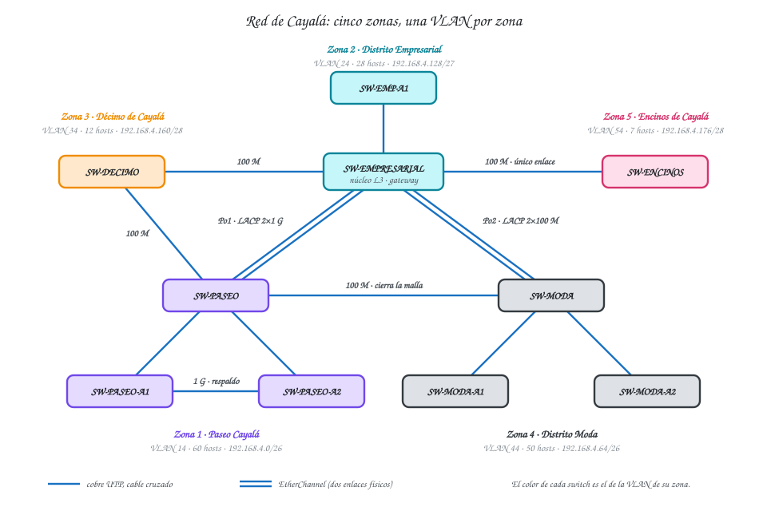

**Figura 9 — Topología lógica: diez switches en cinco zonas, con el color de la VLAN de cada una.**


**Figura 15 — La misma red en Packet Tracer: 10 switches, 10 PCs y 24 enlaces físicos.** El punto
ámbar es el puerto alterno del enlace de respaldo entre los accesos de la zona 1.

| Switch | Modelo | Zona | Rol |
|---|---|---|---|
| SW-EMPRESARIAL | 3560-24PS | 2 | Principal de zona, núcleo L3, gateway de todas las VLANs |
| SW-PASEO | 3560-24PS | 1 | Principal de zona |
| SW-MODA | 3560-24PS | 4 | Principal de zona |
| SW-DECIMO | 2960-24TT | 3 | Principal de zona |
| SW-ENCINOS | 2960-24TT | 5 | Principal de zona |
| SW-PASEO-A1, SW-PASEO-A2 | 2960-24TT | 1 | Acceso |
| SW-EMP-A1 | 2960-24TT | 2 | Acceso |
| SW-MODA-A1, SW-MODA-A2 | 2960-24TT | 4 | Acceso |

Las tres zonas del núcleo usan 3560 porque concentran enlaces agregados y, en el caso de la
zona 2, el enrutamiento. Las zonas 3 y 5 no enrutan ni agregan enlaces, así que un 2960 basta.

### 10.1 Topología híbrida

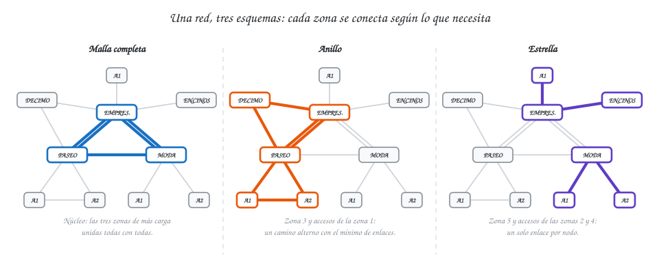

**Figura 10 — La misma red vista tres veces: malla, anillo y estrella.**

| Esquema | Dónde | Por qué |
|---|---|---|
| **Malla completa** | Triángulo SW-EMPRESARIAL – SW-PASEO – SW-MODA | Las tres zonas de mayor carga o criticidad quedan unidas todas con todas: cualquier enlace del núcleo puede caer sin aislar a ninguna |
| **Anillo** | SW-DECIMO – SW-EMPRESARIAL – SW-PASEO, y SW-PASEO – A1 – A2 | Redundancia con el mínimo de enlaces: un camino alterno sin pagar una malla |
| **Estrella** | SW-ENCINOS hacia el núcleo; accesos de las zonas 2 y 4 hacia su principal | Zonas o segmentos donde un corte es tolerable: un solo enlace por nodo |

### 10.2 Esquema de conexión por zona

| Zona | Enlaces hacia la red | Esquema | Tolerancia a fallas |
|---|---|---|---|
| 1 — Paseo | 3 físicos: Po1 (2×1 G) + trunk a SW-MODA | Malla + EtherChannel | Sobrevive a la caída de un miembro y a la del canal completo |
| 2 — Empresarial | 6 físicos: Po1, Po2 y dos trunks | Centro de la malla | Es el punto de convergencia de todas las zonas |
| 3 — Décimo | 2 físicos, a switches distintos | Anillo (doble conexión) | Sobrevive a la caída de un enlace o de un vecino |
| 4 — Moda | 3 físicos: Po2 (2×100 M) + trunk a SW-PASEO | Malla + EtherChannel | Igual que la zona 1, con menor capacidad |
| 5 — Encinos | 1 físico | Estrella | Ninguna: un corte del enlace aísla la zona |

---

## 11. Justificación de cada enlace físico

| # | Extremo A | Extremo B | Medio | Justificación |
|---|---|---|---|---|
| 1-2 | SW-EMPRESARIAL Gi0/1-2 | SW-PASEO Gi0/1-2 | 2×1 G, **Po1** | La zona 1 tiene 60 hosts y todo su tráfico hacia otras zonas pasa por el gateway. Es el enlace más cargado: se usan los únicos puertos Gigabit de ambos switches |
| 3-4 | SW-EMPRESARIAL Fa0/21-22 | SW-MODA Fa0/21-22 | 2×100 M, **Po2** | Zona 4, 50 hosts. Segundo en carga: se agrega para duplicar capacidad y no depender de un cable |
| 5 | SW-PASEO Fa0/23 | SW-MODA Fa0/23 | 100 M | Cierra la malla. Camino alterno de las VLANs 14 y 44 si cae Po1 o Po2 completo |
| 6 | SW-EMPRESARIAL Fa0/23 | SW-DECIMO Gi0/1 | 100 M | Camino principal de la zona 3 al gateway |
| 7 | SW-PASEO Fa0/24 | SW-DECIMO Gi0/2 | 100 M | Segundo enlace de la zona 3, a un switch **distinto**: protege contra la falla del enlace 6 y del puerto que lo termina |
| 8 | SW-EMPRESARIAL Fa0/24 | SW-ENCINOS Gi0/1 | 100 M | Enlace único: 7 hosts y criticidad baja no justifican redundancia |
| 9 | SW-EMPRESARIAL Fa0/1 | SW-EMP-A1 Gi0/1 | 100 M | Acceso de la zona 2 |
| 10-11 | SW-PASEO Fa0/1, Fa0/2 | SW-PASEO-A1, A2 Gi0/1 | 100 M | Uplink de cada acceso de la zona 1 |
| 12 | SW-PASEO-A1 Gi0/2 | SW-PASEO-A2 Gi0/2 | 1 G | Respaldo entre accesos: si cae un uplink, sus locales salen por el acceso vecino |
| 13-14 | SW-MODA Fa0/1, Fa0/2 | SW-MODA-A1, A2 Gi0/1 | 100 M | Uplink de cada acceso de la zona 4 |

Los accesos de la zona 4 no tienen enlace entre sí y los de la zona 1 sí: la diferencia responde a
la criticidad, no a la cantidad de hosts.

---

## 12. Tabla de VLANs y direccionamiento

Se subdividió **192.168.4.0/24** con VLSM, asignando de la subred más grande a la más pequeña.
Cada subred reserva una dirección para el gateway, así que el tamaño se calcula con *hosts + 1*.

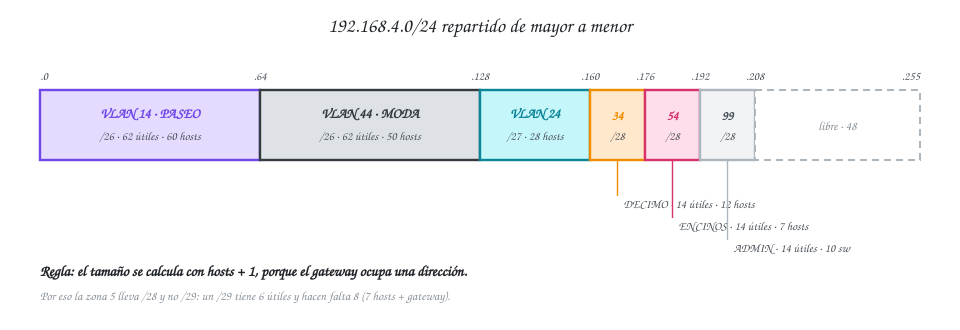

**Figura 11 — Dos /26, un /27 y tres /28; quedan 48 direcciones libres.**

| VLAN | Nombre | Zona | Hosts | Subred | Máscara | Útiles | Gateway | Rango de hosts |
|---|---|---|---|---|---|---|---|---|
| 14 | PASEO | 1 | 60 | 192.168.4.0/26 | 255.255.255.192 | 62 | 192.168.4.1 | .2 – .62 |
| 44 | MODA | 4 | 50 | 192.168.4.64/26 | 255.255.255.192 | 62 | 192.168.4.65 | .66 – .126 |
| 24 | EMPRESARIAL | 2 | 28 | 192.168.4.128/27 | 255.255.255.224 | 30 | 192.168.4.129 | .130 – .158 |
| 34 | DECIMO | 3 | 12 | 192.168.4.160/28 | 255.255.255.240 | 14 | 192.168.4.161 | .162 – .174 |
| 54 | ENCINOS | 5 | 7 | 192.168.4.176/28 | 255.255.255.240 | 14 | 192.168.4.177 | .178 – .190 |
| 99 | NATIVA-ADMIN | — | 10 switches | 192.168.4.192/28 | 255.255.255.240 | 14 | 192.168.4.193 | .194 – .206 |
| 999 | BLACKHOLE | — | — | sin direccionamiento | — | — | — | — |

**Cálculo.** Para *h* hosts se busca el menor *n* tal que 2ⁿ − 2 ≥ *h* + 1:

| Zona | h + 1 | n | 2ⁿ − 2 | Prefijo |
|---|---|---|---|---|
| 1 | 61 | 6 | 62 | /26 |
| 4 | 51 | 6 | 62 | /26 |
| 2 | 29 | 5 | 30 | /27 |
| 3 | 13 | 4 | 14 | /28 |
| 5 | 8 | 4 | 14 | /28 |

La zona 5 necesita /28 y no /29: un /29 tiene 6 direcciones útiles y hacen falta 8.

**Direcciones de los hosts simulados**

| PC | Switch y puerto | VLAN | IP | Gateway |
|---|---|---|---|---|
| PC-PASEO-1 | SW-PASEO-A1 Fa0/1 | 14 | 192.168.4.2 /26 | 192.168.4.1 |
| PC-PASEO-2 | SW-PASEO-A2 Fa0/1 | 14 | 192.168.4.3 /26 | 192.168.4.1 |
| PC-EMP-1 | SW-EMP-A1 Fa0/1 | 24 | 192.168.4.130 /27 | 192.168.4.129 |
| PC-EMP-2 | SW-EMPRESARIAL Fa0/2 | 24 | 192.168.4.131 /27 | 192.168.4.129 |
| PC-DECIMO-1 | SW-DECIMO Fa0/1 | 34 | 192.168.4.162 /28 | 192.168.4.161 |
| PC-DECIMO-2 | SW-DECIMO Fa0/2 | 34 | 192.168.4.163 /28 | 192.168.4.161 |
| PC-MODA-1 | SW-MODA-A1 Fa0/1 | 44 | 192.168.4.66 /26 | 192.168.4.65 |
| PC-MODA-2 | SW-MODA-A2 Fa0/1 | 44 | 192.168.4.67 /26 | 192.168.4.65 |
| PC-ENCINOS-1 | SW-ENCINOS Fa0/1 | 54 | 192.168.4.178 /28 | 192.168.4.177 |
| PC-ENCINOS-2 | SW-ENCINOS Fa0/2 | 54 | 192.168.4.179 /28 | 192.168.4.177 |

**Direcciones de administración (VLAN 99)**

| Switch | IP | Switch | IP |
|---|---|---|---|
| SW-EMPRESARIAL | 192.168.4.193 | SW-PASEO-A1 | 192.168.4.198 |
| SW-PASEO | 192.168.4.194 | SW-PASEO-A2 | 192.168.4.199 |
| SW-DECIMO | 192.168.4.195 | SW-EMP-A1 | 192.168.4.200 |
| SW-MODA | 192.168.4.196 | SW-MODA-A1 | 192.168.4.201 |
| SW-ENCINOS | 192.168.4.197 | SW-MODA-A2 | 192.168.4.202 |

---

## 13. Asignación de puertos por switch

Los puertos de acceso configurados suman exactamente los hosts que pide el enunciado. Todo puerto
sin uso queda en la VLAN 999 y apagado.

| Switch | Acceso (VLAN) | Troncales | Sin uso → VLAN 999, `shutdown` |
|---|---|---|---|
| SW-EMPRESARIAL | Fa0/2-5 (24) | Fa0/1, Fa0/23, Fa0/24, Po1 (Gi0/1-2), Po2 (Fa0/21-22) | Fa0/6-20 |
| SW-EMP-A1 | Fa0/1-24 (24) | Gi0/1 | Gi0/2 |
| SW-PASEO | Fa0/3-14 (14) | Fa0/1, Fa0/2, Fa0/23, Fa0/24, Po1 (Gi0/1-2) | Fa0/15-22 |
| SW-PASEO-A1 | Fa0/1-24 (14) | Gi0/1, Gi0/2 | — |
| SW-PASEO-A2 | Fa0/1-24 (14) | Gi0/1, Gi0/2 | — |
| SW-MODA | Fa0/3-4 (44) | Fa0/1, Fa0/2, Fa0/23, Po2 (Fa0/21-22) | Fa0/5-20, Fa0/24, Gi0/1-2 |
| SW-MODA-A1 | Fa0/1-24 (44) | Gi0/1 | Gi0/2 |
| SW-MODA-A2 | Fa0/1-24 (44) | Gi0/1 | Gi0/2 |
| SW-DECIMO | Fa0/1-12 (34) | Gi0/1, Gi0/2 | Fa0/13-24 |
| SW-ENCINOS | Fa0/1-7 (54) | Gi0/1 | Fa0/8-24, Gi0/2 |

| Zona | Puertos de acceso | Total | Requerido |
|---|---|---|---|
| 1 | 24 + 24 + 12 | 60 | 60 |
| 2 | 24 + 4 | 28 | 28 |
| 3 | 12 | 12 | 12 |
| 4 | 24 + 24 + 2 | 50 | 50 |
| 5 | 7 | 7 | 7 |

Los puertos de acceso llevan `spanning-tree portfast` y `spanning-tree bpduguard enable` (§4).

---

## 14. Troncales implementados

Todos los troncales se configuran de forma explícita (`switchport mode trunk`,
`switchport nonegotiate`), con la VLAN 99 como nativa y una lista `allowed` restringida.

| Troncal | VLANs permitidas | Por qué esas |
|---|---|---|
| Po1 · SW-EMPRESARIAL ↔ SW-PASEO | 14, 34, 44, 99 | 14 propia; 34 y 44 porque es el camino alterno de las zonas 3 y 4 hacia el gateway |
| Po2 · SW-EMPRESARIAL ↔ SW-MODA | 14, 44, 99 | 44 propia; 14 por ser el camino alterno de la zona 1 |
| SW-PASEO ↔ SW-MODA | 14, 44, 99 | Las dos VLANs que usan este enlace como respaldo |
| SW-EMPRESARIAL ↔ SW-DECIMO | 34, 99 | Zona 3 |
| SW-PASEO ↔ SW-DECIMO | 34, 99 | Segundo enlace de la zona 3 |
| SW-EMPRESARIAL ↔ SW-ENCINOS | 54, 99 | Zona 5 |
| SW-EMPRESARIAL ↔ SW-EMP-A1 | 24, 99 | Zona 2 |
| SW-PASEO ↔ A1, A2 y A1 ↔ A2 | 14, 99 | Zona 1 |
| SW-MODA ↔ A1, A2 | 44, 99 | Zona 4 |

La VLAN 54 no viaja por ningún troncal del núcleo y la 24 no sale de su zona: un equipo de
Encinos no puede recibir tramas de otra VLAN porque el cable hacia su zona ni siquiera las
transporta. La VLAN 1 no está en ninguna lista ni tiene puertos asignados; VTP propaga igual
(evidencias E1 a E3).

```
interface FastEthernet0/23
 description -> SW-DECIMO (enlace 1 de 2 de la zona 3)
 switchport trunk encapsulation dot1q      ! solo en el 3560; el 2960 es dot1q fijo
 switchport mode trunk
 switchport trunk native vlan 99
 switchport trunk allowed vlan 34,99
 switchport nonegotiate
```

La evidencia E7 muestra los cinco troncales de SW-EMPRESARIAL con nativa 99 y estas listas.

---

## 15. VTP implementado

| Parámetro | Valor |
|---|---|
| Dominio | `201905884` |
| Contraseña | `cayala2S2026` |
| Versión | 2 |
| **Servidores** | SW-EMPRESARIAL, SW-PASEO, SW-MODA, SW-DECIMO, SW-ENCINOS (el principal de cada zona) |
| **Clientes** | SW-EMP-A1, SW-PASEO-A1, SW-PASEO-A2, SW-MODA-A1, SW-MODA-A2 |

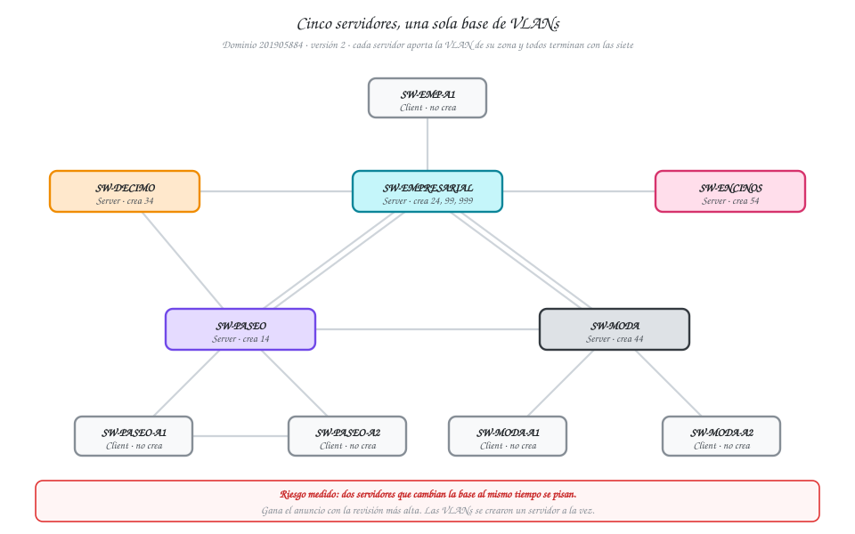

**Figura 8 — Cada servidor crea la VLAN de su zona; los clientes no crean ninguna y reciben las
siete.**

| Servidor | VLANs que creó |
|---|---|
| SW-EMPRESARIAL | 24, 99, 999 |
| SW-PASEO | 14 |
| SW-MODA | 44 |
| SW-DECIMO | 34 |
| SW-ENCINOS | 54 |

Resultado: los diez switches tienen las siete VLANs. El servidor y el cliente capturados muestran
el mismo dominio, la misma revisión y el mismo resumen MD5 (E2 y E3), que es la señal de que la
base está sincronizada.

Dos precauciones al aplicar la configuración:

- **Revisión en cero antes de unirse.** Cada switch pasa por `vtp mode transparent` antes de su
  modo definitivo.
- **Un servidor a la vez.** Las VLANs se crearon en un servidor, se comprobó la propagación y
  recién entonces se pasó al siguiente (ver Informe, §4.3).

---

## 16. Root Bridge por VLAN

Todos los switches ejecutan `spanning-tree mode rapid-pvst`.

| VLAN | Root Bridge | Prioridad configurada | Prioridad efectiva | Raíz secundaria (28672) |
|---|---|---|---|---|
| 14 | SW-PASEO | 24576 | 24590 | SW-EMPRESARIAL |
| 24 | SW-EMPRESARIAL | 24576 | 24600 | — |
| 34 | SW-DECIMO | 24576 | 24610 | SW-EMPRESARIAL |
| 44 | SW-MODA | 24576 | 24620 | SW-EMPRESARIAL |
| 54 | SW-ENCINOS | 24576 | 24630 | SW-EMPRESARIAL |
| 99 | SW-EMPRESARIAL | 24576 | 24675 | — |

La prioridad efectiva es la configurada más el ID de la VLAN (*extended system ID*). El resto de
switches conserva la prioridad por defecto, 32768. Las seis raíces se comprobaron con
`show spanning-tree vlan N` en cada switch: todas responden `This bridge is the root`.

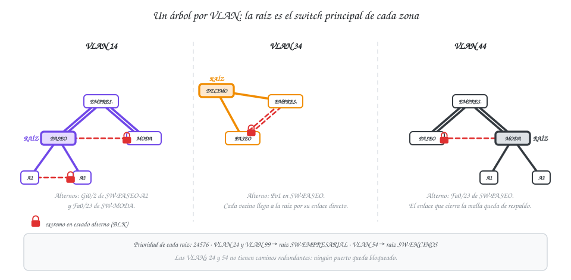

**Figura 12 — Árbol medido en las VLANs con caminos redundantes.**

**Puertos en estado alterno (medidos):**

| VLAN | Puerto bloqueado | Enlace | Por qué ese |
|---|---|---|---|
| 14 | SW-PASEO-A2 `Gi0/2` | Respaldo entre accesos | Cada acceso llega a la raíz por su uplink directo (E4b) |
| 14 | SW-MODA `Fa0/23` | Cierre de la malla | Por Po2 + Po1 el costo es 12 + 3 = 15, menor que 19 por el enlace directo de 100 Mbps |
| 34 | SW-PASEO `Po1` | Canal hacia SW-EMPRESARIAL | Ambos vecinos tienen enlace directo a la raíz (costo 19); gana SW-EMPRESARIAL por su prioridad 28672 |
| 44 | SW-PASEO `Fa0/23` | Cierre de la malla | Por Po1 + Po2 el costo es 3 + 12 = 15, menor que 19 |

**Justificación de la selección.**

- **El principal de cada zona es raíz de su VLAN** porque todo el tráfico de esa VLAN nace o
  termina en su zona. Con la raíz ahí, los accesos de la zona tienen su Root Port sobre el
  uplink directo y el bloqueo cae en los enlaces de respaldo.
- **SW-EMPRESARIAL es raíz secundaria** de las VLANs 14, 34, 44 y 54 porque aloja el gateway de
  todas: si el principal de una zona falla, la raíz pasa al switch por el que ese tráfico iba a
  pasar de todos modos.
- **SW-EMPRESARIAL es raíz de la VLAN 99** porque la administración de los diez switches converge
  en él.
- **La prioridad se fija con valores explícitos** y no con `root primary`, para que la tabla del
  manual coincida con la configuración y el resultado no dependa de las MAC de los equipos.

---

## 17. EtherChannel implementados

| Canal | Extremos | Miembros | Capacidad | Modo | Costo STP |
|---|---|---|---|---|---|
| **Po1** | SW-EMPRESARIAL ↔ SW-PASEO | Gi0/1, Gi0/2 | 2 Gbps | `active` – `active` | 3 |
| **Po2** | SW-EMPRESARIAL ↔ SW-MODA | Fa0/21, Fa0/22 | 200 Mbps | `active` – `active` | 12 |

**Justificación por carga.** La zona 1 (60 hosts) y la zona 4 (50 hosts) suman 110 de los 157
hosts del complejo, y su tráfico hacia cualquier otra zona cruza el enlace con SW-EMPRESARIAL
porque ahí está el gateway. Po1 recibe los puertos Gigabit por ser la zona de mayor carga; Po2 usa
FastEthernet porque el 3560-24PS solo tiene dos puertos Gigabit.

Las zonas 3 y 5 no llevan EtherChannel: 12 y 7 hosts no saturan un enlace de 100 Mbps. La zona 3
recibe dos enlaces por **disponibilidad**, no por capacidad, y por eso van a switches distintos en
lugar de agregarse (§5).

```
interface Port-channel1
 switchport trunk encapsulation dot1q
 switchport mode trunk
 switchport trunk native vlan 99
 switchport trunk allowed vlan 14,34,44,99
 switchport nonegotiate
!
interface range GigabitEthernet0/1-2
 switchport trunk encapsulation dot1q
 switchport mode trunk
 switchport trunk native vlan 99
 switchport trunk allowed vlan 14,34,44,99
 switchport nonegotiate
 channel-protocol lacp
 channel-group 1 mode active
```

> **El `Port-channel` se configura antes de sumar los miembros.** Si un miembro ya configurado
> como troncal entra a un canal recién creado, cuya interfaz lógica todavía está en valores por
> defecto, queda **suspendido** `(s)` y no se recupera solo aunque después se iguale la
> configuración (ver Informe, §4.4).

La evidencia E6 muestra `Po1(SU)` y `Po2(SU)` con sus cuatro miembros en `(P)`.

---

## 18. Enrutamiento entre zonas

Las VLANs aíslan las zonas en Capa 2. La comunicación entre zonas pasa por SW-EMPRESARIAL, que
tiene `ip routing` y un SVI por VLAN que actúa como default gateway de esa zona.

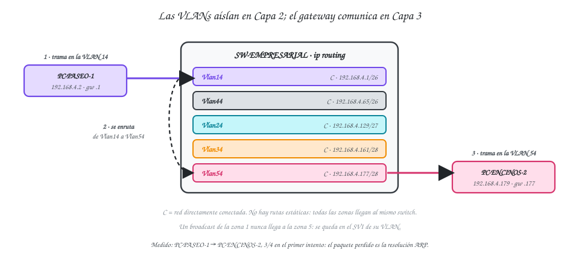

**Figura 14 — Un ping de la zona 1 a la zona 5 se enruta entre dos redes directamente conectadas.**

| SVI | Dirección | Gateway de |
|---|---|---|
| Vlan14 | 192.168.4.1 /26 | Zona 1 |
| Vlan24 | 192.168.4.129 /27 | Zona 2 |
| Vlan34 | 192.168.4.161 /28 | Zona 3 |
| Vlan44 | 192.168.4.65 /26 | Zona 4 |
| Vlan54 | 192.168.4.177 /28 | Zona 5 |
| Vlan99 | 192.168.4.193 /28 | Administración |

No hacen falta rutas estáticas: las seis redes están directamente conectadas al mismo switch y
aparecen como `C` en `show ip route` (E8). Los demás switches no enrutan; tienen una IP en la
VLAN 99 y `ip default-gateway 192.168.4.193` únicamente para su administración.

---

## 19. Dominios de colisión y de broadcast de la red

### 19.1 Dominios de colisión

La red no tiene hubs, así que hay **un dominio de colisión por cada enlace físico**, delimitado
por los dos puertos que lo terminan.

| Tipo de enlace | En el `.pkt` | Diseño completo |
|---|---|---|
| Switch ↔ switch (los miembros de un EtherChannel cuentan por separado) | 14 | 14 |
| Switch ↔ host | 10 | 157 |
| **Total** | **24** | **171** |

**Dispositivos que los delimitan:** los diez switches. Cada puerto de un 2960 o 3560 es un extremo
de un dominio de colisión propio.

**Por qué es adecuada esta segmentación.** Cada dominio contiene exactamente dos dispositivos
unidos por un enlace full-duplex, donde CSMA/CD no interviene: en la práctica no hay colisiones.
Para una red con puntos de venta y agencias bancarias eso significa que el rendimiento de un local
no depende de cuánto transmita el de al lado, que es lo que ocurriría con un medio compartido.

### 19.2 Dominios de broadcast

Hay **seis dominios de broadcast activos** (VLANs 14, 24, 34, 44, 54 y 99), delimitados por los
SVIs de SW-EMPRESARIAL. La VLAN 999 existe pero no tiene puertos activos.

| Dominio | Equipos en el diseño completo | Alcance |
|---|---|---|
| VLAN 14 | 60 | Zona 1 y los troncales del núcleo que la transportan |
| VLAN 24 | 28 | Solo la zona 2 |
| VLAN 34 | 12 | Zona 3 y sus dos enlaces |
| VLAN 44 | 50 | Zona 4 y los troncales del núcleo que la transportan |
| VLAN 54 | 7 | Solo la zona 5 y su enlace |
| VLAN 99 | 10 switches | Toda la red, sin equipos de usuario |

---

## 20. Cableado

Estándar TIA/EIA-568B en todos los enlaces.

| Enlace | Cable | Cantidad | Motivo |
|---|---|---|---|
| Switch ↔ switch | **Cruzado** (crossover) | 14 | Dispositivos del mismo tipo: ambos transmiten por los mismos pares |
| PC ↔ switch | **Directo** (straight-through) | 10 | Dispositivos de distinto tipo |

Velocidades: Gigabit Ethernet en Po1 y en el enlace entre los accesos de la zona 1; Fast Ethernet
en el resto.

> **Limitación del simulador.** En un despliegue real los enlaces entre edificios del complejo
> superan los 100 m del cobre e irían en fibra óptica. Los modelos 2960-24TT y 3560-24PS de
> Packet Tracer solo tienen puertos de cobre fijos, por lo que todos los enlaces se simularon en
> UTP.

---

## 21. Scripts de configuración

Los comandos completos de cada switch están en `configs/scripts/`, un archivo por dispositivo,
listos para pegar en la CLI:

| Archivo | Switch |
|---|---|
| [`SW-EMPRESARIAL.txt`](configs/scripts/SW-EMPRESARIAL.txt) | Principal zona 2, núcleo L3 |
| [`SW-PASEO.txt`](configs/scripts/SW-PASEO.txt) | Principal zona 1 |
| [`SW-MODA.txt`](configs/scripts/SW-MODA.txt) | Principal zona 4 |
| [`SW-DECIMO.txt`](configs/scripts/SW-DECIMO.txt) | Principal zona 3 |
| [`SW-ENCINOS.txt`](configs/scripts/SW-ENCINOS.txt) | Principal zona 5 |
| [`SW-EMP-A1.txt`](configs/scripts/SW-EMP-A1.txt) | Acceso zona 2 |
| [`SW-PASEO-A1.txt`](configs/scripts/SW-PASEO-A1.txt), [`SW-PASEO-A2.txt`](configs/scripts/SW-PASEO-A2.txt) | Accesos zona 1 |
| [`SW-MODA-A1.txt`](configs/scripts/SW-MODA-A1.txt), [`SW-MODA-A2.txt`](configs/scripts/SW-MODA-A2.txt) | Accesos zona 4 |

Todos siguen el mismo orden: identidad → Rapid PVST+ → VTP → EtherChannel (primero el
`Port-channel`, después los miembros) → troncales → VLANs (solo servidores) → puertos de acceso →
puertos sin uso → administración y enrutamiento.

**Orden de aplicación:** primero la sección de troncales en los diez switches; después las VLANs,
un servidor a la vez; al final los puertos de acceso.

---

## 22. Evidencia de pruebas

### 22.1 VLANs y VTP

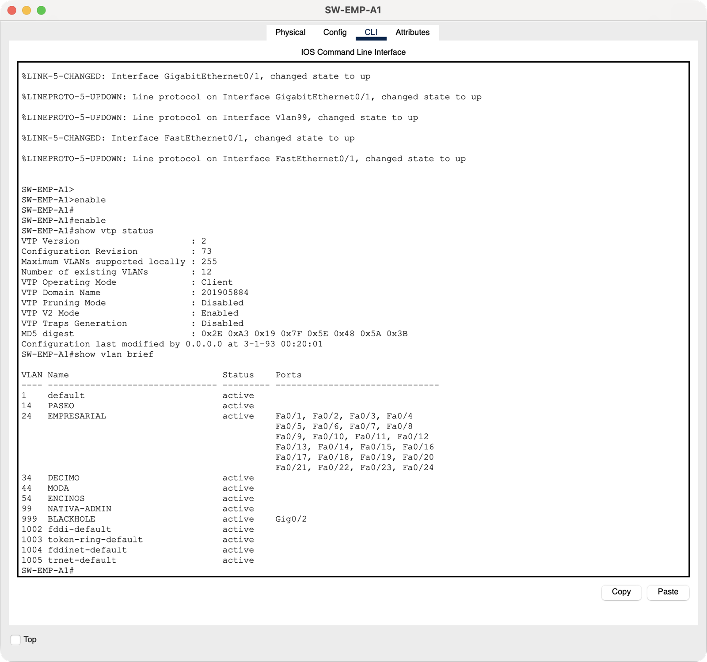

**E1 — `show vlan brief` en SW-EMP-A1 (cliente).** Las siete VLANs están presentes aunque el
switch no creó ninguna; sus 24 puertos están en la VLAN 24 y el puerto libre `Gig0/2` en la 999.

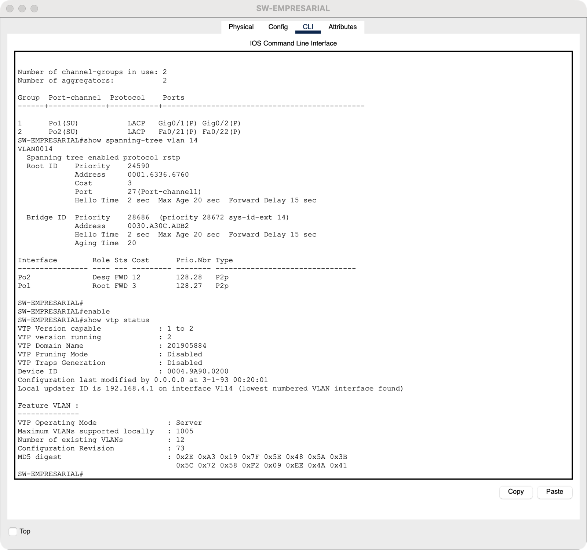

**E2 — `show vtp status` en SW-EMPRESARIAL.** Modo `Server`, dominio `201905884`, versión 2.

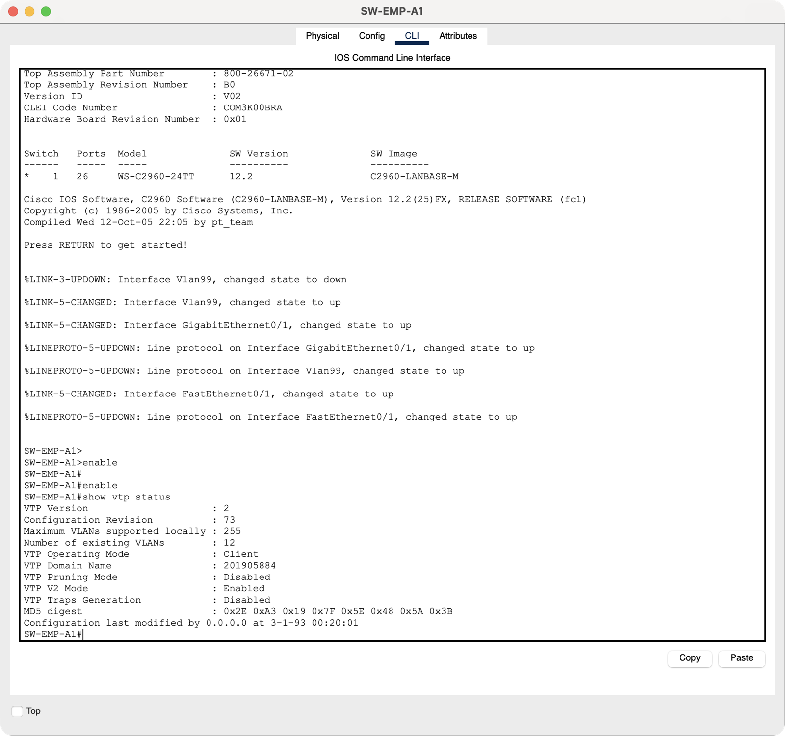

**E3 — `show vtp status` en SW-EMP-A1.** Modo `Client`, mismo dominio, misma revisión de
configuración y mismo MD5 que el servidor.

### 22.2 Spanning Tree

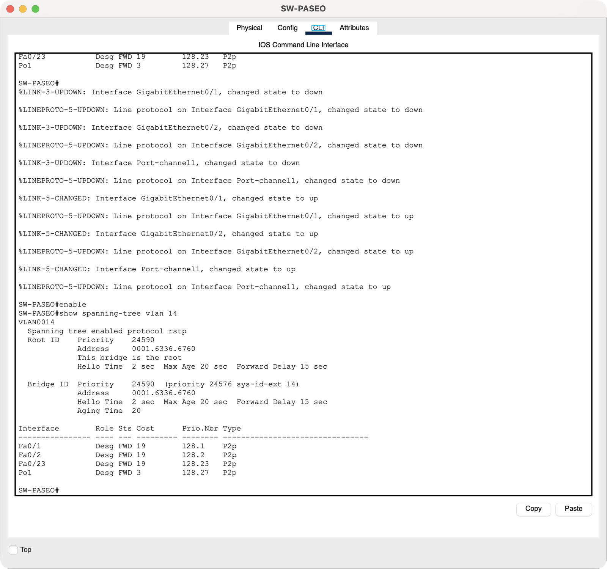

**E4a — `show spanning-tree vlan 14` en SW-PASEO.** Protocolo `rstp`, prioridad 24590,
`This bridge is the root`, todos los puertos `Desg FWD` y `Po1` con costo 3.

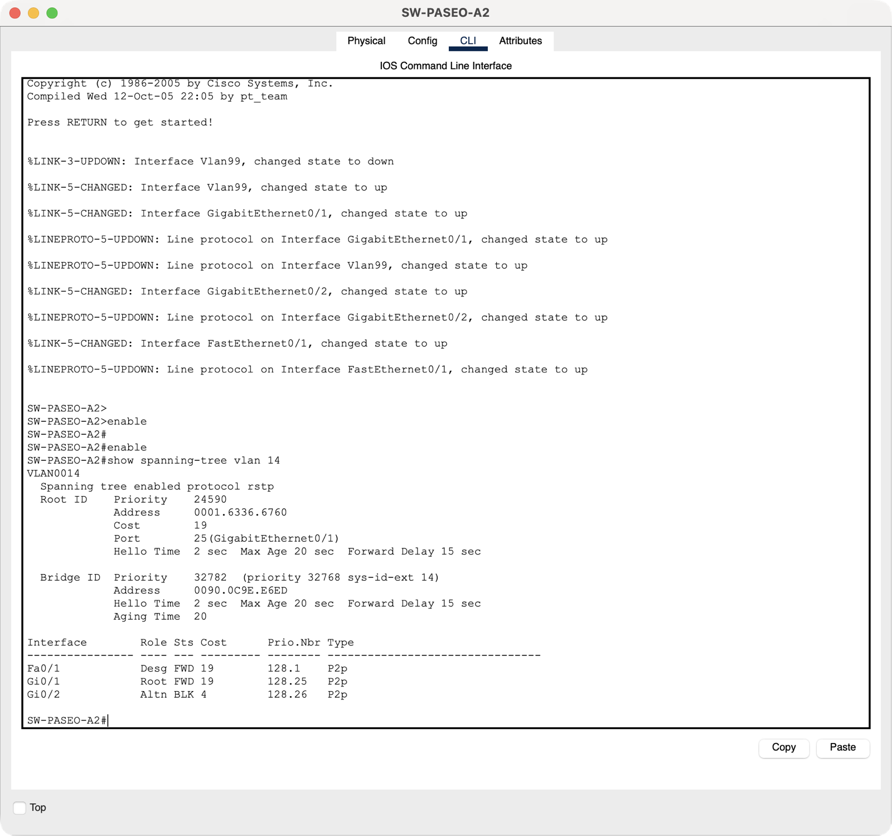

**E4b — El mismo comando en SW-PASEO-A2.** `Gi0/1` es el Root Port y `Gi0/2`, el enlace hacia el
acceso vecino, queda `Altn BLK`.

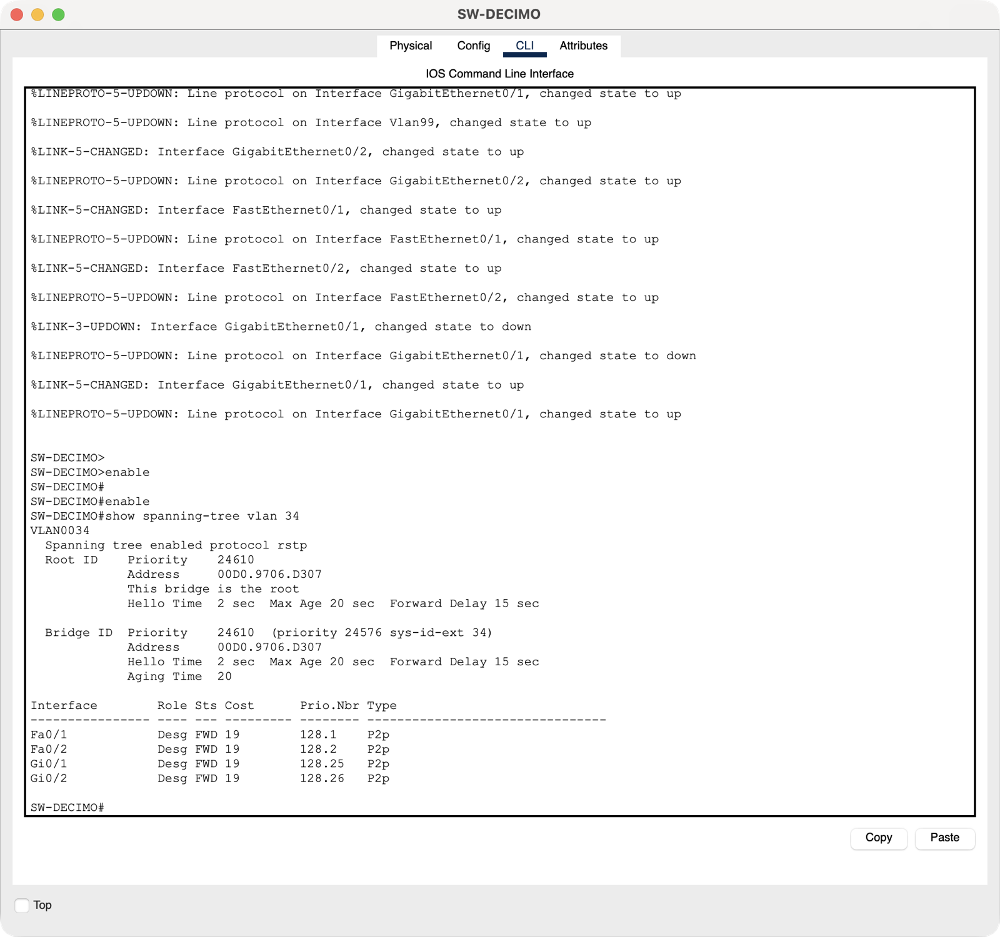

**E5 — `show spanning-tree vlan 34` en SW-DECIMO.** Raíz de la VLAN 34 con prioridad 24610; sus
dos enlaces hacia la red están en `Desg FWD`.

### 22.3 EtherChannel y troncales


**E6 — `show etherchannel summary` en SW-EMPRESARIAL.** `Po1(SU)` con `Gig0/1(P)` y `Gig0/2(P)`;
`Po2(SU)` con `Fa0/21(P)` y `Fa0/22(P)`. Protocolo LACP en ambos.

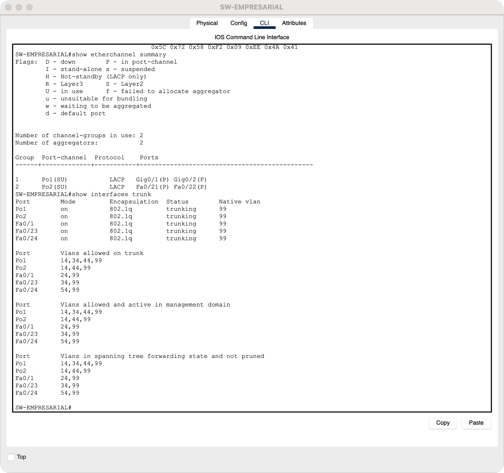

**E7 — `show interfaces trunk` en SW-EMPRESARIAL.** Cinco troncales, todos con nativa 99 y solo
las VLANs de §14.

### 22.4 Enrutamiento y conectividad


**E8 — `show ip route` en SW-EMPRESARIAL.** Seis subredes de 192.168.4.0/24 con tres máscaras
distintas, todas directamente conectadas a su SVI.


**E9 — Pings desde PC-PASEO-1** a PC-PASEO-2 (misma VLAN, otro switch) y a su gateway: 4/4.


**E10 — Pings desde PC-PASEO-1 hacia las zonas 5, 4 y 3.**

### 22.5 Pruebas de falla


**Figura 13 — Las cuatro fallas inducidas y el camino que tomó el tráfico.**


**E11 — Con `Gi0/1` apagado, `Po1` sigue `(SU)`:** `Gig0/1(D)` y `Gig0/2(P)`. El canal no se cae.

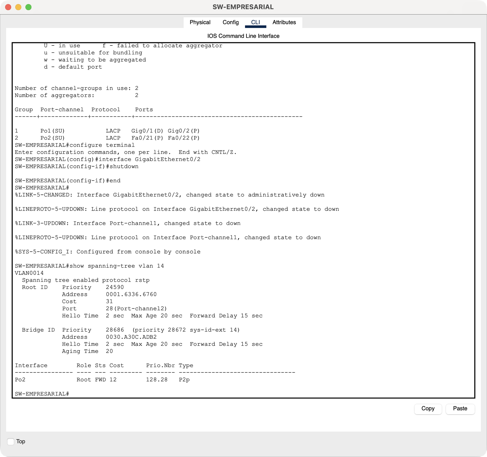

**E12 — Con Po1 completo apagado, el Root Port de la VLAN 14 en SW-EMPRESARIAL pasa a `Po2`**,
con costo 31 hacia la raíz (12 de Po2 más 19 del enlace SW-MODA ↔ SW-PASEO).

Los resultados numéricos de todas las pruebas están en el
[Informe de Desarrollo](InformeDesarrollo.md), §5.

---

## 23. Referencias

- Odom, W. (2019). *CCNA 200-301 Official Cert Guide*, vol. 1. Cisco Press.
- Cisco Networking Academy (2024). *Switching, Routing, and Wireless Essentials*. <https://www.netacad.com/>
- Ciudad Cayalá, sitio oficial. <https://cayala.com/>
- «Ciudad Cayalá (Guatemala)», Wikipedia. <https://es.wikipedia.org/wiki/Ciudad_Cayal%C3%A1_%28Guatemala%29>
- IEEE 802.1Q (VLAN), IEEE 802.1w (Rapid Spanning Tree), IEEE 802.3ad (LACP).
- ANSI/TIA-568 — Cableado de telecomunicaciones para edificios comerciales.
