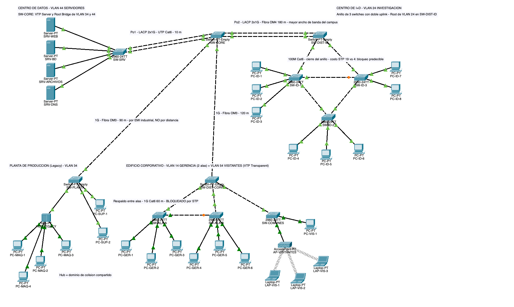
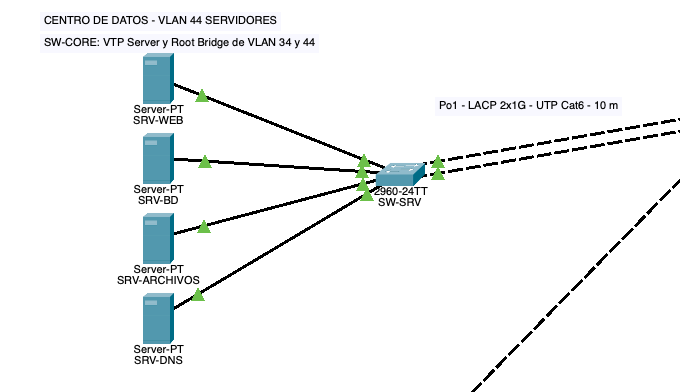
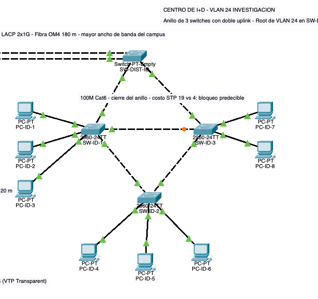
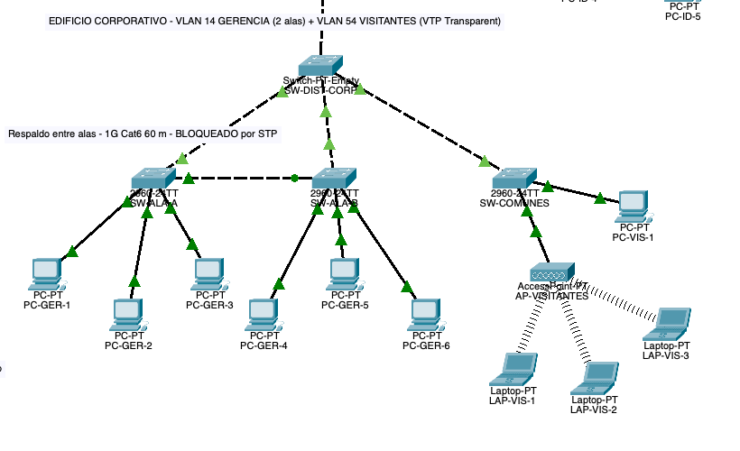
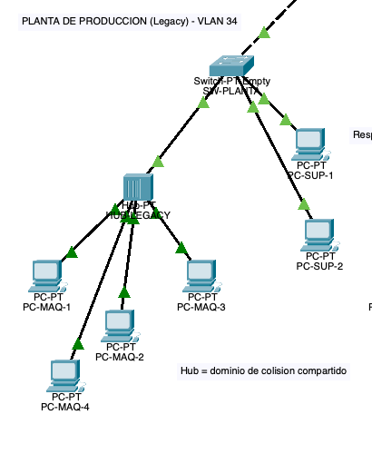
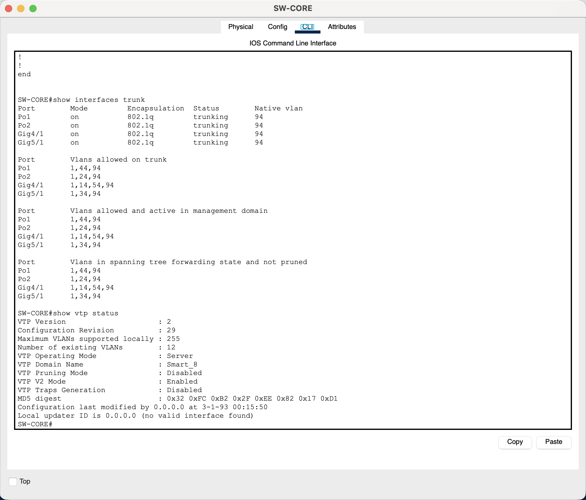

# Manual Técnico — Proyecto 1: SmartCity Tech Park

**Universidad de San Carlos de Guatemala** · Facultad de Ingeniería\
**Curso:** Redes de Computadoras 1 — Segundo Semestre 2026\
**Estudiante:** Santiago Barrera\
**Carné:** 201905884\
**Archivo de simulación:** `Proyecto1_201905884.pkt` (Cisco Packet Tracer 8.x)\

---

<!--
PLANTILLA. Cómo usarla:
- Los comentarios HTML como este son guías de redacción; no se ven en GitHub. Borrarlos al cerrar cada sección.
- Parte I (Marco Teórico): la teoría que sustenta cada decisión; se redacta con definiciones, comparaciones y referencias, ANTES de configurar.
- Parte II (Marco Práctico): la implementación con evidencia; cada decisión cita la sección teórica que la respalda (ej. "véase §6.2").
- Capturas: capturas/topologia/, capturas/areas/, capturas/evidencias/, capturas/laboratorio/ (índice en capturas/EVIDENCIAS.md).
- Configs completas por dispositivo: configs/<hostname>.txt.
- Valores por carné ya sustituidos: NO cambiarlos (penaliza -50 % a -100 %).
-->

## Índice

**Parte I — Marco Teórico**

1. [Introducción y alcance](#1-introducción-y-alcance)
2. [El problema de la red plana](#2-el-problema-de-la-red-plana)
3. [Dominios de colisión y dominios de broadcast](#3-dominios-de-colisión-y-dominios-de-broadcast)
4. [VLANs y enlaces troncales IEEE 802.1Q](#4-vlans-y-enlaces-troncales-ieee-8021q)
5. [VLAN Trunking Protocol (VTP)](#5-vlan-trunking-protocol-vtp)
6. [Spanning Tree Protocol y PVST+](#6-spanning-tree-protocol-y-pvst)
7. [EtherChannel y LACP](#7-etherchannel-y-lacp)
8. [Medios de transmisión: cobre y fibra óptica](#8-medios-de-transmisión-cobre-y-fibra-óptica)
9. [Seguridad básica en Capa 2](#9-seguridad-básica-en-capa-2)

**Parte II — Marco Práctico**

10. [Parámetros de diseño derivados del carné](#10-parámetros-de-diseño-derivados-del-carné)
11. [Topología general](#11-topología-general)
12. [Diseño por área](#12-diseño-por-área)
13. [Tabla de VLANs](#13-tabla-de-vlans)
14. [Asignación de puertos por switch](#14-asignación-de-puertos-por-switch)
15. [Dominios de colisión de la red](#15-dominios-de-colisión-de-la-red)
16. [Dominios de broadcast de la red](#16-dominios-de-broadcast-de-la-red)
17. [VTP: servidor, modos y propagación](#17-vtp-servidor-modos-y-propagación)
18. [STP: Root Bridge por VLAN](#18-stp-root-bridge-por-vlan)
19. [EtherChannel implementados](#19-etherchannel-implementados)
20. [Medios de transmisión por segmento](#20-medios-de-transmisión-por-segmento)
21. [Segmento Legacy: impacto y contención](#21-segmento-legacy-impacto-y-contención)
22. [Seguridad básica aplicada](#22-seguridad-básica-aplicada)
23. [Comandos de configuración por dispositivo](#23-comandos-de-configuración-por-dispositivo)
24. [Evidencia de pruebas](#24-evidencia-de-pruebas)
25. [Parte física: laboratorio](#25-parte-física-laboratorio)
26. [Presupuesto estimado](#26-presupuesto-estimado)
27. [Análisis de PDUs en Modo Simulación (opcional)](#27-análisis-de-pdus-en-modo-simulación-opcional)
28. [Conclusiones](#28-conclusiones)
29. [Referencias](#29-referencias)

---

# Parte I — Marco Teórico

## 1. Introducción y alcance

<!-- 2–3 párrafos: qué es SmartCity Tech Park, qué se le pide al diseño (Capa 1 y Capa 2), qué contiene este manual y cómo está organizado (teoría → práctica). Modelo: §1 del ManualTecnico.md de la Práctica 1. -->

El complejo tecnológico SmartCity Tech Park integra cuatro áreas —Centro de Datos, Centro de Investigación y Desarrollo, Edificio Corporativo y Planta de Producción— que hoy operan sobre una red plana. Este manual documenta el rediseño de su infraestructura en las **Capas 1 y 2 del modelo OSI**: topología jerárquica, segmentación lógica con VLANs, administración centralizada con VTP, prevención de bucles con Spanning Tree y agregación de enlaces con EtherChannel.

El documento se organiza en dos partes. La **Parte I (Marco Teórico)** expone los conceptos que sustentan cada decisión de diseño. La **Parte II (Marco Práctico)** presenta la implementación en Cisco Packet Tracer con su evidencia, citando en cada caso la sección teórica que la respalda.

## 2. El problema de la red plana

<!-- Describir con precisión los síntomas del enunciado (§3 y §4.1): dominio de broadcast único, dominio de colisión compartido en la Planta, enlaces saturados, rutas únicas. Cerrar con la tabla síntoma → causa → tecnología que lo resuelve. -->

| Síntoma en el campus | Causa en Capa 1/2 | Tecnología que lo resuelve | Sección |
|---|---|---|---|
| Tráfico administrativo mezclado con el de invitados | Un solo dominio de broadcast | VLANs | §4 |
| Colisiones continuas en el segmento industrial | Hub: dominio de colisión compartido | Switch de acceso + contención | §3, §21 |
| Enlaces saturados hacia servidores e I+D | Un solo enlace físico por trunk | EtherChannel | §7 |
| Caída total ante la falla de un cable o switch | Rutas únicas, sin redundancia | Topología redundante + STP | §6 |
| VLANs inconsistentes entre switches | Administración manual por equipo | VTP | §5 |

## 3. Dominios de colisión y dominios de broadcast

### 3.1 Dominio de colisión
<!-- Definición, CSMA/CD, half vs full duplex. Regla de conteo: hub = 1 dominio para todo lo conectado; switch = 1 dominio por puerto activo; router también separa. -->

### 3.2 Dominio de broadcast
<!-- Definición, trama FF:FF:FF:FF:FF:FF, inundación. Lo delimitan el router y la VLAN. Red plana con N switches = 1 dominio; con VLANs = 1 por VLAN. -->

### 3.3 Comparación

| Criterio | Dominio de colisión | Dominio de broadcast |
|---|---|---|
| Capa OSI | 1 (medio físico) | 2 (direccionamiento MAC) |
| Lo crea | Medio compartido (hub, half-duplex) | Alcance de una trama de difusión |
| Lo separa | Switch (por puerto), router | Router, VLAN |
| Cómo se cuenta | Puertos activos de switch + 1 por hub | Una por VLAN activa |

## 4. VLANs y enlaces troncales IEEE 802.1Q

### 4.1 Qué es una VLAN
### 4.2 Puertos de acceso y puertos troncales
### 4.3 Etiquetado 802.1Q y VLAN nativa
<!-- Explicar el tag de 4 bytes, por qué la nativa viaja sin etiqueta, riesgo de dejar la VLAN 1 (VLAN hopping) y por qué el enunciado exige cambiarla a la 94. -->

| Puerto | Qué transporta | Etiqueta 802.1Q | Se usa hacia |
|---|---|---|---|
| Access | Una VLAN | No | PCs, servidores, AP, hub |
| Trunk | Varias VLANs | Sí (excepto la nativa) | Otros switches |

## 5. VLAN Trunking Protocol (VTP)

### 5.1 Propósito y funcionamiento
### 5.2 Modos Server, Client y Transparent

| Modo | Crea/borra VLANs | Adopta anuncios | Reenvía anuncios | Uso típico |
|---|---|---|---|---|
| Server | Sí | Sí | Sí | Núcleo que administra el dominio |
| Client | No | Sí | Sí | Distribución y acceso |
| Transparent | Solo localmente | No | Sí (v2) | Switch que debe aislarse de la administración |

### 5.3 El número de revisión de configuración
<!-- Por qué un switch con revisión más alta puede borrar las VLANs del dominio; mitigación (transparent → client, contraseña). -->

## 6. Spanning Tree Protocol y PVST+

### 6.1 El problema del bucle de Capa 2
### 6.2 Elección del Root Bridge y cálculo de costos
<!-- Bridge ID = prioridad + MAC; BPDU; costos por velocidad; estados de puerto; por qué conviene fijar el Root a mano. -->
### 6.3 PVST+ frente a Rapid-PVST+
<!-- Una instancia por VLAN; convergencia 30–50 s vs segundos; el carné par asigna PVST. -->

| Velocidad del enlace | 10 Mbps | 100 Mbps | 1 Gbps | 10 Gbps |
|---|---|---|---|---|
| Costo STP por defecto | 100 | 19 | 4 | 2 |

<!-- La guía del 2960 tabula hasta 1 Gbps (100/19/4); el valor 2 para 10 Gbps viene de la tabla ampliada de 802.1D-2004. Citar la fuente que se use. -->

## 7. EtherChannel y LACP

### 7.1 Agregación de enlaces: capacidad y tolerancia a fallos
### 7.2 LACP (IEEE 802.3ad) frente a PAgP

| | LACP | PAgP |
|---|---|---|
| Estándar | IEEE 802.3ad (abierto) | Propietario Cisco |
| Modos | active / passive | desirable / auto |
| Combinación que forma el canal | active–active, active–passive | desirable–desirable, desirable–auto |

### 7.3 Interacción con Spanning Tree
<!-- STP ve el port-channel como un solo enlace: no bloquea los miembros. -->

## 8. Medios de transmisión: cobre y fibra óptica

<!-- Criterios: distancia (100 m del cobre), ancho de banda, inmunidad electromagnética (ambiente industrial), costo. Cuándo conviene cada uno en un campus de varios edificios. Modelo: §8 del ManualTecnico.md de la Práctica 1. -->

| Medio | Alcance típico | Ancho de banda | Inmunidad EMI | Costo relativo | Uso recomendado en el campus |
|---|---|---|---|---|---|
| UTP Cat 6 | 100 m (1 Gbps) | 1 Gbps | Baja | Bajo | Horizontal dentro de cada edificio |
| UTP Cat 6A | 100 m (10 Gbps) | 10 Gbps | Media (F/UTP) | Medio | Troncales cortos intraedificio |
| Fibra multimodo OM3/OM4 | 300–550 m (10 Gbps) | 10–40 Gbps | Total | Alto (transceptores) | Troncales entre edificios |
| Fibra monomodo OS2 | 10 km+ | 10–100 Gbps | Total | Alto | Distancias largas |

## 9. Seguridad básica en Capa 2

<!-- Banner MOTD (aviso legal de acceso), cambio de VLAN nativa, restricción de VLANs permitidas en trunks, port-security y storm-control como contención. -->

---

# Parte II — Marco Práctico

## 10. Parámetros de diseño derivados del carné

Carné **201905884**: penúltimo dígito **8**, último dígito **4** (par).

| Parámetro | Regla del enunciado | Valor aplicado |
|---|---|---|
| VLANs | `1X` … `5X` con X = 4 | 14, 24, 34, 44, 54 |
| VLAN nativa de los trunks | `9X` | **94** |
| Dominio VTP | `Smart_#` | **Smart_8** |
| Contraseña VTP | fija | `proyecto12S2026` |
| EtherChannel | LACP si par | **LACP** |
| Spanning Tree | PVST si par | **PVST+** (`spanning-tree mode pvst`) |
| Banner MOTD (distribución) | `Acceso Restringido - TechPark_[Carné]` | `Acceso Restringido - TechPark_201905884` |
| Archivo | `Proyecto1_#carnet.pkt` | `Proyecto1_201905884.pkt` |

## 11. Topología general

<!-- Captura de la topología completa con los medios etiquetados. Explicar la jerarquía: Core → distribución → acceso. -->



**Figura 1 — Topología completa.** <!-- una o dos líneas de lectura de la figura -->

### 11.1 Inventario de dispositivos

| Hostname | Modelo (PT) | Área | Rol | Modo VTP |
|---|---|---|---|---|
| SW-CORE | | Centro de Datos | Core / VTP Server | Server |
| SW-SRV | | Centro de Datos | Acceso servidores | Client |
| SW-DIST-ID | | Centro de I+D | Distribución | Client |
| SW-ID-1 / 2 / 3 | | Centro de I+D | Acceso (anillo) | Client |
| SW-DIST-CORP | | Edificio Corporativo | Distribución | Client |
| SW-ALA-A / SW-ALA-B | | Edificio Corporativo | Acceso | Client |
| SW-COMUNES | | Edificio Corporativo | Acceso visitantes | Transparent |
| SW-PLANTA | | Planta de Producción | Acceso | Client |
| HUB-LEGACY | Hub-PT | Planta de Producción | Segmento Legacy | — |
| AP-VISITANTES | AccessPoint-PT | Edificio Corporativo | Inalámbrico | — |

## 12. Diseño por área

<!-- Para cada área: captura, qué exige el enunciado, cómo se resolvió y por qué (citar §3–§9). -->

### 12.1 Centro de Datos (Core)


### 12.2 Centro de I+D


### 12.3 Edificio Corporativo


### 12.4 Planta de Producción


## 13. Tabla de VLANs

| VLAN ID | Nombre | Ubicación física | Dispositivos finales |
|---|---|---|---|
| 14 | Gerencia | Edificio Corporativo (Ala A y Ala B) | |
| 24 | Investigacion | Centro de I+D | ≥ 8 PCs/laptops |
| 34 | Produccion | Planta de Producción | Máquinas vía hub |
| 44 | Servidores | Centro de Datos | ≥ 4 servidores |
| 54 | Visitantes | Edificio Corporativo (Áreas Comunes) | Laptops vía AP |
| 94 | Nativa | Todos los trunks | — |

<!-- Confirmar con el tutor si los nombres van en MAYÚSCULAS (el ejemplo del enunciado dice "exactamente GERENCIA"). -->

## 14. Asignación de puertos por switch

<!-- Una tabla por switch. Columnas fijas. -->

### 14.1 SW-CORE
| Puerto | Modo | VLAN(s) | Conecta a | Medio |
|---|---|---|---|---|
| | | | | |

<!-- Repetir 14.2 … 14.n para cada switch. -->

## 15. Dominios de colisión de la red

<!-- Regla de §3.1: un dominio por puerto activo de switch; el hub y todo lo que cuelga de él forman UN dominio compartido. -->

| Dispositivo | Puertos activos | Dominios de colisión que genera | Observación |
|---|---|---|---|
| SW-CORE | | | |
| … | | | |
| HUB-LEGACY | n máquinas + 1 uplink | **1 (compartido)** | Segmento Legacy, véase §21 |
| **Total** | | | |

## 16. Dominios de broadcast de la red

| Dominio | VLAN | Alcance | Switches que la transportan |
|---|---|---|---|
| 1 | 14 Gerencia | | |
| 2 | 24 Investigacion | | |
| 3 | 34 Produccion | | |
| 4 | 44 Servidores | | |
| 5 | 54 Visitantes | | |
| 6 | 94 Nativa (control) | | |

## 17. VTP: servidor, modos y propagación

<!-- Captura de `show vtp status` en SW-CORE y en un Client; `show vlan brief` en un Client mostrando las VLANs propagadas. Justificar por qué el Core es el Server (§5.2) y por qué SW-COMUNES es Transparent. -->



## 18. STP: Root Bridge por VLAN

<!-- Tabla VLAN → Root elegido → justificación (§6.2). Captura de `show spanning-tree` en el Root ("This bridge is the root") y en un switch con puerto bloqueado. -->

| VLAN | Root Bridge | Prioridad | Justificación |
|---|---|---|---|
| 14 | | | |
| 24 | | | |
| 34 | | | |
| 44 | | | |
| 54 | | | |

## 19. EtherChannel implementados

<!-- Tabla por canal: extremos, puertos miembros, protocolo (LACP active), VLANs, justificación (§7). Captura de `show etherchannel summary` con SU / P. -->

| Port-channel | Extremo A | Extremo B | Puertos | Protocolo | Propósito |
|---|---|---|---|---|---|
| Po1 | SW-CORE | SW-SRV | | LACP active/active | Redundancia y capacidad hacia servidores |
| Po2 | SW-CORE | SW-DIST-ID | | LACP active/active | Trunk de mayor ancho de banda del campus |

## 20. Medios de transmisión por segmento

<!-- Tabla enlace → medio → distancia asumida → justificación (§8). Captura de las etiquetas en el .pkt. -->

| Enlace | Medio | Distancia asumida | Justificación |
|---|---|---|---|
| SW-CORE ↔ SW-DIST-ID | | | |
| SW-CORE ↔ SW-DIST-CORP | | | |
| SW-CORE ↔ SW-PLANTA | | | |
| Intraedificio (acceso) | UTP Cat 6 | < 100 m | |

## 21. Segmento Legacy: impacto y contención

### 21.1 Impacto del dominio de colisión compartido
<!-- Half-duplex, CSMA/CD, retransmisiones, latencia, visibilidad de tramas, propagación de fallas (§3.1). -->
### 21.2 Medidas de contención en el switch de acceso
<!-- Confinamiento a la VLAN 34, storm-control, port-security, un solo puerto para el hub. Qué mitigan y qué NO eliminan. -->

## 22. Seguridad básica aplicada

<!-- Captura del banner al entrar a un switch de distribución; `show interfaces trunk` mostrando nativa 94. -->

## 23. Comandos de configuración por dispositivo

<!-- Bloques por hostname, en el orden en que se ejecutaron. La configuración completa (`show running-config`) va en configs/<hostname>.txt; aquí los comandos relevantes con comentario de propósito. -->

### 23.1 SW-CORE
```
```

## 24. Evidencia de pruebas

<!-- Obligatorias: show spanning-tree, show etherchannel summary, show interfaces trunk. Además: ping intra-VLAN (0 % loss), ping inter-VLAN (100 % loss), prueba de falla (apagar un switch de I+D / un uplink de ala). Índice completo en capturas/EVIDENCIAS.md. -->

| # | Prueba | Dispositivo | Comando | Resultado esperado | Captura |
|---|---|---|---|---|---|
| 1 | Árbol STP | | `show spanning-tree` | Root correcto, puertos BLK donde corresponde | |
| 2 | Canales | | `show etherchannel summary` | Po en `SU`, puertos `P` | |
| 3 | Trunks | | `show interfaces trunk` | Nativa 94, VLANs permitidas | |
| 4 | Conectividad intra-VLAN | PC | `ping` | 0 % loss | |
| 5 | Aislamiento inter-VLAN | PC | `ping` | 100 % loss | |
| 6 | Tolerancia a fallos I+D | | apagar un switch | Los otros dos siguen conectados | |
| 7 | Tolerancia a fallos alas | | apagar uplink | Ala A ↔ Ala B sigue activo | |

## 25. Parte física: laboratorio

<!-- Switch 1 (Server) y Switch 2 (Client) reales; VLANs por carné propagadas; trunk entre ellos; access hacia PCs. Fotos y salidas de show en capturas/laboratorio/. Indicar pareja y fecha. -->

## 26. Presupuesto estimado

<!-- Switches, módulos SFP de fibra, cable UTP y fibra, patch cords. Moneda y fuente de cada precio. Modelo: §20 del ManualTecnico.md de la Práctica 1. -->

| Ítem | Descripción | Cantidad | Precio unitario (USD) | Subtotal | Fuente |
|---|---|---|---|---|---|
| | | | | | |
| **Total** | | | | | |

## 27. Análisis de PDUs en Modo Simulación (opcional)

<!-- BPDU: señalar Root ID, Bridge ID y costo. PDU VTP: Domain Name y Configuration Revision Number. Capturas en capturas/evidencias/. -->

## 28. Conclusiones

## 29. Referencias

<!-- Mismo formato que §23 de la Práctica 1: normas, bibliografía del curso, documentación oficial (los enlaces del enunciado §5), catálogos para el presupuesto. -->

**Normas técnicas**

1. IEEE 802.1Q — *Bridges and Bridged Networks* (VLAN tagging).
2. IEEE 802.1D — *Spanning Tree Protocol*.
3. IEEE 802.3ad — *Link Aggregation* (LACP).

**Documentación oficial**

4. Cisco. *Configure VLAN Trunks* (Catalyst 9000). <https://www.cisco.com/c/en/us/td/docs/switches/lan/c9000/lyr2-fwd/vlan/vlan-configuration-guide/configure-vlan-trunks.html>
5. Cisco. *Understanding VLAN Trunk Protocol (VTP)*, documento 10558. <https://www.cisco.com/c/en/us/support/docs/lan-switching/vtp/10558-21.html>
6. Cisco. *Configuring STP* (Catalyst 2960, IOS 12.2(53)SE). <https://www.cisco.com/c/en/us/td/docs/switches/lan/catalyst2960/software/release/12-2_53_se/configuration/guide/2960scg/swstp.html>
7. Cisco. *Configuring EtherChannels* (Catalyst 2960, IOS 12.2(53)SE). <https://www.cisco.com/c/en/us/td/docs/switches/lan/catalyst2960/software/release/12-2_53_se/configuration/guide/2960scg/swethchl.html>

**Bibliografía del curso**

8. Odom, Wendell. 2019. *CCNA 200-301 Official Cert Guide*, Vol. 1. Indianápolis: Cisco Press.
9. Cisco Networking Academy. *Switching, Routing, and Wireless Essentials*. <https://www.netacad.com/>
