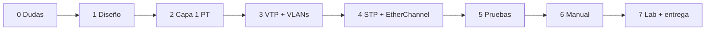

# Plan de trabajo — Proyecto 1

El enunciado promete una metodología en §6 pero la sección viene **vacía**, así que esta es la propia. Orden pensado para evitar "errores de configuración en cascada": primero lo que otros dependen, después lo que depende de ello.

Hoy es 2026-09-07; la elaboración cierra el **17/09/2026** → 10 días.

## Fases
| Fase | Qué | Por qué en este orden | Meta |
|---|---|---|---|
| 0 · Cierre de dudas | Pedir PDF completo, preguntar nombre de VLAN, fecha de lab | Cambian decisiones de diseño y prioridades | 08/09 |
| 1 · Diseño en papel | Bosquejo por área, tabla de switches con rol y modo VTP, tabla de puertos, medios por enlace, Root Bridge por VLAN | Con [[Requerimientos por área]] cerrado, configurar es mecánico | 09/09 |
| 2 · Capa 1 en Packet Tracer | Colocar dispositivos, cablear, etiquetar medios, hub Legacy, AP | Sin topología física no hay nada que configurar | 10/09 |
| 3 · VTP + VLANs | Core Server (`Smart_8`), demás Client/Transparent, crear las 5 VLANs, trunks con nativa 94, access por puerto | VTP primero: si se crean VLANs en Clients, no se puede; si el revision number sube en el lado equivocado, borra todo ([[VTP]]) | 11/09 |
| 4 · Redundancia | EtherChannel LACP (servidores, I+D), STP PVST con Root Bridge por VLAN, verificar puertos bloqueados | Necesita trunks ya funcionando | 12/09 |
| 5 · Pruebas | `ping` intra-VLAN por área, aislamiento inter-VLAN, apagar un switch de I+D y un uplink de ala, `show spanning-tree`, `show etherchannel summary`, `show interfaces trunk` | Son las evidencias que pide la rúbrica | 13/09 |
| 6 · Manual Técnico | README con las tablas de [[Entregables y checklist]], capturas, comandos, presupuesto | Se escribe con todo ya funcionando y capturado | 14–16/09 |
| 7 · Lab físico + entrega | Switches reales Server/Client con la pareja; subir a repo y UEDI | Depende del calendario del lab | ≤ 17/09 |

## Reglas de trabajo
- Cada comando que se ejecute se **copia al README en el momento**, por dispositivo; reconstruirlos después cuesta el doble.
- Guardar el `.pkt` con versión al final de cada fase (`Proyecto1_201905884_f3.pkt` en local; solo el final se sube con el nombre oficial).
- Antes de cada `show vlan brief`, comparar contra [[Parámetros por carné 201905884]].
- Toda decisión de diseño se anota **con su porqué** en el momento en que se toma; la rúbrica califica la justificación, no solo el resultado.

## Flujo

Volver a [[Proyecto 1 - SmartCity Tech Park]].

> 📚 Fuente: propia, a partir de §4.3, §4.5 y §7 del enunciado.
