## Índice

1. [Objetivo](#1-objetivo)
2. [Diseño de la red](#2-diseño-de-la-red)
3. [Paso 1 — Construir la topología](#3-paso-1--construir-la-topología)
4. [Paso 2 — Configurar los enlaces trunk](#4-paso-2--configurar-los-enlaces-trunk)
5. [Paso 3 — Configurar VTP](#5-paso-3--configurar-vtp)
6. [Paso 4 — Crear las VLANs](#6-paso-4--crear-las-vlans)
7. [Paso 5 — Asignar los puertos de acceso](#7-paso-5--asignar-los-puertos-de-acceso)
8. [Paso 6 — Direccionamiento IP de las PCs](#8-paso-6--direccionamiento-ip-de-las-pcs)
9. [Scripts completos de configuración](#9-scripts-completos-de-configuración)
10. [Verificación: `show vtp status`](#10-verificación-show-vtp-status)
11. [Verificación: `show vlan brief`](#11-verificación-show-vlan-brief)
12. [Pruebas de conectividad](#12-pruebas-de-conectividad)
13. [Solución de problemas](#13-solución-de-problemas)
14. [Conclusiones](#14-conclusiones)

---

## 1. Objetivo

Configurar en Cisco Packet Tracer una red conmutada con cuatro switches Cisco 2960, implementando
tres VLANs y el protocolo **VTP** en sus tres modos de operación (*server*, *client* y
*transparent*), verificando que las VLANs se propaguen correctamente desde el servidor hacia los
clientes y comprobando mediante `ping` que:

- Dos PCs de la **misma VLAN** se comunican aunque estén en switches distintos.
- Dos PCs de **VLANs distintas** no se comunican, aunque estén en el mismo switch.

---

## 2. Diseño de la red

### 2.1 VLANs

En IOS una VLAN es un **número**; el nombre es solo una etiqueta descriptiva. Los IDs elegidos son:

| VLAN ID | Nombre | Red | Máscara |
|:---:|---|---|---|
| 10 | `ADMIN` | 192.168.10.0 | 255.255.255.0 |
| 20 | `MERCA` | 192.168.20.0 | 255.255.255.0 |
| 30 | `VENTAS` | 192.168.30.0 | 255.255.255.0 |

> La VLAN 1 (default) queda sin uso para tráfico de datos. Todos los puertos no configurados
> permanecen en ella.

### 2.2 Switches y roles VTP

Los cuatro equipos son **Cisco 2960-24TT** (24 puertos FastEthernet + 2 GigabitEthernet).
Todos comparten el dominio VTP **`REDES1`**.

| Switch | Rol en la topología | Modo VTP | ¿Puede crear VLANs? | Puertos usados |
|---|---|:---:|:---:|---|
| `Switch0` | Central / núcleo | **server** | Sí | Fa0/1, Fa0/2, Fa0/3 (trunks) |
| `ADMIN` | Acceso | **client** | No | Fa0/1, Fa0/2 (PCs) · Fa0/24 (trunk) |
| `MERCA` | Acceso | **client** | No | Fa0/1, Fa0/2 (PCs) · Fa0/24 (trunk) |
| `VENTAS` | Acceso | **transparent** | Sí, pero solo localmente | Fa0/1, Fa0/2 (PCs) · Fa0/24 (trunk) |

### 2.3 Enlaces

| Extremo A | Puerto A | Extremo B | Puerto B | Cable | Tipo de enlace |
|---|---|---|---|---|---|
| `Switch0` | Fa0/1 | `ADMIN` | Fa0/24 | Cross-Over | **Trunk** |
| `Switch0` | Fa0/2 | `MERCA` | Fa0/24 | Cross-Over | **Trunk** |
| `Switch0` | Fa0/3 | `VENTAS` | Fa0/24 | Cross-Over | **Trunk** |
| `ADMIN` | Fa0/1 | `PC1` | Fa0 | Straight-Through | Access |
| `ADMIN` | Fa0/2 | `PC2` | Fa0 | Straight-Through | Access |
| `MERCA` | Fa0/1 | `PC3` | Fa0 | Straight-Through | Access |
| `MERCA` | Fa0/2 | `PC4` | Fa0 | Straight-Through | Access |
| `VENTAS` | Fa0/1 | `PC5` | Fa0 | Straight-Through | Access |
| `VENTAS` | Fa0/2 | `PC6` | Fa0 | Straight-Through | Access |

> **Regla de cableado:** dispositivos del *mismo tipo* (switch↔switch) usan **cross-over**;
> de *distinto tipo* (switch↔PC) usan **straight-through**. Los 2960 soportan auto-MDIX, pero en el
> lab se usa el cable correcto porque la rúbrica evalúa el diseño físico.

### 2.4 Direccionamiento y reparto de PCs

Las PCs se reparten **de forma cruzada**: las dos PCs de un mismo switch pertenecen a VLANs
distintas, y las dos PCs de una misma VLAN están en switches distintos. Así el ping exitoso
demuestra que el trunk y VTP realmente funcionan, y el ping fallido demuestra que el aislamiento
es de capa 2 y no simple falta de cable.

| PC | Switch | Puerto | VLAN | Dirección IP | Máscara | Gateway |
|---|---|---|:---:|---|---|:---:|
| `PC1` | `ADMIN` | Fa0/1 | 10 (ADMIN) | 192.168.10.10 | 255.255.255.0 | — |
| `PC2` | `ADMIN` | Fa0/2 | 20 (MERCA) | 192.168.20.20 | 255.255.255.0 | — |
| `PC3` | `MERCA` | Fa0/1 | 20 (MERCA) | 192.168.20.30 | 255.255.255.0 | — |
| `PC4` | `MERCA` | Fa0/2 | 30 (VENTAS) | 192.168.30.40 | 255.255.255.0 | — |
| `PC5` | `VENTAS` | Fa0/1 | 30 (VENTAS) | 192.168.30.50 | 255.255.255.0 | — |
| `PC6` | `VENTAS` | Fa0/2 | 10 (ADMIN) | 192.168.10.60 | 255.255.255.0 | — |

> **El gateway se deja vacío a propósito.** No hay router en esta topología: no existe
> enrutamiento inter-VLAN, y ese es justamente el comportamiento que la tarea pide demostrar.

### 2.5 Diagrama lógico

```
                         ┌──────────────────────┐
                         │      Switch0         │
                         │   VTP SERVER         │
                         │   dominio: REDES1    │
                         └──┬────────┬───────┬──┘
                    Fa0/1   │  Fa0/2 │ Fa0/3 │
                   (trunk)  │(trunk) │(trunk)│
              ┌─────────────┘        │       └─────────────┐
              │ Fa0/24               │ Fa0/24              │ Fa0/24
       ┌──────┴──────┐        ┌──────┴──────┐       ┌──────┴───────┐
       │    ADMIN    │        │    MERCA    │       │    VENTAS    │
       │ VTP CLIENT  │        │ VTP CLIENT  │       │VTP TRANSPARENT│
       └──┬───────┬──┘        └──┬───────┬──┘       └──┬────────┬──┘
     Fa0/1│       │Fa0/2    Fa0/1│       │Fa0/2   Fa0/1│        │Fa0/2
        ┌─┴─┐   ┌─┴─┐          ┌─┴─┐   ┌─┴─┐         ┌─┴─┐    ┌─┴─┐
        │PC1│   │PC2│          │PC3│   │PC4│         │PC5│    │PC6│
        └───┘   └───┘          └───┘   └───┘         └───┘    └───┘
       VLAN 10 VLAN 20        VLAN 20 VLAN 30       VLAN 30  VLAN 10
```

---

## 3. Paso 1 — Construir la topología

### 3.1 Colocar los dispositivos

1. En la barra inferior izquierda de Packet Tracer, seleccionar
   **`Network Devices`** → **`Switches`** y arrastrar al área de trabajo **cuatro** switches
   modelo **`2960`**.
2. Seleccionar **`End Devices`** → **`End Devices`** y arrastrar **seis** dispositivos **`PC`**.
3. Acomodarlos según el diagrama de la sección 2.5: el switch central arriba, los tres de acceso
   en fila abajo, y las PCs debajo de cada switch de acceso.

### 3.2 Renombrar los dispositivos

Hacer clic sobre el **nombre** que aparece debajo de cada icono y escribir el nombre nuevo, o bien
entrar a la pestaña **`Config`** del dispositivo y cambiar el campo **`Display Name`**.

Nombres a usar: `Switch0`, `ADMIN`, `MERCA`, `VENTAS`, `PC1` … `PC6`.

> En los switches, el comando `hostname` que se aplicará más adelante en la CLI también actualiza
> la etiqueta en el lienzo, así que basta con renombrar las PCs a mano.

### 3.3 Cablear

1. Seleccionar el icono del **rayo** (`Connections`) en la barra inferior.
2. Elegir **`Copper Cross-Over`** (línea punteada) para los tres enlaces switch↔switch.
3. Elegir **`Copper Straight-Through`** (línea sólida) para los seis enlaces switch↔PC.
4. Hacer clic en el primer dispositivo → elegir el puerto de la lista → clic en el segundo
   dispositivo → elegir su puerto. Seguir la tabla de la sección 2.3.

> **Importante:** al terminar de cablear, los enlaces entre switches aparecerán con puntos
> **naranjas** durante unos 30 segundos. Es STP calculando la topología. Esperar a que se pongan
> **verdes** antes de continuar. Los enlaces a las PCs se ponen verdes de inmediato.

### 📸 Evidencia 1 — Topología completa

> Capturar el área de trabajo con los 10 dispositivos, ya renombrados y con todos los enlaces
> en verde.

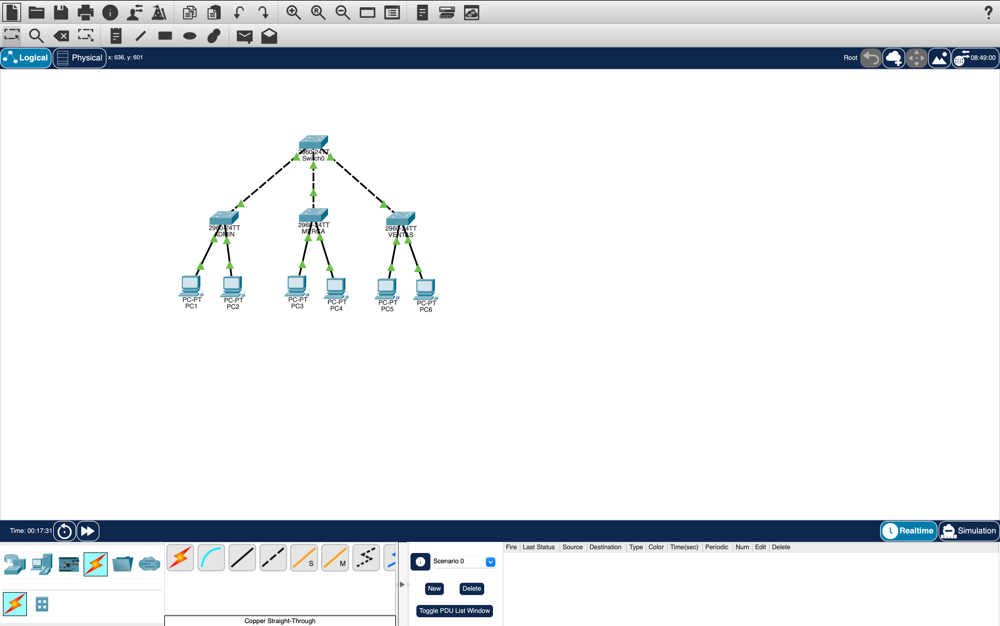

---

## 4. Paso 2 — Configurar los enlaces trunk

**Este paso va primero, antes que VTP.** El motivo: los mensajes VTP (*advertisements*) viajan
únicamente por enlaces **trunk**. Si los trunks no están arriba, el servidor puede tener las tres
VLANs creadas y los clientes nunca se enterarán.

Entrar a cada switch → pestaña **`CLI`** → presionar `Enter` si aparece el diálogo de configuración
inicial y responder `no`.

### En `Switch0` (los tres trunks):

```cisco
enable
configure terminal
hostname Switch0
!
interface FastEthernet0/1
 description TRUNK a ADMIN
 switchport mode trunk
 no shutdown
exit
interface FastEthernet0/2
 description TRUNK a MERCA
 switchport mode trunk
 no shutdown
exit
interface FastEthernet0/3
 description TRUNK a VENTAS
 switchport mode trunk
 no shutdown
exit
end
```

### En `ADMIN`, `MERCA` y `VENTAS` (un solo trunk cada uno):

```cisco
enable
configure terminal
hostname ADMIN          ! (o MERCA / VENTAS según el switch)
!
interface FastEthernet0/24
 description TRUNK a Switch0
 switchport mode trunk
 no shutdown
exit
end
```

> **¿Por qué no se escribe `switchport trunk encapsulation dot1q`?**
> Porque el Cisco 2960 solo soporta **802.1Q**; al no tener alternativa (ISL), IOS no acepta ese
> comando en este modelo. En un switch multicapa como el 3560 sí es obligatorio.

### Verificación del paso

```cisco
show interfaces trunk
```

Debe listar el puerto con `Mode: on`, `Encapsulation: 802.1q`, `Status: trunking` y
`Native vlan: 1`.

### 📸 Evidencia 2 — Trunks activos

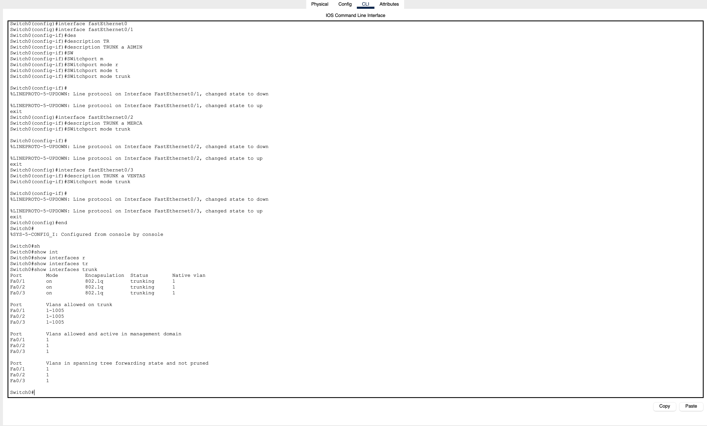

---

## 5. Paso 3 — Configurar VTP

VTP (*VLAN Trunking Protocol*) sincroniza la base de datos de VLANs entre switches del mismo
dominio, para no tener que crearlas manualmente en cada equipo.

| Modo | Crea/borra VLANs | Aprende por VTP | Reenvía advertisements | Guarda VLANs en `vlan.dat` |
|---|:---:|:---:|:---:|:---:|
| **server** | Sí | Sí | Sí | Sí |
| **client** | **No** | Sí | Sí | No (solo en RAM) |
| **transparent** | Sí, **solo local** | **No** | Sí (las deja pasar) | Sí, en `running-config` |

### En `Switch0` — servidor:

```cisco
configure terminal
vtp domain REDES1
vtp version 2
vtp mode server
end
```

### En `ADMIN` y `MERCA` — clientes:

```cisco
configure terminal
vtp domain REDES1
vtp mode client
end
```

### En `VENTAS` — transparente:

```cisco
configure terminal
vtp domain REDES1
vtp mode transparent
end
```

> **El dominio debe escribirse exactamente igual en los cuatro switches** — `REDES1` distingue
> mayúsculas de minúsculas. Un switch con dominio distinto simplemente descarta los mensajes VTP
> del resto y nunca aprende nada.

> **Sobre el número de revisión:** el enunciado recomienda cuidarlo, y con razón. La base de datos
> de VLANs que se impone en el dominio es **la que tenga el número de revisión más alto**, sin
> importar si viene de un server o de un client. Un switch reciclado de otra práctica, con revisión
> 15, puede borrar las VLANs de un servidor con revisión 3 al conectarlo. Como en esta práctica los
> cuatro switches salen de fábrica con revisión **0**, no hay riesgo. Si hiciera falta resetearla:
> pasar el switch a `vtp mode transparent`, luego devolverlo a `vtp mode client` — eso deja la
> revisión en 0.

### 📸 Evidencia 3 — Modos VTP configurados

> Ver la sección 10 para las capturas de `show vtp status` de cada switch.

---

## 6. Paso 4 — Crear las VLANs

### 6.1 En el servidor (`Switch0`)

Las tres VLANs se crean **una sola vez**, en el servidor:

```cisco
configure terminal
vlan 10
 name ADMIN
exit
vlan 20
 name MERCA
exit
vlan 30
 name VENTAS
exit
end
```

Verificar de inmediato:

```cisco
show vlan brief
```

### 6.2 Comprobar la propagación a los clientes

Entrar a la CLI de `ADMIN` y de `MERCA` y ejecutar:

```cisco
show vlan brief
```

**Las VLANs 10, 20 y 30 deben aparecer sin haberlas escrito.** Eso es VTP funcionando.
Si no aparecen, esperar unos segundos y repetir; si siguen sin aparecer, revisar la
[sección 13](#13-solución-de-problemas).

> **Nota de análisis:** `ADMIN` aprende también la VLAN 30 (`VENTAS`), aunque ninguna de sus PCs
> la use. VTP sincroniza la **base de datos completa** del dominio, no un subconjunto según lo que
> cada switch necesite. Tener la VLAN definida no consume nada mientras ningún puerto esté
> asignado a ella.

### 6.3 En el switch transparente (`VENTAS`)

`VENTAS` **no aprende nada por VTP** — ejecutar `show vlan brief` ahí mostrará únicamente las
VLANs de fábrica. Hay que crear las VLANs **manualmente**, en local:

```cisco
configure terminal
vlan 10
 name ADMIN
exit
vlan 20
 name MERCA
exit
vlan 30
 name VENTAS
exit
end
```

> Esto no es un parche ni un error del diseño: **es la evidencia** de que el modo transparente
> mantiene su propia base de datos local e ignora los anuncios del servidor. Aun así los reenvía
> hacia abajo, para no romper el dominio VTP de los switches que estuvieran detrás.

---

## 7. Paso 5 — Asignar los puertos de acceso

Recién ahora se asignan los puertos: en un switch en modo **client** el comando
`switchport access vlan 10` **falla** si la VLAN 10 todavía no llegó por VTP.

### En `ADMIN`:

```cisco
configure terminal
interface FastEthernet0/1
 description PC1 - VLAN ADMIN
 switchport mode access
 switchport access vlan 10
 no shutdown
exit
interface FastEthernet0/2
 description PC2 - VLAN MERCA
 switchport mode access
 switchport access vlan 20
 no shutdown
exit
end
```

### En `MERCA`:

```cisco
configure terminal
interface FastEthernet0/1
 description PC3 - VLAN MERCA
 switchport mode access
 switchport access vlan 20
 no shutdown
exit
interface FastEthernet0/2
 description PC4 - VLAN VENTAS
 switchport mode access
 switchport access vlan 30
 no shutdown
exit
end
```

### En `VENTAS`:

```cisco
configure terminal
interface FastEthernet0/1
 description PC5 - VLAN VENTAS
 switchport mode access
 switchport access vlan 30
 no shutdown
exit
interface FastEthernet0/2
 description PC6 - VLAN ADMIN
 switchport mode access
 switchport access vlan 10
 no shutdown
exit
end
```

> **`switchport mode access` va antes que `switchport access vlan`.** El primero fija el rol del
> puerto (deja de negociar DTP); el segundo dice a qué VLAN pertenece. Invertirlos funciona, pero
> deja el puerto negociando modo hasta la segunda línea.

### Guardar la configuración en los cuatro switches

```cisco
end
write memory
```

---

## 8. Paso 6 — Direccionamiento IP de las PCs

Para cada PC: clic en el icono → pestaña **`Desktop`** → **`IP Configuration`** → seleccionar
**`Static`** y llenar:

| PC | IPv4 Address | Subnet Mask | Default Gateway |
|---|---|---|---|
| `PC1` | 192.168.10.10 | 255.255.255.0 | *(vacío)* |
| `PC2` | 192.168.20.20 | 255.255.255.0 | *(vacío)* |
| `PC3` | 192.168.20.30 | 255.255.255.0 | *(vacío)* |
| `PC4` | 192.168.30.40 | 255.255.255.0 | *(vacío)* |
| `PC5` | 192.168.30.50 | 255.255.255.0 | *(vacío)* |
| `PC6` | 192.168.10.60 | 255.255.255.0 | *(vacío)* |

### 📸 Evidencia 4 — Configuración IP de una PC

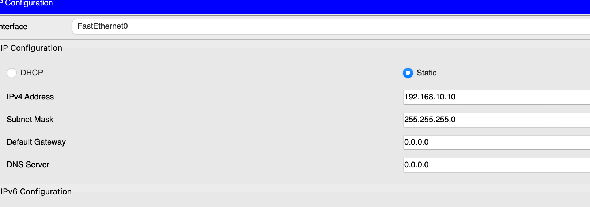

---

## 9. Scripts completos de configuración

> Los mismos scripts están en la carpeta `configs/` de este repositorio, listos para copiar y pegar
> en la CLI de cada switch.

### 9.1 `Switch0` — VTP Server

```cisco
enable
configure terminal
hostname Switch0
!
! --- Trunks hacia los switches de acceso ---
interface FastEthernet0/1
 description TRUNK a ADMIN
 switchport mode trunk
 no shutdown
exit
interface FastEthernet0/2
 description TRUNK a MERCA
 switchport mode trunk
 no shutdown
exit
interface FastEthernet0/3
 description TRUNK a VENTAS
 switchport mode trunk
 no shutdown
exit
!
! --- VTP: dominio y modo servidor ---
vtp domain REDES1
vtp version 2
vtp mode server
!
! --- Creación de las VLANs (solo aquí: es el server) ---
vlan 10
 name ADMIN
exit
vlan 20
 name MERCA
exit
vlan 30
 name VENTAS
exit
!
end
write memory
```

### 9.2 `ADMIN` — VTP Client

```cisco
enable
configure terminal
hostname ADMIN
!
! --- Trunk hacia Switch0 (PRIMERO: sin trunk no hay VTP) ---
interface FastEthernet0/24
 description TRUNK a Switch0
 switchport mode trunk
 no shutdown
exit
!
! --- VTP: mismo dominio, modo cliente ---
vtp domain REDES1
vtp mode client
!
! --- Puertos de acceso (requiere VLANs ya recibidas por VTP) ---
interface FastEthernet0/1
 description PC1 - VLAN ADMIN
 switchport mode access
 switchport access vlan 10
 no shutdown
exit
interface FastEthernet0/2
 description PC2 - VLAN MERCA
 switchport mode access
 switchport access vlan 20
 no shutdown
exit
!
end
write memory
```

### 9.3 `MERCA` — VTP Client

```cisco
enable
configure terminal
hostname MERCA
!
! --- Trunk hacia Switch0 ---
interface FastEthernet0/24
 description TRUNK a Switch0
 switchport mode trunk
 no shutdown
exit
!
! --- VTP: mismo dominio, modo cliente ---
vtp domain REDES1
vtp mode client
!
! --- Puertos de acceso ---
interface FastEthernet0/1
 description PC3 - VLAN MERCA
 switchport mode access
 switchport access vlan 20
 no shutdown
exit
interface FastEthernet0/2
 description PC4 - VLAN VENTAS
 switchport mode access
 switchport access vlan 30
 no shutdown
exit
!
end
write memory
```

### 9.4 `VENTAS` — VTP Transparent

```cisco
enable
configure terminal
hostname VENTAS
!
! --- Trunk hacia Switch0 ---
interface FastEthernet0/24
 description TRUNK a Switch0
 switchport mode trunk
 no shutdown
exit
!
! --- VTP: mismo dominio, modo transparente ---
vtp domain REDES1
vtp mode transparent
!
! --- VLANs LOCALES (en transparente NO llegan por VTP) ---
vlan 10
 name ADMIN
exit
vlan 20
 name MERCA
exit
vlan 30
 name VENTAS
exit
!
! --- Puertos de acceso ---
interface FastEthernet0/1
 description PC5 - VLAN VENTAS
 switchport mode access
 switchport access vlan 30
 no shutdown
exit
interface FastEthernet0/2
 description PC6 - VLAN ADMIN
 switchport mode access
 switchport access vlan 10
 no shutdown
exit
!
end
write memory
```

---

## 10. Verificación: `show vtp status`

Ejecutar `show vtp status` en la CLI de **cada uno** de los cuatro switches.

### Qué revisar en la salida

| Campo | Valor esperado | Por qué importa |
|---|---|---|
| `VTP Domain Name` | `REDES1` | Debe ser idéntico en los cuatro |
| `VTP Operating Mode` | `Server` / `Client` / `Transparent` | Confirma el rol asignado |
| `Configuration Revision` | Igual en Server y Clients | Prueba que están sincronizados |
| `Number of existing VLANs` | 8 (5 de fábrica + 3 creadas) | Confirma que las VLANs llegaron |

> En un switch **transparente** el `Configuration Revision` se queda en **0** y no cambia nunca,
> por más VLANs que se creen localmente. Es la señal más clara de que ese switch está fuera de la
> sincronización del dominio.

### 📸 Evidencia 5 — `show vtp status` en `Switch0` (Server)

```cisco
Switch0# show vtp status
```

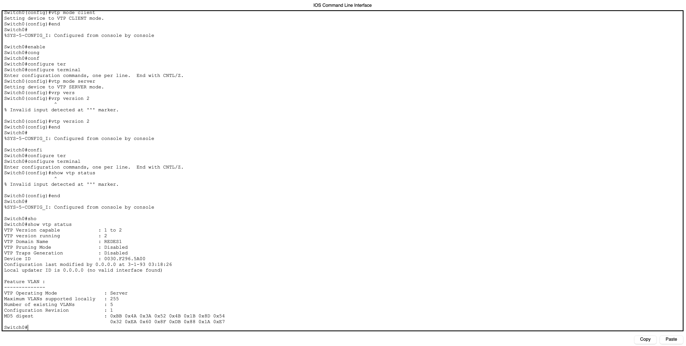

### 📸 Evidencia 6 — `show vtp status` en `ADMIN` (Client)

```cisco
ADMIN# show vtp status
```

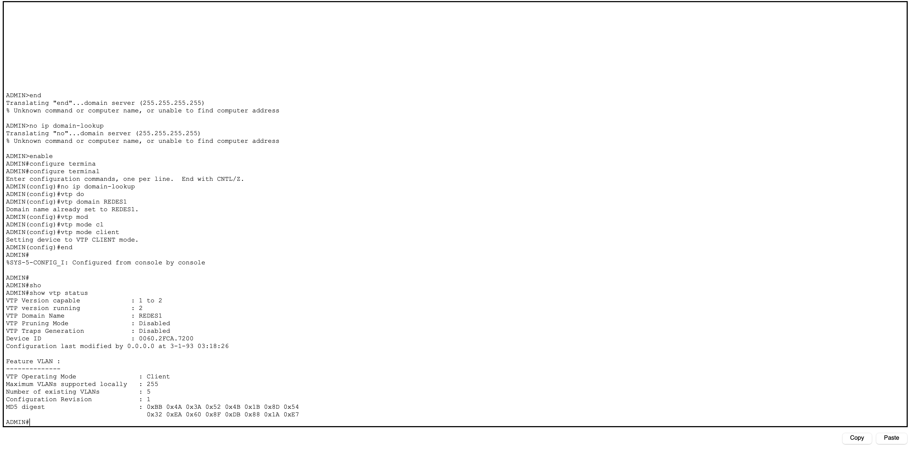

### 📸 Evidencia 7 — `show vtp status` en `MERCA` (Client)

```cisco
MERCA# show vtp status
```

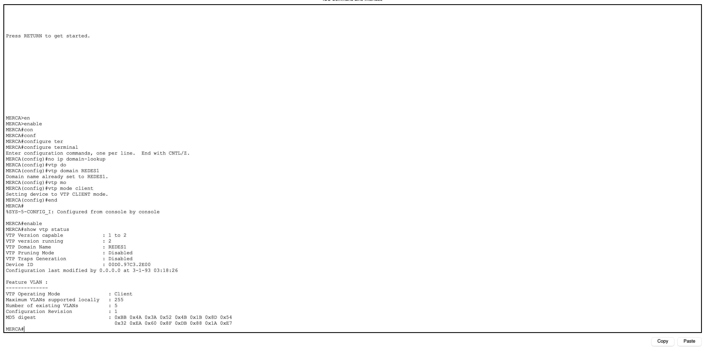

### 📸 Evidencia 8 — `show vtp status` en `VENTAS` (Transparent)

```cisco
VENTAS# show vtp status
```

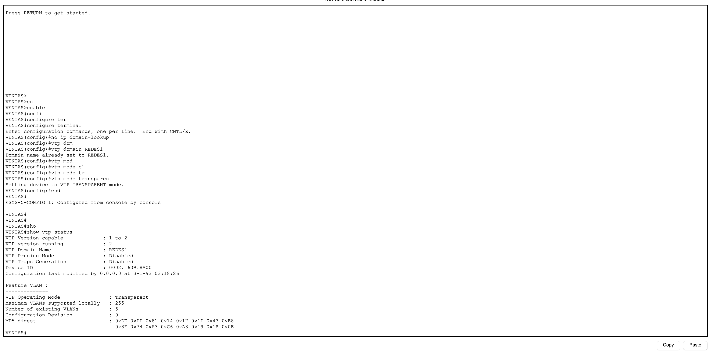

### Tabla comparativa

| Switch | Modo VTP | Dominio | Config. Revision | VLANs 10/20/30 | Origen de las VLANs |
|---|---|---|:---:|:---:|---|
| `Switch0` | Server | REDES1 | `___` | ✅ | Creadas localmente |
| `ADMIN` | Client | REDES1 | `___` | ✅ | Aprendidas por VTP |
| `MERCA` | Client | REDES1 | `___` | ✅ | Aprendidas por VTP |
| `VENTAS` | Transparent | REDES1 | 0 | ✅ | Creadas manualmente |

La presencia de las tres VLANs en los cuatro switches se verificó leyendo la base de datos real
de cada equipo. El campo `Configuration Revision` de los tres primeros se completa con el valor
leído en las capturas de esta sección; en `VENTAS` permanece en 0 por estar en modo transparente.

---

## 11. Verificación: `show vlan brief`

Ejecutar `show vlan brief` en los cuatro switches. La salida esperada muestra las tres VLANs
creadas y, en los switches de acceso, los puertos asignados a cada una.

### 📸 Evidencia 9 — `show vlan brief` en `Switch0`

> Deben aparecer las VLANs 10, 20 y 30. **Ningún puerto** aparece asignado a ellas: `Switch0`
> solo tiene trunks, y los trunks no pertenecen a una VLAN de acceso.

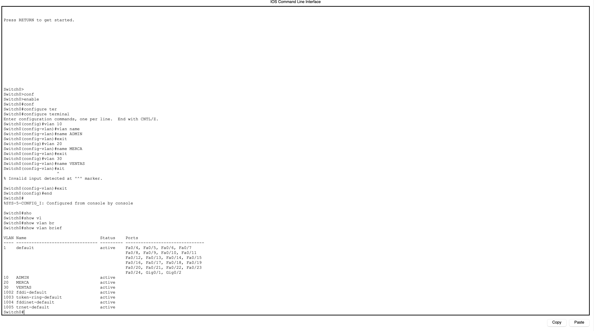

### 📸 Evidencia 10 — `show vlan brief` en `ADMIN`

> Fa0/1 debe aparecer bajo la VLAN 10 (ADMIN) y Fa0/2 bajo la VLAN 20 (MERCA).
> **Las VLANs llegaron por VTP: nunca se escribió `vlan 10` en este switch.**

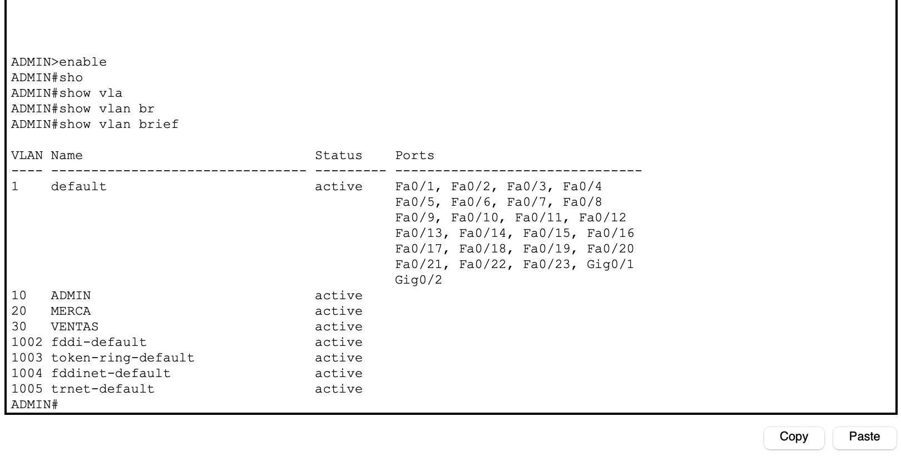

### 📸 Evidencia 11 — `show vlan brief` en `MERCA`

> Fa0/1 bajo la VLAN 20 (MERCA) y Fa0/2 bajo la VLAN 30 (VENTAS).

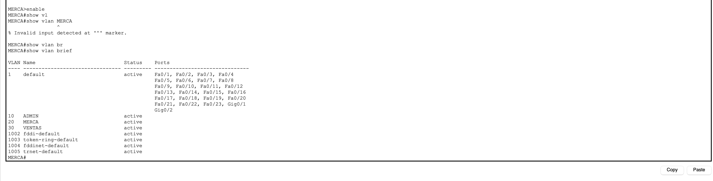

### 📸 Evidencia 12 — `show vlan brief` en `VENTAS`

> Fa0/1 bajo la VLAN 30 (VENTAS) y Fa0/2 bajo la VLAN 10 (ADMIN).
> Estas VLANs se crearon **a mano**, porque el modo transparente no las aprende.

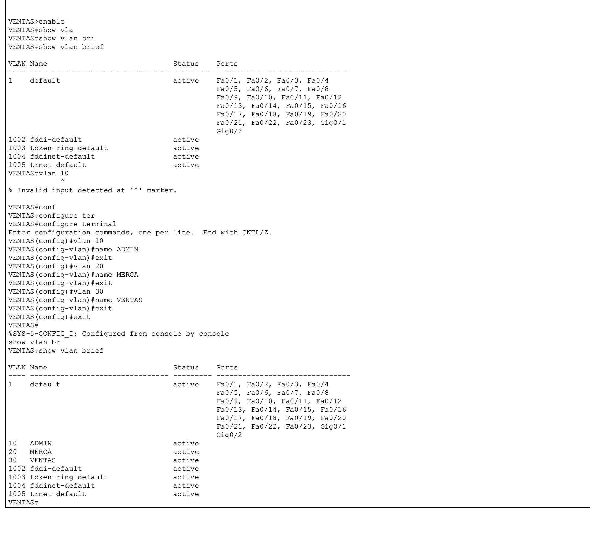

---

## 12. Pruebas de conectividad

Las pruebas se ejecutan desde: clic en la PC → pestaña **`Desktop`** → **`Command Prompt`**.

> **Sobre el primer paquete:** es normal que el primer `ping` de una serie muestre
> `Request timed out.` — es el tiempo que tarda el ARP en resolver la MAC del destino. Los tres
> siguientes deben responder. Si hace falta, ejecutar el comando dos veces y capturar la segunda.

### 12.1 Ping exitoso — misma VLAN, switches distintos

Estas tres pruebas atraviesan el trunk y pasan por `Switch0`. Que funcionen demuestra que
el trunking y la propagación de VLANs están correctos.

#### 📸 Evidencia 13 — `PC1` → `PC6` (VLAN 10 · ADMIN)

Recorrido: `ADMIN` → trunk → `Switch0` → trunk → `VENTAS`

```
C:\> ping 192.168.10.60
```

**Resultado esperado:** `Reply from 192.168.10.60: bytes=32 time<1ms TTL=128`

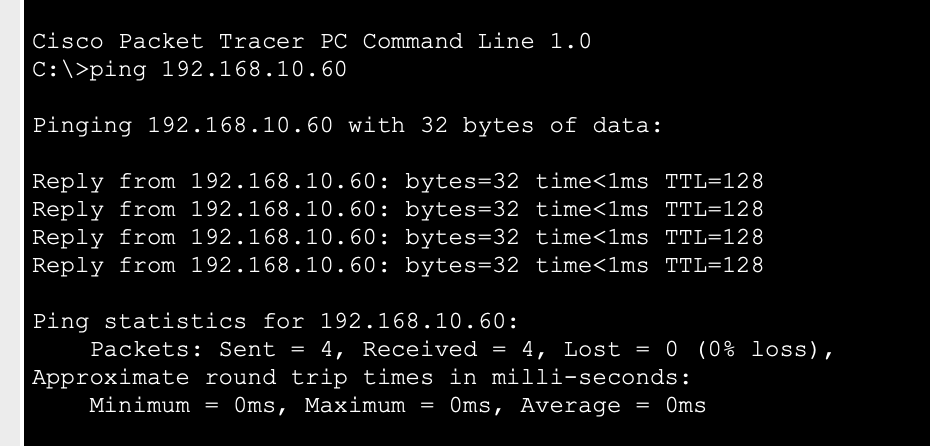

#### 📸 Evidencia 14 — `PC2` → `PC3` (VLAN 20 · MERCA)

Recorrido: `ADMIN` → trunk → `Switch0` → trunk → `MERCA`

```
C:\> ping 192.168.20.30
```

**Resultado esperado:** `Reply from 192.168.20.30: bytes=32 time<1ms TTL=128`

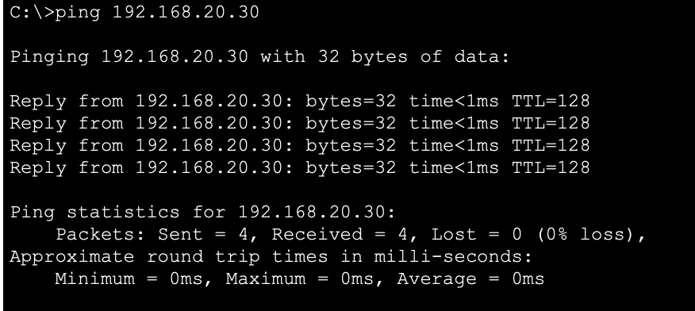

#### 📸 Evidencia 15 — `PC4` → `PC5` (VLAN 30 · VENTAS)

Recorrido: `MERCA` → trunk → `Switch0` → trunk → `VENTAS`

```
C:\> ping 192.168.30.50
```

**Resultado esperado:** `Reply from 192.168.30.50: bytes=32 time<1ms TTL=128`

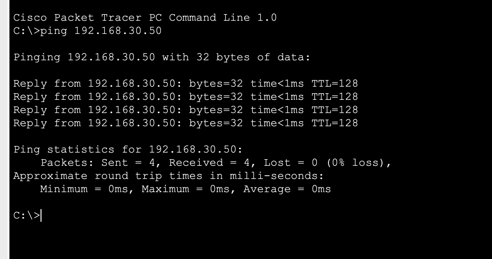

### 12.2 Ping fallido — VLANs distintas

#### 📸 Evidencia 16 — `PC1` → `PC2` (VLAN 10 → VLAN 20, **mismo switch**)

Esta es la prueba más contundente: ambas PCs están conectadas al **mismo switch físico**
(`ADMIN`), en puertos contiguos. Lo único que las separa es la VLAN.

```
C:\> ping 192.168.20.20
```

**Resultado esperado:** falla (`Destination host unreachable` o `Request timed out`),
`Packets: Sent = 4, Received = 0, Lost = 4 (100% loss)`

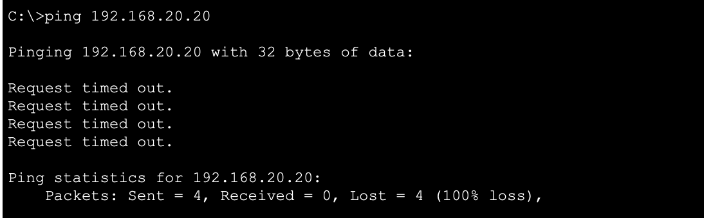

#### 📸 Evidencia 17 — `PC1` → `PC3` (VLAN 10 → VLAN 20, switches distintos)

```
C:\> ping 192.168.20.30
```

**Resultado esperado:** falla, `Lost = 4 (100% loss)`

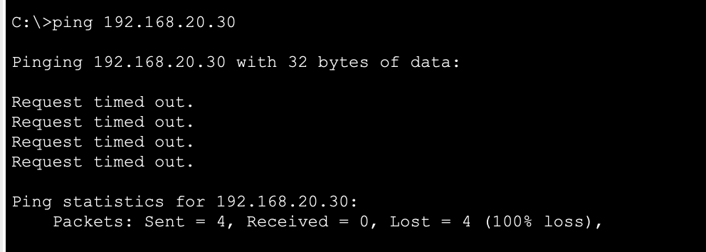

### 12.3 Matriz de conectividad

Resultados reales obtenidos, 28/08/2026. Cada prueba envió 4 paquetes ICMP.

| Origen | Destino | VLAN origen | VLAN destino | Switches | Esperado | **Obtenido** |
|---|---|:---:|:---:|---|:---:|:---:|
| `PC1` | `PC6` | 10 | 10 | ADMIN → VENTAS | ✅ Éxito | ✅ **4/4 · 0% loss** |
| `PC2` | `PC3` | 20 | 20 | ADMIN → MERCA | ✅ Éxito | ✅ **4/4 · 0% loss** |
| `PC4` | `PC5` | 30 | 30 | MERCA → VENTAS | ✅ Éxito | ✅ **4/4 · 0% loss** |
| `PC1` | `PC2` | 10 | 20 | ADMIN → ADMIN | ❌ Falla | ❌ **0/4 · 100% loss** |
| `PC1` | `PC3` | 10 | 20 | ADMIN → MERCA | ❌ Falla | ❌ **0/4 · 100% loss** |
| `PC5` | `PC6` | 30 | 10 | VENTAS → VENTAS | ❌ Falla | ❌ **0/4 · 100% loss** |

**6 de 6 pruebas coinciden con lo esperado.** Las tres primeras confirman que el trunking y la
propagación de VLANs funcionan: ninguna de ellas ocurre dentro de un mismo switch, así que todas
atraviesan al menos un enlace trunk. Las tres últimas confirman el aislamiento entre VLANs,
incluyendo dos casos (`PC1`→`PC2` y `PC5`→`PC6`) en los que **origen y destino comparten switch
físico** y aun así no se comunican.

### 12.4 Prueba adicional (opcional, recomendada)

Un observador podría objetar que los pings de la sección 12.2 fallan simplemente porque las PCs
están en **subredes IP distintas** y no tienen gateway — no por las VLANs. Para descartarlo:

1. Cambiar temporalmente la IP de `PC2` a **192.168.10.99 / 255.255.255.0** — la **misma subred**
   que `PC1`.
2. Desde `PC1`, ejecutar `ping 192.168.10.99`.
3. **Sigue fallando**, aunque ahora ambas PCs estén en la misma subred IP y en el mismo switch.
4. Restaurar la IP original de `PC2` (192.168.20.20).

Esto prueba que el aislamiento ocurre en **capa 2**: el switch nunca reenvía la trama de ARP
entre puertos de VLANs distintas, así que la comunicación se corta antes de que IP entre en juego.

#### 📸 Evidencia 18 — Prueba de aislamiento en capa 2 (opcional)

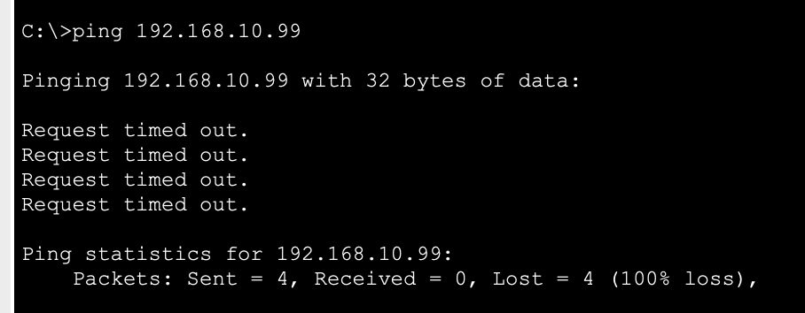

#### 📸 Evidencia 19 — Tabla MAC del switch `ADMIN` durante la prueba

Con `PC2` temporalmente en `192.168.10.99` (misma subred que `PC1`, mismo switch, puertos
contiguos), ejecutar en `ADMIN`:

```cisco
show mac address-table
```

Salida obtenida:

```
          Mac Address Table
-------------------------------------------

Vlan    Mac Address       Type        Ports
----    -----------       --------    -----

   1    0030.f296.5a01    DYNAMIC     Fa0/24
  10    000a.4125.a95d    DYNAMIC     Fa0/1
  10    0030.f296.5a01    DYNAMIC     Fa0/24
  20    0030.f296.5a01    DYNAMIC     Fa0/24
  30    0030.f296.5a01    DYNAMIC     Fa0/24
```

La primera columna de la tabla es **`Vlan`**, no la dirección MAC: la tabla de direcciones de un
switch con VLANs está indexada por el par **`(VLAN, MAC)`**. La consecuencia se observa
directamente en esta salida: la dirección `0030.f296.5a01` —correspondiente a `Switch0`, alcanzable
por el enlace trunk Fa0/24— figura **cuatro veces**, una por cada VLAN que atraviesa ese trunk
(1, 10, 20 y 30). Son cuatro entradas independientes para una misma dirección física, y el switch
no las confunde porque cada una se identifica junto con su VLAN.

De ahí se desprende el comportamiento observado en la prueba. La dirección de `PC1`
(`000a.4125.a95d`) está registrada **exclusivamente en la VLAN 10**, asociada al puerto Fa0/1. La
petición ARP originada por `PC2` ingresa por Fa0/2, que pertenece a la VLAN 20; el switch busca la
dirección destino *dentro de la VLAN 20*, no la encuentra, y descarta la trama. La información
sobre `PC1` existe en el switch, pero es inaccesible desde otra VLAN.

El aislamiento no lo produce entonces el direccionamiento IP, sino esta separación de la tabla de
direcciones MAC por VLAN, que opera en capa 2 antes de que el protocolo IP intervenga.

> Las entradas de la tabla son dinámicas y expiran tras un período de inactividad (300 segundos por
> omisión), por lo que un equipo que no haya transmitido recientemente puede no figurar en la salida.

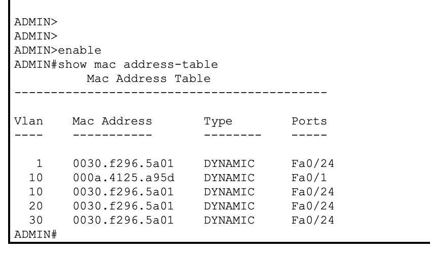

### 12.5 Evidencia con PDUs (panel de escenarios de Packet Tracer)

Además de las capturas del `Command Prompt`, conviene dejar registradas las pruebas como **PDUs
simples** en el panel de escenarios de Packet Tracer. La ventaja es que las seis pruebas quedan
visibles **en una sola tabla**, con su estado `Successful` / `Failed`, y se guardan dentro del
propio archivo `.pkt`.

**Procedimiento:** con Packet Tracer en modo **Realtime**, seleccionar la herramienta
**Add Simple PDU** (el ícono del sobre cerrado, en la barra derecha, o la tecla `P`), hacer clic
primero en la PC **origen** y después en la PC **destino**. Cada par genera una fila en la tabla
`PDU List` de la esquina inferior derecha.

Las seis PDUs a crear, en este orden:

| # | Origen | Destino | VLANs | Estado esperado |
|:-:|---|---|:---:|---|
| 1 | `PC1` | `PC6` | 10 → 10 | 🟢 `Successful` |
| 2 | `PC2` | `PC3` | 20 → 20 | 🟢 `Successful` |
| 3 | `PC4` | `PC5` | 30 → 30 | 🟢 `Successful` |
| 4 | `PC1` | `PC2` | 10 → 20 | 🔴 `Failed` |
| 5 | `PC1` | `PC3` | 10 → 20 | 🔴 `Failed` |
| 6 | `PC5` | `PC6` | 30 → 10 | 🔴 `Failed` |

> **Sobre el primer intento:** una PDU puede quedar en `Failed` la primera vez por la resolución
> ARP, igual que el primer `ping`. Si una de las tres primeras aparece en rojo, borrarla con
> `Delete` en la `PDU List` y volver a crearla — la segunda vez resuelve.

#### 📸 Evidencia 20 — Panel de PDUs con las seis pruebas

Capturar la `PDU List` completa mostrando las tres primeras en `Successful` y las tres últimas
en `Failed`. Es la síntesis visual de toda la sección 12.

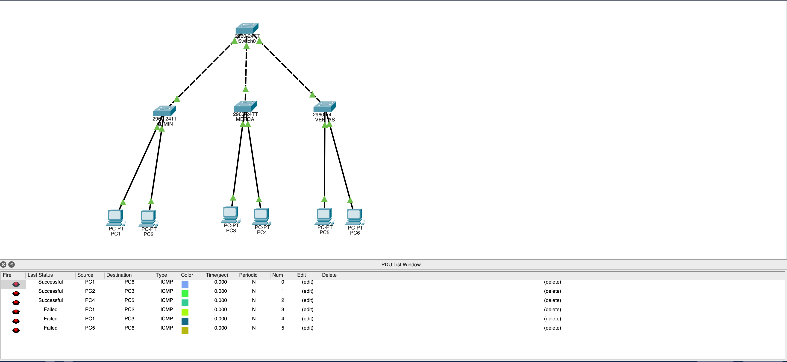

---

## 13. Solución de problemas

| Síntoma | Causa probable | Cómo verificarlo | Solución |
|---|---|---|---|
| Las VLANs no aparecen en los clientes | El enlace al servidor no es trunk | `show interfaces trunk` en ambos extremos | Aplicar `switchport mode trunk` en los **dos** extremos del enlace |
| Las VLANs no aparecen en los clientes | Dominio VTP distinto o mal escrito | `show vtp status` → campo `VTP Domain Name` | Corregir con `vtp domain REDES1` (distingue mayúsculas) |
| `VTP Domain Name` sale vacío o `NULL` | Nunca se recibió un advertisement | `show vtp status` | Revisar el trunk; luego reescribir `vtp domain REDES1` |
| `VLAN not found in current VLAN database` al asignar un puerto | Se intentó asignar una VLAN inexistente en un **client** | `show vlan brief` en ese switch | Esperar a que VTP propague, o crear la VLAN en el **server** |
| `%VTP VLAN configuration not allowed when device is in CLIENT mode` | Se intentó crear una VLAN en un client | `show vtp status` → `Operating Mode` | Crear la VLAN en `Switch0`; nunca en un client |
| `VENTAS` no muestra las VLANs | Es **transparente**: no aprende por VTP | `show vtp status` | Crear las VLANs manualmente en `VENTAS` (sección 6.3) |
| Ping falla entre PCs de la misma VLAN | Puerto en la VLAN equivocada | `show vlan brief` en el switch de acceso | Reasignar con `switchport access vlan <id>` |
| Ping falla entre PCs de la misma VLAN | IP o máscara mal escrita | `Desktop` → `IP Configuration` en la PC | Corregir según la tabla de la sección 2.4 |
| Enlaces entre switches en naranja permanente | Se usó cable straight-through en switch↔switch | Ver el tipo de cable en el enlace | Reemplazar por **cross-over** |
| Las VLANs desaparecieron del servidor | Un switch entró con número de revisión mayor | `show vtp status` → `Configuration Revision` | Poner el intruso en `transparent` y volverlo a `client`; recrear las VLANs en el server |
| El primer ping siempre falla | Resolución ARP en curso | — | Normal. Repetir el ping y capturar el segundo |

### 13.1 Incidencia real registrada durante el armado

Durante las pruebas de conectividad, dos de los tres pings de la misma VLAN respondieron
correctamente y **uno falló**: `PC2` → `PC3` (VLAN 20), con 100% de pérdida.

**Diagnóstico por acotamiento.** Como `PC1`→`PC6` (VLAN 10) sí funcionaba, y esa prueba atraviesa
**dos enlaces trunk** pasando por `Switch0`, quedaba descartado que el problema fuera del trunking,
de VTP o de la propagación de VLANs. La falla tenía que estar en uno de los dos puertos de acceso
involucrados: `ADMIN` Fa0/2 o `MERCA` Fa0/1.

**Causa.** Al revisar la configuración de `MERCA`:

```cisco
interface FastEthernet0/1
 description PC3 - VLAN MERCA     <- la descripción indica VLAN 20
 switchport access vlan 10        <- pero el puerto estaba en la VLAN 10
 switchport mode access
```

Un error de tipeo: `10` en lugar de `20`. `PC3` había quedado asignada a la VLAN 10.

**Característica del síntoma.** `PC3` no quedó desconectada sino desplazada: pasó a la VLAN 10,
junto a `PC1` y `PC6`. Como su dirección IP (`192.168.20.30`) pertenece a otra subred, tampoco
podía comunicarse con ellas. El equipo quedó aislado de toda la red sin que se generara ningún
mensaje de error, y con una `description` que indicaba lo contrario.

**Solución.**

```cisco
interface FastEthernet0/1
 switchport access vlan 20
```

No hace falta eliminar la asignación previa: `switchport access vlan` sobrescribe el valor anterior.

El campo `description` es un comentario y el IOS no lo valida contra la configuración real del
puerto. La verificación debe realizarse con `show vlan brief` o `show interfaces switchport`.

---

## 14. Conclusiones

1. **VTP elimina el trabajo repetitivo y las inconsistencias.** Las tres VLANs se escribieron una
   sola vez, en `Switch0`, y aparecieron automáticamente en `ADMIN` y `MERCA`. En una red con
   decenas de switches esto no es solo comodidad: es la diferencia entre una base de datos de VLANs
   consistente y una llena de errores de tipeo.

2. **El modo transparente es un aislamiento deliberado, no una falla.** `VENTAS` mantuvo su propia
   base de datos local y no se sincronizó con el dominio, pero sí reenvió los advertisements. Es el
   modo indicado para un switch que necesita VLANs propias sin participar del dominio corporativo.

3. **Las VLANs segmentan en capa 2, antes de que IP intervenga.** `PC1` y `PC2` comparten switch,
   puertos contiguos y hasta el mismo cableado, y aun así no se comunican. El switch descarta la
   trama por pertenecer a un dominio de difusión distinto — la prueba opcional de la sección 12.4 lo
   confirma incluso con ambas PCs en la misma subred IP.

4. **El orden de configuración no es negociable.** Trunk → dominio → modo → VLANs en el server →
   propagación → puertos de acceso. Saltarse el orden produce errores que parecen de otra causa:
   asignar un puerto antes de que la VLAN llegue devuelve `VLAN not found`, que se confunde
   fácilmente con un problema de cableado.

5. **Sin router no hay comunicación entre VLANs.** El aislamiento logrado es total. Para
   comunicarlas haría falta enrutamiento inter-VLAN — *router-on-a-stick* con subinterfaces 802.1Q,
   o un switch multicapa con SVIs.

---

## Contenido de la entrega

```
Tarea 3/
├── Manual_Tecnico.md          <- este documento
├── Tarea_3.pkt        <- archivo de Packet Tracer
├── configs/
│   ├── Switch0.txt
│   ├── ADMIN.txt
│   ├── MERCA.txt
│   └── VENTAS.txt
└── evidencias/
    ├── 01-topologia.png
    ├── 02-trunks-switch0.png
    ├── 02b-trunk-admin.png
    ├── 02c-trunk-merca.png
    ├── 02d-trunk-ventas.png
    ├── 03-ip-pc1.png
    ├── 04-vlans-switch0.png
    ├── 04-vtp-status-switch0.png
    ├── 05-vtp-status-admin.png
    ├── 06-vtp-status-merca.png
    ├── 07-vtp-status-ventas.png
    ├── 08-vlan-brief-switch0.png
    ├── 09-vlan-brief-admin.png
    ├── 10-vlan-brief-merca.png
    ├── 11-vlan-brief-ventas.png
    ├── 12-ping-ok-vlan10.png
    ├── 13-ping-ok-vlan20.png
    ├── 14-ping-ok-vlan30.png
    ├── 15-ping-fail-mismo-switch.png
    ├── 16-ping-fail-distinto-switch.png
    ├── 17-ping-fail-misma-subred.png
    ├── 18-mac-table-admin.png
    └── 19-pdu-list.png
```

## Referencias

- Cisco Systems. (2026). *Configuring VLANs*.
  https://www.cisco.com/c/en/us/support/docs/lan-switching/vtp/98154-conf-vlan.html
- Presentación y ejemplo de clase — Laboratorio de Redes de Computadoras 1, USAC.
